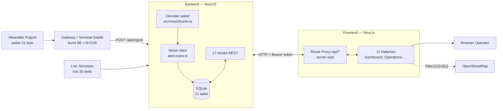
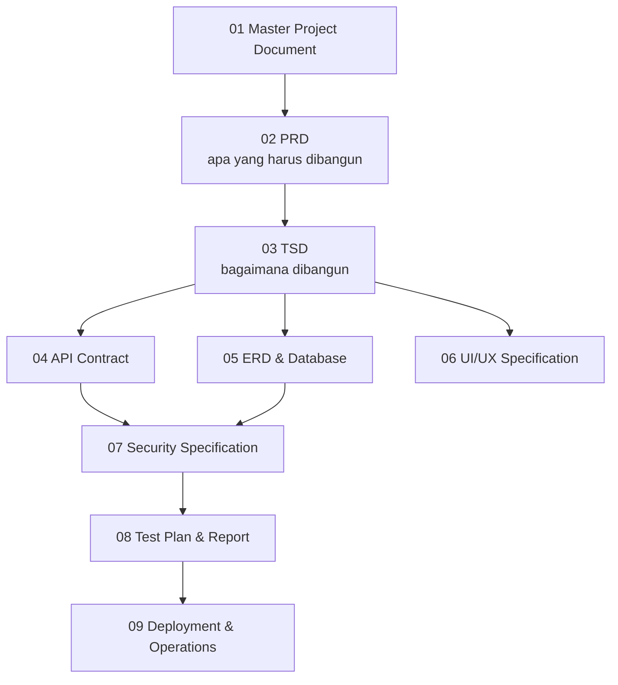

# 01 — Master Project Document

> SYNAPSE-T · Dokumen Induk Proyek · Versi 1.0 · 8 Oktober 2026

Dokumen ini adalah titik masuk tunggal untuk memahami SYNAPSE-T: apa yang dibangun,
batasannya, siapa yang terlibat, dan bagaimana seluruh dokumen lain saling terkait.

---

## 1. Identitas Proyek

| Atribut | Nilai |
|---|---|
| Nama produk | **SYNAPSE-T** |
| Nama internal backend | TrackForge Backend (`trackforge-backend`) |
| Kategori | IoT Soldier Tracking & Tactical Command Platform |
| Tagline (dari `layout.tsx`) | *Real-time situational awareness* |
| Versi aplikasi | FE `0.1.0` · BE `0.1.0` |
| Lisensi | `UNLICENSED` (privat, tidak untuk distribusi publik) |
| Bahasa domain | Indonesia (konteks satuan militer/TNI); UI berbahasa Inggris |

---

## 2. Latar Belakang dan Masalah

Satuan di lapangan membawa perangkat wearable yang mengirim posisi dan tanda vital
melalui jalur satelit berbandwidth sangat kecil. Satu paket per prajurit hanya
**21 byte**. Data ini tidak berguna selama masih berupa byte mentah di gateway.

Tiga masalah yang diselesaikan SYNAPSE-T:

1. **Byte mentah tidak bisa dibaca manusia.** Perlu dekoder yang mengubah paket biner
   menjadi posisi, denyut jantung, SpO₂, suhu, baterai, dan flag kondisi.
2. **Kejadian kritis tenggelam dalam arus data.** 15 prajurit × 2 paket/menit
   menghasilkan puluhan ribu rekaman per hari. Komandan butuh sistem yang
   mengangkat SOS, casualty, aritmia, heat stress, baterai lemah, dan hilang kontak
   menjadi alert yang bisa ditindak.
3. **Tidak ada jejak pertanggungjawaban.** Siapa melihat apa, siapa menutup alert,
   siapa mengaktifkan operasi — semuanya harus tercatat.

---

## 3. Tujuan dan Sasaran

### 3.1 Tujuan Produk

| Kode | Tujuan |
|---|---|
| G-1 | Menampilkan posisi dan kondisi seluruh personel pada satu peta komando real-time |
| G-2 | Mendekode paket telemetri 21-byte dan burst satelit tanpa kehilangan byte aslinya |
| G-3 | Mengangkat kondisi kritis menjadi alert otomatis dengan siklus hidup yang jelas |
| G-4 | Mengelola operasi taktis: grup personel, geofence, dan siklus hidup operasi |
| G-5 | Menyediakan penelusuran historis (track, vitals, event) per prajurit atau grup |
| G-6 | Menyediakan kontrol akses berbasis peran dan audit trail untuk setiap aksi |

### 3.2 Sasaran Terukur (Baseline Saat Ini)

| Metrik | Nilai saat ini | Sumber |
|---|---|---|
| Kapasitas burst satelit | 1–15 prajurit per burst | `MAX_BURST_SOLDIERS` |
| Ukuran paket per prajurit | 21 byte | `PAYLOAD_LEN` |
| Kadens telemetri | 1 paket / 30 detik / prajurit | `SEED_INTERVAL_MS` |
| Volume simulasi | 15 prajurit → 30 rekaman/menit | `live-simulator.service.ts` |
| Retensi telemetri | 30 hari | `RETENTION_DAYS` |
| Masa hidup sesi login | 7 hari | `createSession` |
| Ambang hilang kontak | 1.800 detik (30 menit) | `NO_CONTACT_GAP_SECONDS` |

---

## 4. Ruang Lingkup

### 4.1 Masuk Lingkup (Sudah Terimplementasi)

| Domain | Status | Catatan |
|---|---|---|
| Ingest burst satelit | ✅ Berfungsi | `POST /api/ingest`, dekode 6-byte header + N×21 byte |
| Explorer (pencarian rekaman) | ✅ Berfungsi | Filter, timeline, detail paket, ekspor CSV |
| Alerts | ✅ Berfungsi | 7 jenis alert, acknowledge, resolve, ekspor |
| History | ✅ Berfungsi | Track peta, playback, statistik, grafik vitals |
| Operations | ✅ Berfungsi | Wizard 4 langkah, grup, geofence, 5 status siklus hidup |
| Personnel & Groups | ✅ Berfungsi (API) | Belum ada halaman UI khusus; dipakai lewat wizard operasi |
| Tickets | ⚠️ API saja | Lengkap di BE; UI hanya tombol "Ticket" di Alerts |
| User Access (identitas, peran, binding) | ✅ Berfungsi | Halaman `/access` |
| Activity Log (audit) | ✅ Berfungsi | Halaman `/activity` |
| Profile | ✅ Berfungsi | Termasuk unggah foto profil |
| Simulator telemetri | ✅ Berfungsi | Seed 24 jam + live tick 30 detik |
| Geofence mandiri (`/api/geofences`) | ⚠️ API saja | Tidak dipakai UI; UI memakai geofence milik operasi |

### 4.2 Di Luar Lingkup / Belum Selesai

| Item | Kondisi | Dampak |
|---|---|---|
| **Reports** | Halaman `/reports` hanya mock statis, tanpa panggilan API. Menu dinonaktifkan | Fitur laporan belum ada |
| **Layer Weapons** | Marker hardcoded di `dashboard-view.tsx`, menu `disabled` ("Coming soon") | Pelacakan senjata belum ada |
| **Menu Settings** | Item menu ada, tapi hanya menutup dropdown | Tidak ada halaman pengaturan |
| **Editor permission peran** | `replaceRolePermissions` ada tapi tidak dipanggil controller mana pun | Peran baru dibuat tanpa permission |
| **Kategori MESH / BEACON / SPECIAL / SYSTEM** | Ada di skema `CATEGORIES`, tidak pernah ditulis | Hanya `TELEMETRY` dan `UPLINK` yang terisi |
| **Notifikasi push / email** | Tidak ada | Alert hanya terlihat saat UI dibuka |
| **Multi-tenant / multi-satuan** | Tidak ada | Satu basis data = satu satuan |
| **Database produksi (PostgreSQL)** | Hanya SQLite file | Lihat risiko R-1 |

---

## 5. Stakeholder dan Peran Pengguna

### 5.1 Peran Sistem (Seeded)

Enam peran dibuat otomatis saat basis data kosong (`SEED_ROLES`):

| Peran | Kategori tugas | Cakupan izin |
|---|---|---|
| `superadmin` | Platform | Seluruh 16 domain, semua aksi |
| `operations commander` | Command | Semua domain operasional + baca `lora_mesh`, `gateways`, `activity_log` |
| `operations officer` | Operations | Tulis: overview, groups, personal, operations, geofences, explorer, alerts, tickets, history. Baca: weapons, reports |
| `field operator` | Field | Baca saja: overview, groups, personal, operations, alerts, history |
| `device & fleet admin` | Infrastructure | Tulis `lora_mesh`, `gateways`; baca `overview` |
| `viewer` | Observer | Baca saja seluruh domain operasional |

Seluruh peran seeded bersifat `is_system = 1` dan `is_protected = 1` — tidak bisa diubah
atau dihapus lewat API.

### 5.2 Pemangku Kepentingan

| Pihak | Kepentingan |
|---|---|
| Komandan operasi | Gambaran situasi, keputusan cepat atas alert kritis |
| Operator pusat kendali | Monitoring harian, triase alert, pengelolaan tiket |
| Admin perangkat | Kesehatan gateway dan perangkat wearable |
| Administrator sistem | Identitas pengguna, peran, audit |
| Tim pengembang | Pemelihara FE dan BE |

---

## 6. Arsitektur Tingkat Tinggi



### Prinsip Arsitektur

1. **Browser tidak pernah menghubungi backend secara langsung.** Semua trafik lewat
   Next.js route handler di `src/app/api/**`. Alamat backend disimpan di variabel
   server-only `EXPLORER_API_BASE` sehingga tidak bocor ke klien.
2. **Byte asli selalu disimpan.** Kolom `raw_hex` menyimpan paket apa adanya, sehingga
   dekode ulang atau audit forensik tetap mungkin.
3. **Satu sumber kebenaran skema.** Skema SQLite dibuat oleh `DatabaseService.initDb()`.
   Entity TypeORM hanya stub dan `synchronize` dimatikan.
4. **Alert bersifat idempoten per insiden.** Hanya satu baris terbuka per
   kombinasi `(soldier_id, alert_type)` selagi status `ACTIVE` atau `ACKNOWLEDGED`.

---

## 7. Tech Stack

### 7.1 Frontend — `iot_fe`

| Komponen | Versi | Peran |
|---|---|---|
| Next.js | 16.3.8 | App Router, route proxy, SSR metadata |
| React / React DOM | 19.2.8 | UI |
| react-leaflet / leaflet | 5.0.0 / 1.9.4 | Semua peta |
| recharts | 3.10.1 | Grafik timeline dan vitals |
| Tailwind CSS | v4 (`@tailwindcss/postcss`) | Hanya reset global; styling utama CSS kustom |
| TypeScript | 5.x | Strict typing |
| ESLint | 9 + `eslint-config-next` | Linting |

### 7.2 Backend — `be-nest`

| Komponen | Versi | Peran |
|---|---|---|
| NestJS | 11 (`common`, `core`, `platform-express`) | Framework HTTP |
| better-sqlite3 | 12.11.1 | Driver basis data sinkron |
| TypeORM | 0.3.20 | **Hanya stub entity**; `synchronize: false` |
| class-validator / class-transformer | 0.14.1 / 0.5.1 | Terpasang, DTO **belum diaktifkan** (lihat 07 §4) |
| Jest + Supertest | 29.7.0 / 7.0.0 | 40 test e2e (6 suite) |
| TypeScript | 5.7.2 | — |

### 7.3 Infrastruktur

| Layanan | Fungsi | Alamat |
|---|---|---|
| Railway | Hosting BE + volume persisten | `be-iot-production.up.railway.app` |
| Vercel | Hosting FE | `iot-tau-ashen.vercel.app` |
| OpenStreetMap | Tile peta (via proxy `/tiles`) | `tile.openstreetmap.org` |
| Nominatim | Geocoding (endpoint tersedia, belum dipakai UI) | `nominatim.openstreetmap.org` |

---

## 8. Struktur Repositori

### 8.1 Frontend

```
iot_fe/
├── docs/                        # Dokumentasi ini
├── public/images/               # Logo SYNAPSE-T
└── src/
    ├── app/
    │   ├── layout.tsx           # Root layout, font Geist, metadata global
    │   ├── page.tsx             # Redirect "/" → "/login"
    │   ├── globals.css
    │   ├── login/               # Halaman masuk (di luar grup platform)
    │   ├── (platform)/          # Grup rute — TIDAK muncul di URL
    │   │   ├── dashboard/       # Peta komando + kartu prajurit
    │   │   ├── operations/      # Daftar, detail, wizard operasi
    │   │   ├── explorer/        # Pencarian rekaman telemetri
    │   │   ├── history/         # Track historis + playback
    │   │   ├── alerts/          # Triase alert
    │   │   ├── access/          # Identitas, peran, binding
    │   │   ├── activity/        # Audit log
    │   │   ├── profile/         # Profil pengguna
    │   │   └── reports/         # Mock statis (menu dinonaktifkan)
    │   ├── api/                 # 10 route proxy server-side
    │   └── tiles/[z]/[x]/[y]/   # Proxy tile OSM
    ├── components/TopHeader.tsx  # Navigasi + menu pengguna
    └── lib/                     # 9 modul klien API + sesi
```

Setiap folder fitur memakai pola `page.tsx` (server, metadata, baca `searchParams`)
→ `components/<fitur>-view.tsx` (klien, seluruh state) → `<fitur>.css` (prefix kelas khusus).

### 8.2 Backend

```
be-nest/
├── src/
│   ├── main.ts                  # Bootstrap, ValidationPipe, port
│   ├── app.module.ts            # 17 modul
│   ├── mesh/frame.ts            # Dekoder/enkoder paket 21-byte & burst
│   ├── common/                  # Sesi, audit, guard, filter error, util SQL
│   ├── database/
│   │   ├── database.service.ts  # SUMBER KEBENARAN SKEMA (initDb)
│   │   ├── access.ts            # RBAC, hashing password, seed akses
│   │   ├── alert-rules.ts       # Mesin alert
│   │   ├── seed-explorer.ts     # Generator data simulasi
│   │   ├── retention.ts         # Pembersihan data > 30 hari
│   │   └── entities/            # Stub TypeORM (bukan skema aktif)
│   ├── ingest/                  # Satu-satunya jalur masuk telemetri
│   ├── explorer/ alerts/ history/        # Domain baca telemetri
│   ├── operations/ personnel/ geofences/ # Domain operasional
│   ├── tickets/                 # Tindak lanjut alert
│   ├── users/ roles/ bindings/ profile/  # Identitas & akses
│   ├── audit/                   # Jejak aktivitas
│   ├── health/                  # Health check + stub OpenAPI
│   └── simulator/               # Live simulator
└── test/                        # 6 berkas e2e spec
```

---

## 9. Inventaris Fungsional

| Domain BE | Base path | Endpoint | Halaman FE terkait |
|---|---|---|---|
| Health | `/health` | 1 | — |
| OpenAPI (stub) | `/openapi.json` | 1 | — |
| Ingest | `/api/ingest` | 1 | — (dari gateway) |
| Explorer | `/api/explorer` | 5 | `/explorer`, `/dashboard` |
| Alerts | `/api/alerts` | 8 | `/alerts`, `/dashboard` |
| History | `/api/history` | 8 | `/history`, `/dashboard` |
| Operations | `/api/operations` | 23 | `/operations`, `/dashboard` |
| Personnel & Groups | `/api/personnel`, `/api/groups` | 9 | wizard `/operations` |
| Geofences (mandiri) | `/api/geofences` | 3 | — |
| Tickets | `/api/tickets` | 17 | tombol di `/alerts` |
| Users | `/users` | 7 | `/access`, `/login` |
| Roles | `/roles` | 6 | `/access` |
| Bindings | `/user-roles` | 3 | `/access` |
| Profile | `/auth/me`, `/users/me` | 4 | `/profile`, header |
| Audit | `/audit-logs` | 8 | `/activity`, `/profile` |

Total 104 endpoint pada 15 controller. Rincian lengkap setiap endpoint — parameter,
bentuk respons, kode error, dan status perlindungan — ada di
[04 — API Contract](./04-api-contract.md).

---

## 10. Risiko dan Utang Teknis

| ID | Risiko | Dampak | Tingkat | Mitigasi yang disarankan |
|---|---|---|---|---|
| R-1 | SQLite berkas tunggal di volume Railway | Tidak ada replikasi, tidak ada failover, backup manual | **Tinggi** | Migrasi ke PostgreSQL sebelum operasional nyata |
| R-2 | Banyak endpoint tanpa autentikasi (`/users`, `/roles`, `/user-roles`, `/api/explorer`, `/api/ingest`, baca `/audit-logs`) | Siapa pun bisa membuat user dan memberi peran `superadmin` | **Kritis** | Aktifkan guard global; lihat 07 §6 |
| R-3 | Kredensial default `superadmin` / `superadmin` ditulis ulang setiap startup | Akses penuh bagi siapa pun yang tahu | **Kritis** | Seed hanya sekali + paksa ganti password |
| R-4 | `SessionGuard` dan `RequirePermission` tidak pernah didaftarkan | Pemeriksaan izin tersebar manual per controller, mudah terlewat | **Tinggi** | Daftarkan sebagai `APP_GUARD` |
| R-5 | DTO `class-validator` tidak terpasang (`@Body() body: any`) | Validasi bergantung kode manual di service | **Sedang** | Pasang DTO + `forbidNonWhitelisted: true` |
| R-6 | `initDb` melakukan `DROP TABLE` saat kolom lama tidak cocok | Data telemetri dan alert bisa hilang saat upgrade | **Tinggi** | Ganti dengan migrasi bertahap |
| R-7 | Tidak ada rate limiting pada `/users/login` dan `/api/ingest` | Brute force dan CPU DoS (PBKDF2 sinkron 120k iterasi) | **Tinggi** | Tambah throttler |
| R-8 | Respons 500 membocorkan pesan exception internal | Kebocoran informasi | **Sedang** | Sanitasi di `DetailExceptionFilter` |
| R-9 | `audit_logs.session_id` menyimpan token sesi, dan detail audit dapat dibaca tanpa autentikasi | Token sesi bisa dipanen | **Kritis** | Simpan hash token; lindungi endpoint audit |
| R-10 | Data yang tampil adalah hasil simulator, bukan perangkat nyata | Demo bisa disalahartikan sebagai operasional | **Sedang** | Beri penanda "SIMULATED" di UI |

Daftar temuan keamanan lengkap beserta langkah perbaikan ada di
[07 — Security Specification](./07-security-specification.md).

---

## 11. Glosarium

| Istilah | Arti |
|---|---|
| **Burst** | Satu transmisi satelit: 6 byte header + 1–15 payload prajurit |
| **Payload** | Satu paket prajurit berukuran tepat 21 byte |
| **Explorer Record** | Satu baris pada tabel `explorer_records` — unit data mentah |
| **TELEMETRY** | Kategori rekaman berisi posisi + vitals satu prajurit |
| **UPLINK** | Kategori rekaman yang mewakili burst transport (bukan data prajurit) |
| **Freshness** | Usia data: `FRESH` (≤30 s), `AGING` (≤15 mnt), `STALE` (>15 mnt) |
| **Position Source** | Asal koordinat: `GNSS`, `DEAD_RECKONING`, `TRILATERATION`, `STALE` |
| **Flag** | Satu byte berisi 8 bit kondisi (SOS, casualty, aritmia, strap, dll.) |
| **Alert** | Insiden hasil evaluasi flag atau ketiadaan telemetri |
| **Ticket** | Tindak lanjut terstruktur atas satu alert (1 alert : 0..1 tiket) |
| **Geofence** | Poligon area; disimpan sebagai `[lng, lat]`, dirender `[lat, lng]` |
| **Group** | Satuan personel; **direferensikan lewat nama** pada telemetri dan alert |
| **Soldier ID** | Kunci bisnis prajurit (mis. 101–115), berbeda dari `personnel.id` |
| **DANRU** | Komandan regu — ditandai pada marker peta |
| **Binding** | Pengikatan satu pengguna ke satu peran (`user_role_bindings`) |
| **Scope** | Lingkup kueri History: `SOLDIER` atau `GROUP` (filter, bukan kontrol akses) |
| **TANPA VITAL** | Nilai yang disisipkan saat chest strap terlepas |

---

## 12. Peta Dokumen



| Jika Anda ingin... | Buka |
|---|---|
| Memahami kebutuhan dan user story | 02 |
| Memahami arsitektur dan protokol paket | 03 |
| Memanggil atau menguji endpoint | 04 |
| Mengubah skema atau menulis kueri | 05 |
| Membangun atau mengubah layar | 06 |
| Menilai kesiapan keamanan | 07 |
| Menjalankan atau menambah pengujian | 08 |
| Melakukan deploy atau menangani insiden | 09 |

---

## 13. Riwayat Revisi

| Versi | Tanggal | Perubahan | Basis kode |
|---|---|---|---|
| 1.0 | 8 Okt 2026 | Dokumentasi awal lengkap, diturunkan dari kode | FE `86b0734`, BE `eec3f95` |
