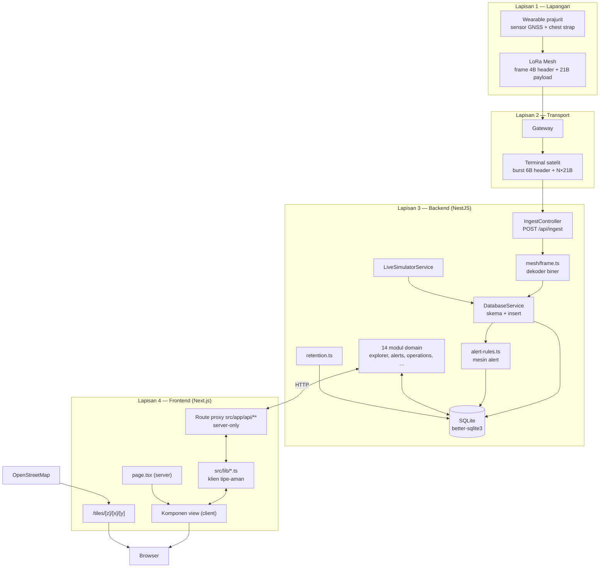
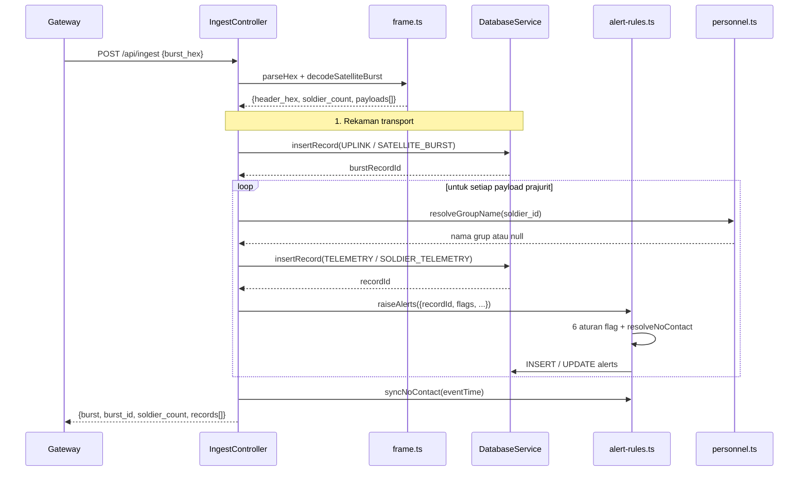
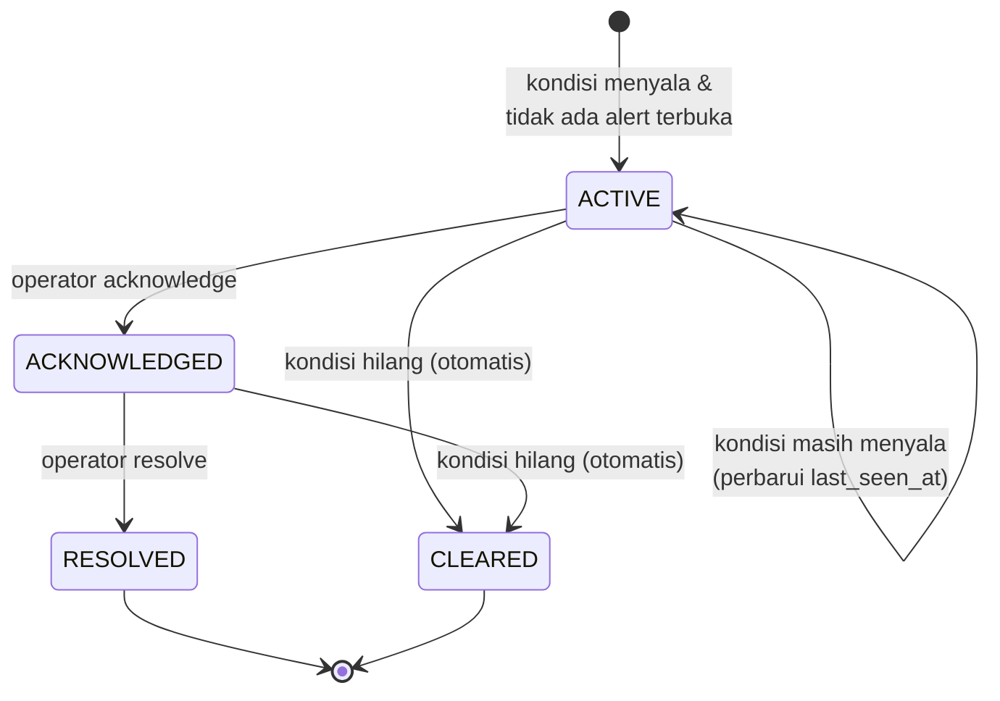

# 03 — Technical Specification Document (TSD)

> SYNAPSE-T · Versi 1.0 · 8 Oktober 2026
> Prasyarat: [01 — Master](./01-master-project-document.md), [02 — PRD](./02-prd.md)

Dokumen ini menjelaskan **bagaimana** sistem dibangun: arsitektur, modul, aliran data,
format paket biner, mesin alert, simulator, dan keputusan desain beserta alasannya.

---

## 1. Gambaran Arsitektur

### 1.1 Lapisan Sistem



### 1.2 Keputusan Arsitektur Utama

| ID | Keputusan | Alasan | Konsekuensi |
|---|---|---|---|
| AD-1 | Semua panggilan API lewat route proxy Next.js | Menyembunyikan alamat backend; tidak ada CORS; satu titik untuk header | Setiap endpoint BE baru butuh route proxy, atau masuk lewat `[[...path]]` yang sudah ada |
| AD-2 | `better-sqlite3` (sinkron), bukan driver async | Dekode burst + penulisan alert jadi atomik tanpa queue | Satu proses; tidak bisa scale horizontal |
| AD-3 | Skema SQL ditulis tangan di `initDb()`, TypeORM `synchronize: false` | Butuh kontrol penuh atas CHECK, index, dan migrasi | Entity TypeORM menjadi stub yang bisa menyesatkan (lihat §9) |
| AD-4 | Grup direferensikan **berdasarkan nama** pada telemetri | Telemetri boleh masuk sebelum master personel ada | Rename grup tidak otomatis mengubah rekaman historis |
| AD-5 | Geofence disimpan `[lng, lat]` (urutan GeoJSON) | Interoperabilitas standar | Harus ditukar jadi `[lat, lng]` di setiap titik render Leaflet |
| AD-6 | Satu alert terbuka per `(soldier_id, alert_type)` | Mencegah banjir alert dari flag yang menyala terus | Riwayat episode terbatas; `last_seen_at` yang diperbarui |
| AD-7 | Simulator berjalan di dalam proses backend | Demo bisa dijalankan tanpa perangkat nyata | Data produksi tercampur data simulasi (risiko R-10) |
| AD-8 | Token sesi opaque, bukan JWT | Bisa dicabut seketika; tidak ada klaim yang perlu dipercaya | Setiap request butuh satu kueri basis data |
| AD-9 | Deep link lewat `searchParams` server, bukan `useSearchParams` | Menghindari batasan Suspense Next.js 16 | State awal hanya bisa dibaca saat render server |

---

## 2. Backend — Struktur Modul

`AppModule` mengimpor 17 modul:

| # | Modul | Tanggung jawab | Berkas inti |
|---|---|---|---|
| 1 | `DatabaseModule` | Koneksi, skema, seed, insert rekaman | `database.service.ts` |
| 2 | `HealthModule` | `/health`, stub `/openapi.json` | `health.controller.ts` |
| 3 | `IngestModule` | Satu-satunya jalur masuk telemetri | `ingest.controller.ts` |
| 4 | `ExplorerModule` | Pencarian rekaman, detail, opsi, CSV | `explorer.*` |
| 5 | `AlertsModule` | Daftar, detail, acknowledge, resolve, CSV | `alerts.*` |
| 6 | `HistoryModule` | Track, vitals, statistik, event | `history.*` |
| 7 | `GeofencesModule` | CRUD geofence mandiri (tidak dipakai UI) | `geofences.*` |
| 8 | `PersonnelModule` | Master personel + grup + keanggotaan | `personnel.*` |
| 9 | `UsersModule` | Identitas, login, status | `users.controller.ts` |
| 10 | `ProfileModule` | `/auth/me`, update profil, foto | `profile.*` |
| 11 | `RolesModule` | Katalog peran + permission | `roles.*` |
| 12 | `BindingsModule` | Pengikatan pengguna ↔ peran | `bindings.*` |
| 13 | `AuditModule` | Baca dan ekspor audit | `audit.*` |
| 14 | `TicketsModule` | Tiket, task, update, kolaborator | `tickets.*` |
| 15 | `OperationsModule` | Operasi, grup, geofence, siklus hidup | `operations.*` |
| 16 | `SimulatorModule` | Live tick + pemicu retensi | `live-simulator.service.ts` |

Pola tiap modul: `*.module.ts` → `*.controller.ts` (routing + validasi ringan) →
`*.service.ts` (logika bisnis) → kadang `*.repository.ts` (SQL).

### 2.1 Bootstrap

`src/main.ts` melakukan:

1. `NestFactory.create(AppModule)`
2. Memasang `ValidationPipe` global: `{ transform: true, whitelist: true, forbidNonWhitelisted: false }`
3. Memasang `DetailExceptionFilter` global — mengubah semua error menjadi `{ "detail": ... }`
4. `listen(process.env.PORT ?? 8000)`

> `whitelist: true` hanya efektif bila controller memakai DTO berdekorator.
> Controller `operations` dan `tickets` masih memakai `@Body() body: any`, sehingga
> pipe tidak melakukan apa pun di sana (lihat 07 §4).

### 2.2 Utilitas Bersama (`src/common`)

| Berkas | Fungsi |
|---|---|
| `records.ts` | `utcNow()`, `parseEventTime()`, `canonicalTime()`, `makeRecord()` — normalisasi waktu ke UTC `YYYY-MM-DDTHH:MM:SSZ` |
| `sql.ts` | `bind()` — menormalkan `undefined`→`null` dan boolean→0/1 untuk better-sqlite3 |
| `session.ts` | Pembuatan, resolusi, pencabutan token sesi |
| `audit.ts` | Kosakata audit (kategori, aksi) + penulis baris audit |
| `guards.ts` | `SessionGuard`, dekorator `RequirePermission` — **belum didaftarkan** |
| `detail-exception.filter.ts` | Pembungkus error seragam |

---

## 3. Protokol Paket Telemetri

Seluruh definisi ada di `src/mesh/frame.ts`.

### 3.1 Konstanta

| Konstanta | Nilai | Arti |
|---|---|---|
| `HEADER_LEN` | 4 | Header LoRa mesh |
| `PAYLOAD_LEN` | 21 | Payload satu prajurit |
| `FRAME_LEN` | 25 | Frame mesh lengkap |
| `BURST_HEADER_LEN` | 6 | Header transport satelit (opaque) |
| `MAX_BURST_SOLDIERS` | 15 | Jumlah prajurit maksimum per burst |

### 3.2 Payload Prajurit — 21 Byte

Struct Python-style: `<HBIiiBBBBBB` (little-endian).

| Offset | Ukuran | Tipe | Field | Satuan / Catatan |
|---|---|---|---|---|
| 0 | 2 | `uint16 LE` | `soldier_id` | Kunci bisnis prajurit |
| 2 | 1 | `uint8` | `seq` | Nomor urut paket (membungkus di 255) |
| 3 | 4 | `uint32 LE` | `timestamp` | Unix epoch detik |
| 7 | 4 | `int32 LE` | `lat` | Derajat × 10⁷ (E7) |
| 11 | 4 | `int32 LE` | `lon` | Derajat × 10⁷ (E7) |
| 15 | 1 | `uint8` | `hr` | Denyut jantung, bpm |
| 16 | 1 | `uint8` | `hrv` | Heart-rate variability, ms |
| 17 | 1 | `uint8` | `spo2` | Saturasi oksigen, % |
| 18 | 1 | `uint8` | `temp` | Suhu tubuh |
| 19 | 1 | `uint8` | `batt` | Baterai, % |
| 20 | 1 | `uint8` | `flags` | 8 bit kondisi (§3.3) |

Konversi koordinat: `degreesToE7(d) = round(d × 10_000_000)`;
dekode `d = round((e7 / 10_000_000) × 1e7) / 1e7` (presisi 7 desimal ≈ 1,1 cm).

### 3.3 Byte Flags

| Bit | Mask | Field | Arti |
|---|---|---|---|
| 0 | `0b0000_0001` | `sos` | Tombol SOS ditekan |
| 1 | `0b0000_0010` | `casualty` | Korban terdeteksi |
| 2 | `0b0000_0100` | `arrhythmia` | Aritmia terdeteksi |
| 3–4 | `0b0001_1000` | `position_source` | Indeks: `0` GNSS, `1` DEAD_RECKONING, `2` TRILATERATION, `3` STALE |
| 5 | `0b0010_0000` | `strap_connected` | **1 = terpasang** (default saat enkode) |
| 6 | `0b0100_0000` | `low_battery` | Baterai lemah |
| 7 | `0b1000_0000` | `heat_stress` | Heat stress |

Dekode `position_source`: `POSITION_SOURCES[(flags >> 3) & 0b11]`.

Catatan penting: bit 5 bermakna **positif** (terpasang). Alert `STRAP_DISCONNECTED`
dipicu saat `strap_connected === false`. Saat strap terlepas,
`soldierPayloadAsData()` menambahkan `vital: "TANPA VITAL"` ke `data_json` —
nilai sensor tidak diganti nol agar tidak menyesatkan.

### 3.4 Frame LoRa Mesh — 25 Byte

| Offset | Ukuran | Field | Catatan |
|---|---|---|---|
| 0 | 1 | `ver_type` | Versi/tipe |
| 1 | 1 | `ttl` | Time-to-live hop |
| 2 | 1 | `hop_count` | Jumlah hop terlewati |
| 3 | 1 | `payload_length` | Harus tepat `21`, jika tidak → error |
| 4 | 21 | `payload` | Payload prajurit |

Frame mesh didekode oleh `decodeMeshFrame()` tetapi **tidak** dipakai jalur HTTP
mana pun — ingest hanya menerima burst satelit. Tersedia untuk tooling dan test.

### 3.5 Burst Satelit

```
┌────────────────────┬──────────────┬──────────────┬─────┬──────────────┐
│ Header 6 byte      │ Payload #0   │ Payload #1   │ ... │ Payload #N-1 │
│ (opaque, disimpan  │ 21 byte      │ 21 byte      │     │ 21 byte      │
│  sebagai hex)      │              │              │     │              │
└────────────────────┴──────────────┴──────────────┴─────┴──────────────┘
Total = 6 + N×21 byte,  1 ≤ N ≤ 15  →  27 .. 321 byte
```

`decodeSatelliteBurst()` menurunkan `N` **dari panjang buffer**, bukan dari field
header — header sengaja diperlakukan opaque agar tidak mengarang field yang tidak
terdokumentasi. Validasi:

| Kondisi | Hasil |
|---|---|
| `len < 27` | Error "must be at least 27 bytes" |
| `(len − 6) % 21 ≠ 0` | Error "body must be a multiple of 21 bytes" |
| `N < 1` atau `N > 15` | Error "soldier count must be 1–15" |
| Hex ganjil / bukan hex | Error dari `parseHex()` |

Semua error di atas dikembalikan sebagai HTTP `400`.

---

## 4. Aliran Data Ingest



### 4.1 Rekaman yang Dihasilkan

Satu burst dengan `N` prajurit menghasilkan `N + 1` baris `explorer_records`:

| Jenis | `category` | `data_type` | `raw_format` | `raw_hex` | `soldier_id` |
|---|---|---|---|---|---|
| Transport | `UPLINK` | `SATELLITE_BURST` | `SATELLITE_BURST` | Hex burst **penuh** | `null` |
| Per prajurit | `TELEMETRY` | `SOLDIER_TELEMETRY` | `PAYLOAD_21` | Hex 21 byte potongan | `soldier_id` |

Rekaman TELEMETRY menyimpan tautan balik ke burst di `data_json`:
`burst_id`, `burst_record_id`, `burst_index`.

`burst_id` memakai nilai yang dikirim klien bila ada; jika tidak, dibuat
`burst-<header_hex>-<8 hex acak>`.

### 4.2 Pengayaan Grup

`resolveGroupName(db, soldierId)` mencari `personnel` → `group_members` → `groups`.
Bila tidak ditemukan, hasilnya `null` dan kolom `group_id` rekaman tetap kosong.
**Sistem tidak pernah mengarang nama grup** (BR-03, diverifikasi test
`personnel.e2e-spec.ts`).

### 4.3 Penanganan Waktu

| Field | Sumber | Format |
|---|---|---|
| `event_time` | `payload.timestamp` (unix detik dari perangkat) | `YYYY-MM-DDTHH:MM:SSZ` |
| `received_at` | `body.received_at` atau `utcNow()` | idem |
| `freshness` | `body.freshness` atau `"FRESH"` | `FRESH`/`AGING`/`STALE` |

Timestamp tak terbaca → HTTP `422`. Semua waktu berupa string UTC ISO-8601 tanpa
milidetik, sehingga perbandingan leksikografis = perbandingan kronologis — ini
dipakai di banyak klausa `WHERE event_time < ?`.

---

## 5. Mesin Alert

Implementasi: `src/database/alert-rules.ts`.

### 5.1 Katalog Aturan

| `alert_type` | Pemicu | `derived_from` | Severity | Pesan |
|---|---|---|---|---|
| `SOS` | `flags.sos` | `FLAGS` | CRITICAL | SOS button pressed |
| `CASUALTY` | `flags.casualty` | `FLAGS` | CRITICAL | Casualty detected |
| `ARRHYTHMIA` | `flags.arrhythmia` | `FLAGS` | CRITICAL | Arrhythmia detected |
| `LOW_BATTERY` | `flags.low_battery` | `FLAGS` | WARNING | Battery low |
| `HEAT_STRESS` | `flags.heat_stress` | `FLAGS` | WARNING | Heat stress detected |
| `STRAP_DISCONNECTED` | `flags.strap_connected === false` | `CHEST_STRAP` | INFO | Chest strap disconnected |
| `NO_CONTACT` | Jeda telemetri > 1.800 s | `NO_TELEMETRY` | INFO | No telemetry for more than 30 minutes |

### 5.2 Mesin Status (`applyCondition`)



`OPEN_STATUSES = ['ACTIVE', 'ACKNOWLEDGED']`. Logika `applyCondition`:

| Kondisi | Alert terbuka ada? | Aksi |
|---|---|---|
| Aktif | Tidak | `INSERT` baris baru status `ACTIVE` |
| Aktif | Ya | `UPDATE` `last_seen_at`, posisi, `details_json` — **tidak** membuat baris baru |
| Tidak aktif | Ya | `UPDATE status = 'CLEARED'` |
| Tidak aktif | Tidak | Tidak ada aksi |

Inilah yang membuat episode aritmia berulang tidak menduplikasi alert (AC-08).

`alert_code` dibentuk sebagai `<TYPE>-<soldier_id>-<event_time tanpa pemisah>`,
mis. `SOS-107-20261008T041500Z`.

### 5.3 Deteksi NO_CONTACT

Berbeda dari aturan flag — berbasis ketiadaan data:

1. **Clock** = `MAX(event_time)` seluruh rekaman TELEMETRY, atau `asOf` bila lebih baru.
2. Untuk setiap `soldier_id`, ambil `MAX(event_time)` miliknya.
3. Jika `clock − last_seen > 1800 s` **dan** belum ada `NO_CONTACT` terbuka →
   buat alert dengan `event_time = last_seen + 1800 s` (waktu terdeteksinya, bukan sekarang).
4. `details_json` berisi `{ last_telemetry_at, gap_seconds }`.

Saat telemetri kembali, `resolveNoContact()` menetapkan `CLEARED` untuk seluruh
`NO_CONTACT` terbuka dengan `event_time <= eventTime` (AC-09).

Optimasi: seed dan live tick memanggil `raiseAlerts({ syncNoContactScan: false })`
per rekaman lalu `syncNoContact()` **sekali** per tick, agar pemindaian penuh
tidak dijalankan ribuan kali.

---

## 6. Simulator dan Retensi

### 6.1 Seed (`seed-explorer.ts`)

| Parameter | Nilai | Variabel env |
|---|---|---|
| Jumlah prajurit | 15 (`soldier_id` 101–115) | — |
| Interval | 30.000 ms | — |
| Durasi default | 24 jam | `TRACKFORGE_SEED_HOURS` |
| Jumlah tick | `hours × 3600 × 1000 / 30000` = 2.880 (24 jam) | — |
| Rekaman TELEMETRY tanpa gap | 15 × 2.880 = 43.200 | — |
| Basis waktu | Berakhir pada wall-clock sekarang | `TRACKFORGE_SEED_BASE` |
| Matikan seed | — | `TRACKFORGE_SEED=0` |

Posisi awal 15 prajurit tersebar di sekitar `-6.2011, 106.8121` (Jakarta) dengan
`bearing` berbeda; `vitals()` menghasilkan pergerakan dan nilai vital deterministik
berdasarkan `tick` dan `soldier_id` (tidak acak — hasil reproducible untuk test).

Insiden yang disisipkan sengaja:

| Prajurit | Insiden | Tujuan |
|---|---|---|
| `115` (`NO_CONTACT_SOLDIER_ID`) | Jeda telemetri > 30 menit | Menghasilkan satu `NO_CONTACT` yang bisa diuji |
| Beberapa prajurit | Insiden pertengahan (ter-clear) dan insiden akhir (tetap `ACTIVE`) | Daftar alert punya campuran status |
| Setiap `tick % 17 === 0` | `position_source` non-GNSS | Menguji dekode 2-bit |

### 6.2 Live Simulator (`live-simulator.service.ts`)

| Perilaku | Detail |
|---|---|
| Nonaktif bila | `TRACKFORGE_SEED=0` atau `TRACKFORGE_LIVE_SIM=0` (dipakai test) |
| Tick pertama | 1 detik setelah modul init |
| Interval | 30 detik (`setInterval`) |
| Bucket waktu | `ms − (ms % 30000)` — mencegah dua tick di bucket yang sama |
| Catch-up | Bila data terakhir > 2 interval tertinggal: emit 2–20 tick (`TRACKFORGE_LIVE_CATCHUP_TICKS`, default 10) |
| Nomor tick awal | `max(seedTickCount(), jumlah rekaman SIMULATED soldier 101)` |
| Retensi | `setInterval` tiap 1 jam + setiap tick memanggil `runRetentionIfDue()` |
| Ketahanan | Setiap tick dibungkus `try/catch` → hanya `log.warn`, proses tidak mati |

### 6.3 Retensi (`retention.ts`)

| Atribut | Nilai |
|---|---|
| Masa simpan | `RETENTION_DAYS = 30` |
| Frekuensi | Paling sering 1× per 24 jam; penanda di `app_meta.retention_last_run_at` |
| Dihapus | `explorer_records` kategori `TELEMETRY`; `explorer_records` `UPLINK`/`SATELLITE_BURST`; seluruh `alerts` dengan `event_time < cutoff` |
| **Tidak** dihapus | `users`, `roles`, `permissions`, `personnel`, `groups`, `operations`, `tickets`, `audit_logs` |
| Mode paksa | `runRetentionIfDue(db, true)` — dipakai test |

---

## 7. Frontend — Arsitektur

### 7.1 Pola Tiap Halaman

```
src/app/(platform)/<fitur>/
├── page.tsx                      # Server Component
│                                 #  - export const metadata
│                                 #  - menerima & meneruskan searchParams
│                                 #  - merender <FiturView initial... />
├── components/
│   ├── <fitur>-view.tsx          # Client Component — SELURUH state di sini
│   └── <komponen lain>.tsx       # Peta, modal, panel
└── <fitur>.css                   # CSS kustom, prefix kelas khusus
```

Grup rute `(platform)` tidak muncul di URL. Fungsinya memberi layout bersama
(`TopHeader` + container) bagi 9 halaman di dalamnya, sementara `/login`
berada di luar grup sehingga tidak memakai header.

### 7.2 Daftar Rute

| Rute | Berkas | Deep link `searchParams` |
|---|---|---|
| `/` | `app/page.tsx` | — (redirect ke `/login`) |
| `/login` | `app/login/page.tsx` | — |
| `/dashboard` | `(platform)/dashboard` | — |
| `/explorer` | `(platform)/explorer` | `?record=` |
| `/alerts` | `(platform)/alerts` | `?alert=` |
| `/history` | `(platform)/history` | `?soldier=`, `?scope=` |
| `/operations` | `(platform)/operations` | `?op=` |
| `/access` | `(platform)/access` | — |
| `/activity` | `(platform)/activity` | — |
| `/profile` | `(platform)/profile` | — |
| `/reports` | `(platform)/reports` | — (mock) |

`searchParams` dibaca di Server Component dan diturunkan sebagai prop. Pendekatan
ini dipilih karena `useSearchParams` di Next.js 16 memaksa pembungkusan Suspense
dan membuat halaman menjadi dinamis secara implisit (AD-9).

### 7.3 Lapisan Proxy API

Sepuluh route handler di `src/app/api/`:

| Route | Diteruskan ke | Catatan |
|---|---|---|
| `api/explorer/[[...path]]` | `/api/explorer/**` | |
| `api/alerts/[[...path]]` | `/api/alerts/**` | |
| `api/history/[[...path]]` | `/api/history/**` | |
| `api/operations/[[...path]]` | `/api/operations/**` | |
| `api/auth/[[...path]]` | `/auth/**`, `/users/me` | |
| `api/users/[[...path]]` | `/users/**` | Termasuk `POST /users/login` |
| `api/roles/[[...path]]` | `/roles/**` | |
| `api/user-roles/[[...path]]` | `/user-roles/**` | |
| `api/audit-logs/[[...path]]` | `/audit-logs/**` | |
| `tiles/[z]/[x]/[y]` | `tile.openstreetmap.org` | Bukan ke backend |

Semua route backend memakai pola yang sama:

```ts
const base = (process.env.EXPLORER_API_BASE ?? "http://127.0.0.1:8000")
  .replace(/\/$/, "");
```

> Inilah penyebab perbedaan data antara lokal dan Vercel: bila
> `EXPLORER_API_BASE` tidak di-set di Vercel, proxy jatuh ke `127.0.0.1:8000`
> yang tidak ada di lingkungan serverless. Lihat [09](./09-deployment-operations-guide.md) §3.

Header yang diteruskan: `Authorization`, `Content-Type`, dan (untuk ekspor)
`Accept`. Proxy meneruskan status code dan body apa adanya sehingga `{ "detail": ... }`
dari backend tetap terbaca klien.

### 7.4 Lapisan Klien (`src/lib`)

| Berkas | Isi |
|---|---|
| `explorer.ts` | `listExplorer`, `latestPinsFromExplorer`, tipe `LiveSoldierPin` |
| `alerts.ts` | Daftar, detail, acknowledge, resolve, ekspor |
| `history.ts` | Track, vitals, statistik, event |
| `operations.ts` | Operasi, grup, geofence, konversi poligon (§7.6) |
| `access.ts` | Users, roles, bindings |
| `audit.ts` | Daftar + ekspor audit |
| `profile.ts` | `/auth/me`, update profil |
| `session.ts` | Baca/tulis `localStorage.session_id`, bangun header `Authorization` |
| `map.ts` | `MAP_CENTER`, util peta bersama |

Setiap fungsi menerima `AbortSignal` opsional sehingga view bisa membatalkan
request saat filter berubah cepat atau komponen unmount.

### 7.5 Komponen Peta

Lima komponen berbasis react-leaflet, semuanya di-`dynamic import` dengan
`ssr: false` karena Leaflet butuh `window`:

| Komponen | Dipakai di | Isi |
|---|---|---|
| Dashboard map | `/dashboard` | Marker prajurit + geofence operasi aktif |
| History track map | `/history` | Polyline + marker playback |
| Alert map | `/alerts` | Marker lokasi alert |
| Operation detail map | `/operations` | Marker + poligon satu operasi |
| Wizard geofence map | modal wizard | Mode gambar poligon & lingkaran |

Konvensi bersama:

- Tile diambil dari `/tiles/{z}/{x}/{y}` (proxy), bukan langsung dari OSM.
- Filter SVG "night" diterapkan pada layer tile agar peta tetap gelap.
- `MAP_CENTER = [-6.175421, 106.827312]` (Jakarta) sebagai fallback saat tidak ada data.
- Marker kritis memakai warna `--red`; peringatan `--amber`; normal `--cyan`.

### 7.6 Penanganan Poligon

Masalah: backend dan Leaflet memakai urutan koordinat berbeda, dan payload poligon
historis punya beberapa bentuk. Solusi di `src/lib/operations.ts`:

```
normalizeBePolygon(raw)   →  ring [lng, lat][]
  menerima: string JSON | GeoJSON Polygon | { polygon: [...] } | [[..]]
  membuang titik penutup yang duplikat
  menolak ring < 3 titik  →  []

bePolygonToLatLng(polygon) →  [lat, lng][]
  deteksi heuristik: bila |a| <= 90 dan |b| > 90 maka sudah [lat, lng]
  jika tidak, tukar dari [lng, lat]

mapPayloadToFences(map)   →  OpGeofence[]
  for...of (bukan map+filter) agar tipe tetap OpGeofence[]
  melewati zona dengan < 3 titik, tidak melempar error
```

Backend melakukan hal setara di `OperationsService.parseStoredPolygon()` sehingga
baris `polygon_json` yang rusak menghasilkan `[]`, bukan exception `JSON.parse`.

Heuristik `|lat| <= 90 && |lng| > 90` benar untuk wilayah Indonesia
(longitude 95–141) tetapi **tidak universal** — di wilayah dengan longitude < 90
deteksi ini bisa salah. Catat sebagai keterbatasan yang diketahui.

### 7.7 Wizard Create Operation

Empat langkah di `create-operation-modal.tsx` (852 baris):

| Langkah | Isi | Syarat lanjut (`canNext`) |
|---|---|---|
| 1 | Nama, kode, deskripsi, jadwal | Nama tidak kosong |
| 2 | Pilih personel, bentuk grup, tunjuk DANRU | `assignmentPersonCount(draft.assignments) > 0` |
| 3 | Gambar geofence di peta | — (opsional) |
| 4 | Ringkasan + Create | — |

**Sumber personel (langkah 2).** Masalah awal: wizard membaca tabel `personnel`
yang kosong, sementara dashboard membaca rekaman explorer. Perbaikan menggabungkan
keduanya:

```ts
Promise.all([
  operationPersonnelOptions("", signal).catch(() => []),      // master personel
  listExplorer({ category: "TELEMETRY", timeRange: "30d", limit: 150 }, signal)
    .catch(() => []),                                          // sama dengan peta dashboard
])
```

`pinToOpPerson()` memetakan satu pin menjadi `OpPerson` (`label = "S-<id>"`,
`status` dari `tone`), lalu `mergePersonnelOptions()` menggabungkan tanpa duplikat.

**Pencegahan kehilangan geofence (langkah 3).** Sebelumnya poligon yang digambar
tapi belum ditekan "Save" hilang saat pengguna menekan Next atau Create. Perbaikan:

```ts
buildPendingFence()   // poligon ≥3 titik, atau lingkaran → circleToPolygon(center, 400)
clearDrawState(id?)   // reset state gambar
withFlushedDraft()    // commit gambar yang sedang berjalan ke draft, lalu kembalikan draft
```

Dipanggil di dua tempat: tombol Next (`if (step === 3) withFlushedDraft()`) dan
tombol Create (`onSubmit(withFlushedDraft())`).

Fitur "Link existing group" pernah ada di langkah 2 (dropdown, lalu diubah menjadi
input dengan `datalist`), kemudian **dihapus seluruhnya** atas permintaan pengguna.
Endpoint backend `GET /api/operations/groups/options` dan route tautan grup masih ada
dan berfungsi — hanya UI-nya yang tidak ada.

---

## 8. Model Data Ringkas

Rincian lengkap ada di [05 — ERD & Database](./05-erd-database-specification.md).
Ringkasan pengelompokan 21 tabel:

| Kelompok | Tabel | Sifat |
|---|---|---|
| Telemetri | `explorer_records`, `alerts` | Volume tinggi, terkena retensi 30 hari |
| Operasional | `operations`, `operation_groups`, `operation_geofences`, `geofences` | Master, tidak kena retensi |
| Personel | `personnel`, `groups`, `group_members` | Master |
| Tiket | `tickets`, `ticket_collaborators`, `ticket_tasks`, `ticket_updates` | Master |
| Akses | `users`, `roles`, `permissions`, `role_permissions`, `user_role_bindings`, `user_sessions` | Master |
| Sistem | `audit_logs`, `app_meta` | Master |

### 8.1 Resolusi Path Basis Data

`DatabaseService.dbPath()` memilih dengan prioritas:

1. `process.env.TRACKFORGE_DB` bila di-set (dipakai test: `data/seed-validate.db`)
2. `path.join(process.env.RAILWAY_VOLUME_MOUNT_PATH, 'trackforge.db')` bila ada
3. `path.join(process.cwd(), 'data', 'trackforge.db')`

Direktori induk dibuat otomatis (`mkdirSync recursive`) karena SQLite tidak bisa
membuat folder yang belum ada.

---

## 9. Utang Teknis

| ID | Isu | Lokasi | Dampak |
|---|---|---|---|
| TD-1 | Entity TypeORM hanya stub; skema sebenarnya di `initDb()` | `src/database/entities/` | Pengembang baru bisa mengubah entity dan mengira skema berubah |
| TD-2 | `SessionGuard` dan `RequirePermission` tidak terdaftar | `src/common/guards.ts` | Pemeriksaan izin manual, tersebar, mudah terlewat |
| TD-3 | Controller `operations` & `tickets` memakai `@Body() body: any` | `operations.controller.ts` | `ValidationPipe` tidak aktif untuk domain terbesar |
| TD-4 | `initDb()` dapat `DROP TABLE` saat kolom lama tidak cocok | `database.service.ts` | Potensi kehilangan data saat upgrade |
| TD-5 | Kategori `MESH`, `BEACON`, `SPECIAL`, `SYSTEM` tidak pernah ditulis | `CATEGORIES` | Skema menjanjikan lebih dari yang terisi |
| TD-6 | `decodeMeshFrame` tidak dipakai jalur produksi | `mesh/frame.ts` | Kode mati (tapi berguna untuk tooling) |
| TD-7 | `replaceRolePermissions()` tanpa endpoint | `database/access.ts` | Peran kustom lahir tanpa izin |
| TD-8 | `/api/geofences` tidak dipakai UI | `geofences/` | Dua jalur geofence yang berbeda |
| TD-9 | Heuristik deteksi urutan koordinat tidak universal | `lib/operations.ts` | Salah di longitude < 90 |
| TD-10 | `next.config.ts` kosong | FE | Tidak ada header keamanan, `images`, atau `redirects` terkonfigurasi |

---

## 10. Peta ke Dokumen Lain

| Topik | Dokumen |
|---|---|
| Spesifikasi tiap endpoint | [04 — API Contract](./04-api-contract.md) |
| Definisi kolom dan index | [05 — ERD & Database](./05-erd-database-specification.md) |
| Token desain dan tiap layar | [06 — UI/UX](./06-ui-ux-specification.md) |
| Model ancaman dan izin | [07 — Security](./07-security-specification.md) |
| Cakupan dan hasil pengujian | [08 — Test Plan & Report](./08-test-plan-and-report.md) |
| Variabel env dan prosedur deploy | [09 — Deployment & Ops](./09-deployment-operations-guide.md) |
