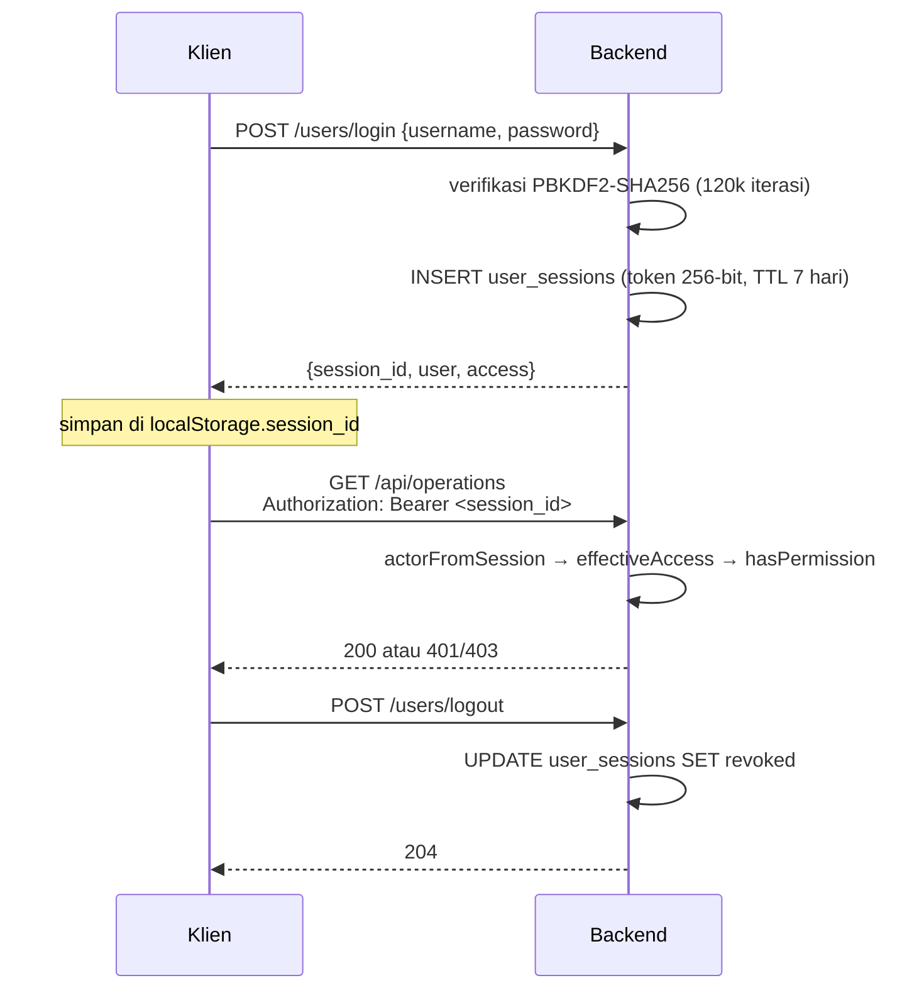
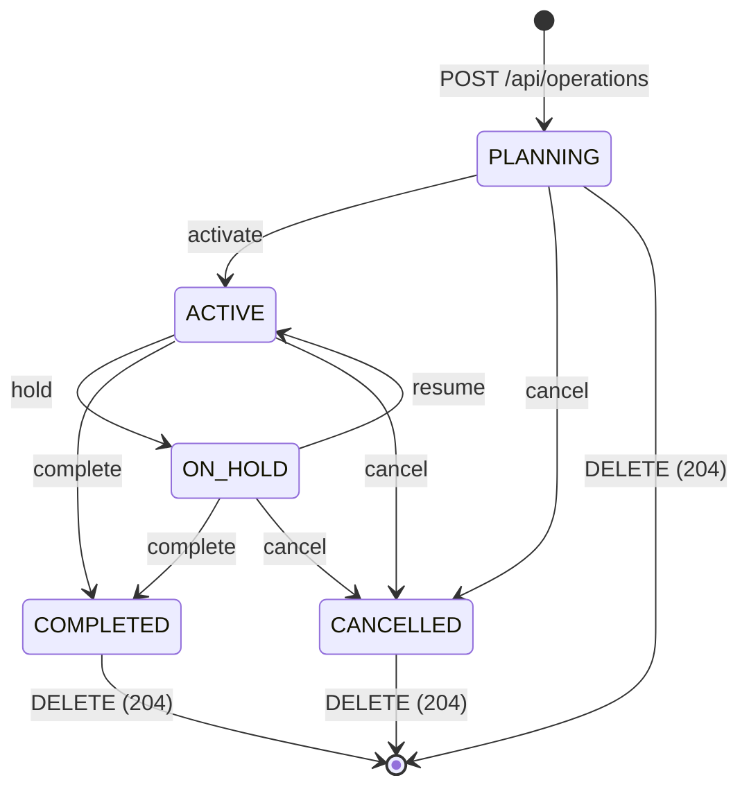
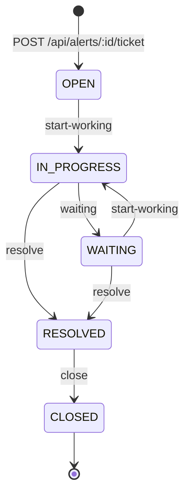

# 04 — API Contract

> SYNAPSE-T · Versi 1.0 · 8 Oktober 2026
> Prasyarat: [03 — TSD](./03-tsd.md)

Kontrak lengkap seluruh endpoint HTTP backend. Total **15 controller / 104 endpoint**.

| Lingkungan | Base URL |
|---|---|
| Lokal | `http://127.0.0.1:8000` |
| Produksi | `https://be-iot-production.up.railway.app` |
| Melalui frontend | `https://<fe-host>/api/...` (lihat §2.4) |

---

## 1. Konvensi

### 1.1 Format

| Aspek | Aturan |
|---|---|
| Content type request | `application/json` (kecuali unggah gambar profil) |
| Content type response | `application/json`, atau `text/csv; charset=utf-8` untuk ekspor |
| Format waktu | String UTC ISO-8601 tanpa milidetik: `YYYY-MM-DDTHH:MM:SSZ` |
| Penamaan field | `snake_case` pada domain telemetri/operasi; `camelCase` pada `audit-logs` |
| Boolean di basis data | Disimpan `0`/`1`, dikembalikan sebagai angka |
| Koordinat | `latitude`/`longitude` derajat desimal; poligon geofence `[lng, lat]` |

### 1.2 Envelope Error

Seluruh error dinormalkan oleh `DetailExceptionFilter`:

```json
{ "detail": "operation not found" }
```

`detail` bisa berupa string atau objek (saat `ValidationPipe` mengembalikan daftar
pesan). Tidak ada pembungkus `{ "error": ... }` di mana pun.

| Status | Arti dalam sistem ini |
|---|---|
| `200` | Sukses (termasuk seluruh aksi `POST` siklus hidup) |
| `201` | Resource dibuat |
| `204` | Sukses tanpa body (hapus) |
| `400` | Input tidak valid (hex rusak, `timeRange` tak dikenal, poligon cacat) |
| `401` | `authentication required` — token sesi tidak ada/kedaluwarsa |
| `403` | `permission denied`, `account is not active`, `account is not verified` |
| `404` | Resource tidak ditemukan |
| `405` | `Method Not Allowed` (hanya `DELETE /audit-logs/:eventId`) |
| `409` | Konflik aturan bisnis (mis. `alert already has a ticket`) |
| `422` | Field wajib tidak ada, timestamp tak terbaca |
| `500` | Error internal — **pesan exception ikut terbawa** (temuan S-8 di dok 07) |

### 1.3 Paginasi

Dua gaya berbeda hidup bersamaan:

| Gaya | Parameter | Field respons | Dipakai oleh |
|---|---|---|---|
| Offset | `limit`, `offset` | `items`, `total`, `limit`, `offset`, `count` | explorer, alerts, history, tickets |
| Halaman | `page`, `limit` | `items`, `total`, `page`, `limit` | users, audit-logs, operations, personnel, groups |

| Endpoint | `limit` default | `limit` maks |
|---|---|---|
| explorer, alerts, history | 50 | 500 |
| tickets | 50 | 100 |
| personnel | 50 | 200 |
| users, audit-logs | 20 | 100 |
| operations | 20 | 100 |

### 1.4 Preset `timeRange`

Domain telemetri (explorer, alerts, history, tickets) hanya mengenal **dua** preset
(`TIME_RANGES` di `src/common/records.ts`):

| Nilai | Alias yang diterima | Arti |
|---|---|---|
| `all` | `alltime` | Tanpa batas bawah waktu |
| `30d` | `30day`, `30days` | 30 hari terakhir |

Nilai lain → `400`. Untuk rentang kustom pakai `from_time` dan `to_time`.

`audit-logs` memakai tabel preset **berbeda dan tidak kompatibel**:
`24h`, `7d`, `30d`, `90d`.

---

## 2. Autentikasi

### 2.1 Alur



### 2.2 Header

| Header | Keterangan |
|---|---|
| `Authorization: Bearer <token>` | Cara utama |
| `X-Session-Id: <token>` | Alternatif yang diterima `sessionToken()` |
| `X-User-Id: <id>` | Dibaca dekorator `XUserId` dan `SessionGuard`, **tetapi guard tidak terdaftar** sehingga tidak berpengaruh |

### 2.3 Matriks Perlindungan

| Domain | Base path | Perlindungan | Izin yang diperiksa |
|---|---|---|---|
| Health | `/health` | Anonim | — |
| OpenAPI | `/openapi.json` | Anonim | — |
| **Ingest** | `/api/ingest` | **Anonim** ⚠️ | — |
| **Explorer** | `/api/explorer` | **Anonim** ⚠️ | — |
| **Geofences** | `/api/geofences` | **Anonim** ⚠️ | — |
| **Users** | `/users` | **Anonim** ⚠️ | — |
| **Roles** | `/roles` | **Anonim** ⚠️ | — |
| **Bindings** | `/user-roles` | **Anonim** ⚠️ | — |
| Alerts | `/api/alerts` | Sesi | `alerts` (baca / tulis) |
| History | `/api/history` | Sesi | `history` |
| Operations | `/api/operations` | Sesi | `operations` (baca / tulis) |
| Personnel | `/api/personnel` | Sesi | `personal` (baca / tulis) |
| Groups | `/api/groups` | Sesi | `groups` (baca / tulis) |
| Tickets | `/api/tickets` | Sesi | `tickets` (baca / tulis) |
| Profile | `/auth/me`, `/users/me` | Sesi | — (hanya diri sendiri) |
| Audit baca | `GET /audit-logs*` | **Anonim** ⚠️ kecuali `/me` | — |
| Audit tulis | `POST /audit-logs` | Sesi | — |

Baris bertanda ⚠️ adalah celah keamanan yang diketahui; rinciannya dan rencana
perbaikan ada di [07 — Security Specification](./07-security-specification.md) §6.

Operasi tulis pada `operations` dan `tickets` menambahkan pemeriksaan kelayakan akun
di luar izin: `identity_type = 'HUMAN'`, `verification = 'VERIFIED'`,
`status = 'ACTIVE'`, dan binding peran aktif. Gagal salah satu → `403`.

### 2.4 Pemetaan Proxy Frontend

| URL frontend | Diteruskan ke backend |
|---|---|
| `/api/explorer/**` | `/api/explorer/**` |
| `/api/alerts/**` | `/api/alerts/**` |
| `/api/history/**` | `/api/history/**` |
| `/api/operations/**` | `/api/operations/**` |
| `/api/users/**` | `/users/**` |
| `/api/roles/**` | `/roles/**` |
| `/api/user-roles/**` | `/user-roles/**` |
| `/api/audit-logs/**` | `/audit-logs/**` |
| `/api/auth/**` | `/auth/**`, `/users/me` |

Perhatikan: path backend untuk identitas **tidak** berawalan `/api`
(`/users`, `/roles`, `/user-roles`, `/audit-logs`), sedangkan domain telemetri
dan operasional berawalan `/api`. Proxy FE menyeragamkannya menjadi `/api/*`.

---

## 3. Health & Meta

### `GET /health`

Anonim. Tidak memerlukan parameter.

```json
{ "status": "ok", "database": "connected", "records": 43215 }
```

### `GET /openapi.json`

Anonim. Mengembalikan dokumen OpenAPI **stub** — bukan spesifikasi lengkap.
Jangan dipakai sebagai sumber kebenaran; gunakan dokumen ini.

---

## 4. Ingest

### `POST /api/ingest` → `200`

Satu-satunya jalur masuk telemetri. Anonim.

**Body**

| Field | Tipe | Wajib | Keterangan |
|---|---|---|---|
| `burst_hex` | string | salah satu | Hex burst; `0x` dan spasi diabaikan |
| `raw_hex` | string | salah satu | Alias `burst_hex` |
| `burst_base64` | string | salah satu | Alternatif base64 |
| `gateway_id` | string | tidak | Disimpan di rekaman UPLINK dan TELEMETRY |
| `burst_id` | string | tidak | Default `burst-<header_hex>-<8 hex acak>` |
| `received_at` | string / number | tidak | Default waktu server |
| `freshness` | string | tidak | Default `"FRESH"` |
| `record_origin` | string | tidak | Default `"INGEST"` |

Panjang burst harus `6 + N × 21` byte dengan `1 ≤ N ≤ 15` (27–321 byte).
Layout byte: lihat [03 — TSD](./03-tsd.md) §3.

**Respons**

```json
{
  "burst": {
    "id": 51233,
    "category": "UPLINK",
    "data_type": "SATELLITE_BURST",
    "raw_format": "SATELLITE_BURST",
    "raw_hex": "0102030405060a00...",
    "data": {
      "burst_id": "burst-010203040506-9f3c21aa",
      "header_hex": "010203040506",
      "soldier_count": 3,
      "payload_size_bytes": 69,
      "gateway_id": "GW-01"
    }
  },
  "burst_id": "burst-010203040506-9f3c21aa",
  "soldier_count": 3,
  "records": [ { "id": 51234, "category": "TELEMETRY", "...": "..." } ]
}
```

**Error**

| Status | Penyebab |
|---|---|
| `400` | Hex tidak valid, panjang bukan `6 + N×21`, `N` di luar 1–15 |
| `422` | Tidak ada field burst, atau timestamp payload tak terbaca |
| `500` | `record was not stored` |

---

## 5. Explorer — `/api/explorer`

Anonim. Lima endpoint.

### `GET /api/explorer`

**Parameter**

| Parameter | Tipe | Keterangan |
|---|---|---|
| `category` | string / list | Default menyingkirkan transport kecuali `include_transport=1` |
| `include_transport` | `1` \| `true` | Sertakan kategori `UPLINK` |
| `data_type` | string / list | mis. `SOLDIER_TELEMETRY` |
| `entity_type`, `entity_id` | string | |
| `soldier_id` | number | |
| `group_id`, `gateway_id` | string | |
| `position_source` | string | `GNSS` \| `DEAD_RECKONING` \| `TRILATERATION` \| `STALE` |
| `transport` | string | mis. `SATELLITE` |
| `freshness` | string | `FRESH` \| `AGING` \| `STALE` |
| `severity` | string | |
| `record_origin` | string | `INGEST` \| `SIMULATED` \| … |
| `raw_format` | string | `PAYLOAD_21` \| `SATELLITE_BURST` |
| `timeRange` | `all` \| `30d` | §1.4 |
| `from_time`, `to_time` | ISO | Rentang kustom |
| `q` | string | Pencarian teks bebas |
| `limit`, `offset` | number | Default 50 / 0, maks 500 |

Parameter list dapat diulang (`?category=A&category=B`) atau dipisah koma.

**Respons**

```json
{
  "items": [
    {
      "id": 51234,
      "category": "TELEMETRY",
      "data_type": "SOLDIER_TELEMETRY",
      "entity_type": "SOLDIER",
      "entity_id": "107",
      "soldier_id": 107,
      "group_id": "Alpha Squad",
      "gateway_id": "GW-01",
      "event_time": "2026-10-08T04:15:00Z",
      "received_at": "2026-10-08T04:15:02Z",
      "position_source": "GNSS",
      "transport": "SATELLITE",
      "freshness": "FRESH",
      "severity": null,
      "record_origin": "SIMULATED",
      "raw_format": "PAYLOAD_21",
      "raw_hex": "6b00a1...",
      "raw_bytes_length": 21,
      "created_at": "2026-10-08T04:15:02Z",
      "data": {
        "soldier_id": 107, "seq": 42, "timestamp": 1791519300,
        "lat": -6.2011234, "lon": 106.8121567,
        "hr": 88, "hrv": 46, "spo2": 97, "temp": 37, "batt": 72,
        "flags": {
          "raw": 32, "sos": false, "casualty": false, "arrhythmia": false,
          "position_source": "GNSS", "strap_connected": true,
          "low_battery": false, "heat_stress": false
        }
      }
    }
  ],
  "limit": 50,
  "offset": 0,
  "count": 1,
  "total": 43200
}
```

Field level atas selalu 19 kolom `PUBLIC_FIELDS` + `data` (hasil `JSON.parse`
dari `data_json`).

### `GET /api/explorer/summary`

Parameter filter sama. Mengembalikan agregat jumlah dan bucket timeline untuk
grafik di halaman Explorer.

### `GET /api/explorer/filters/options`

Tanpa parameter. Mengembalikan nilai distinct nyata dari basis data:

```json
{
  "categories": ["TELEMETRY", "UPLINK"],
  "data_types": ["SOLDIER_TELEMETRY", "SATELLITE_BURST"],
  "entity_types": ["SOLDIER", "GATEWAY"],
  "soldier_ids": [101, 102, "..."],
  "group_ids": [],
  "gateway_ids": ["GW-01"],
  "position_sources": ["GNSS", "DEAD_RECKONING"],
  "transports": ["SATELLITE"],
  "freshnesses": ["FRESH"],
  "record_origins": ["SIMULATED"],
  "raw_formats": ["PAYLOAD_21", "SATELLITE_BURST"],
  "time_ranges": ["all", "30d"]
}
```

> `is_sos` **bukan** opsi filter Explorer — SOS hanya terlihat sebagai flag di dalam
> `data.flags.sos`. Diverifikasi oleh test `is_sos_is_not_an_explorer_business_filter`.

### `GET /api/explorer/export.csv`

Parameter filter sama. Mengembalikan `text/csv` dengan BOM UTF-8 dan 20 kolom
(19 field publik + `data` sebagai JSON terserialisasi).

### `GET /api/explorer/:recordId`

Detail satu rekaman. Bentuknya sama dengan satu elemen `items`, ditambah nama
personel bila master tersedia. `404` bila tidak ada.

---

## 6. Alerts — `/api/alerts`

Butuh sesi + izin `alerts`. Delapan endpoint.

### `GET /api/alerts`

**Parameter**

| Parameter | Keterangan |
|---|---|
| `alert_type` | List: `SOS`, `CASUALTY`, `ARRHYTHMIA`, `LOW_BATTERY`, `HEAT_STRESS`, `STRAP_DISCONNECTED`, `NO_CONTACT` |
| `severity` | List: `CRITICAL`, `WARNING`, `INFO` |
| `status` | `ACTIVE`, `ACKNOWLEDGED`, `RESOLVED`, `CLEARED` |
| `soldier_id`, `group_id`, `gateway_id` | Filter entitas |
| `timeRange`, `from_time`, `to_time` | Waktu (§1.4) |
| `q` | Pencarian teks |
| `limit`, `offset` | Default 50 / 0, maks 500 |

**Respons** — `items[]` berisi 26 field publik:

```json
{
  "items": [
    {
      "id": 912,
      "alert_code": "SOS-107-20261008T041500Z",
      "alert_type": "SOS",
      "severity": "CRITICAL",
      "status": "ACTIVE",
      "entity_type": "SOLDIER",
      "entity_id": "107",
      "soldier_id": 107,
      "group_id": "Alpha Squad",
      "gateway_id": "GW-01",
      "source_record_id": 51234,
      "event_time": "2026-10-08T04:15:00Z",
      "first_seen_at": "2026-10-08T04:15:00Z",
      "last_seen_at": "2026-10-08T04:17:30Z",
      "position_source": "GNSS",
      "latitude": -6.2011234,
      "longitude": 106.8121567,
      "message": "SOS button pressed",
      "acknowledged_at": null,
      "acknowledged_by": null,
      "resolved_at": null,
      "resolved_by": null,
      "derived_from": "FLAGS",
      "record_origin": "SIMULATED",
      "created_at": "2026-10-08T04:15:00Z",
      "updated_at": "2026-10-08T04:17:30Z"
    }
  ],
  "total": 37, "limit": 50, "offset": 0
}
```

### Endpoint Alerts Lainnya

| Method | Path | Izin | Keterangan |
|---|---|---|---|
| `GET` | `/api/alerts/summary` | baca | Hitungan per severity/status + bucket timeline |
| `GET` | `/api/alerts/filters/options` | baca | Nilai distinct + `time_ranges` |
| `GET` | `/api/alerts/export.csv` | baca | CSV, 26 kolom + `details` |
| `GET` | `/api/alerts/sos` | baca | Khusus SOS; parameter `limit`, `offset` |
| `GET` | `/api/alerts/:alertId` | baca | Detail + `details_json` ter-parse; `404` bila tidak ada |
| `POST` | `/api/alerts/:alertId/acknowledge` → `200` | tulis | Body: `{ "note": "..." }` opsional |
| `POST` | `/api/alerts/:alertId/resolve` → `200` | tulis | Body: `{ "note": "..." }` opsional |

Acknowledge menetapkan `status = 'ACKNOWLEDGED'`, `acknowledged_at`, dan
`acknowledged_by` dari sesi — **bukan** dari body. Resolve menetapkan
`status = 'RESOLVED'`, `resolved_at`, `resolved_by`.

Status `CLEARED` **tidak** dapat dibuat lewat API; hanya mesin alert yang
menetapkannya (lihat TSD §5.2).

---

## 7. History — `/api/history`

Butuh sesi + izin `history`. Delapan endpoint. Domain ini hanya membaca kategori
`TELEMETRY`; kategori transport tersedia sebagai override debug.

### Parameter Bersama

| Parameter | Keterangan |
|---|---|
| `scope` | `SOLDIER` (butuh `soldier_id`) atau `GROUP` (butuh `group_id`) |
| `soldier_id` | number |
| `group_id` | string (nama grup) |
| `history_data_type` | List: `TELEMETRY`, `MESH_FRAME`, `UPLINK`, `BEACON`, `SPECIAL`, `SYSTEM` |
| `position_source` | List, memfilter asal koordinat |
| `timeRange`, `from_time`, `to_time` | Waktu (§1.4) |
| `limit`, `offset` | Default 50 / 0, maks 500 |

> `scope` adalah **filter kueri**, bukan kontrol akses. Pemegang izin `history`
> dapat membaca prajurit atau grup mana pun.

### Daftar Endpoint

| Method | Path | Mengembalikan |
|---|---|---|
| `GET` | `/api/history` | Daftar event terpaginasi |
| `GET` | `/api/history/filters/options` | Nilai distinct + `time_ranges` |
| `GET` | `/api/history/summary` | Kartu: `total_distance_km`, `distance_is_derived`, `heart_rate_avg_bpm`, dsb. |
| `GET` | `/api/history/statistics` | Statistik rinci (durasi, kecepatan, cakupan) |
| `GET` | `/api/history/charts` | Seri waktu HR / SpO₂ / suhu untuk recharts |
| `GET` | `/api/history/track` | Titik terurut untuk polyline dan playback |
| `GET` | `/api/history/export.csv` | CSV |
| `GET` | `/api/history/point/:recordId` | Detail satu titik track |

Deduplikasi: `deduped(rows)` menyingkirkan rekaman dengan `event_time` sama agar
jarak tidak dihitung ganda saat satu burst berisi beberapa paket dari prajurit yang
sama. Diverifikasi test `history_reads_explorer_without_double_counting`.

`total_distance_km` selalu disertai `distance_is_derived: true` — jarak dihitung
dari koordinat, bukan dibaca dari perangkat.

---

## 8. Operations — `/api/operations`

Butuh sesi + izin `operations`. Dua puluh endpoint — domain terbesar.

> Catatan implementasi: controller ini memakai `@Body() body: any`. Kelas DTO ada
> di repo tetapi tidak dipasang, sehingga `ValidationPipe` global tidak aktif di
> sini. Validasi dilakukan manual di `OperationsService`.

### 8.1 Pembacaan Koleksi

| Method | Path | Parameter |
|---|---|---|
| `GET` | `/api/operations` | `q`, `status`, `group_id`, `start_from`, `start_to`, `page` (≥1), `limit` (default 20, maks 100) |
| `GET` | `/api/operations/summary` | — |
| `GET` | `/api/operations/filters/options` | — |
| `GET` | `/api/operations/groups/options` | — |
| `GET` | `/api/operations/personnel/options` | `q` (pencarian nama) |

`GET /api/operations` → `{ items, total, page, limit }`. Satu item:

```json
{
  "id": 12,
  "operation_code": "OP-2026-012",
  "name": "Patroli Sektor Timur",
  "description": "Patroli rutin sektor timur",
  "type": "PATROL",
  "status": "ACTIVE",
  "start_at": "2026-10-08T06:00:00Z",
  "end_at": "2026-10-08T18:00:00Z",
  "group_count": 2,
  "personnel_count": 9,
  "geofence_count": 3
}
```

`operation_code` dibuat otomatis oleh `repo.nextCode()` dengan pola
`OP-<tahun>-<urutan 3 digit>` (mis. `OP-2026-012`) dan **tidak dapat dikirim klien**.

`GET /api/operations/personnel/options` mengembalikan kandidat personel dari master
`personnel`. Wizard frontend **menggabungkan** hasil ini dengan pin dari
`GET /api/explorer?category=TELEMETRY` karena tabel `personnel` sering masih kosong
(lihat TSD §7.7).

### 8.2 Siklus Hidup

| Method | Path | Status | Keterangan |
|---|---|---|---|
| `POST` | `/api/operations` | `201` | Membuat operasi + grup + anggota + geofence dalam satu transaksi |
| `GET` | `/api/operations/:operationId` | `200` | Detail lengkap |
| `PATCH` | `/api/operations/:operationId` | `200` | Ubah nama, kode, deskripsi, jadwal |
| `DELETE` | `/api/operations/:operationId` | `204` | Hanya `PLANNING`, `COMPLETED`, `CANCELLED` |
| `POST` | `/api/operations/:operationId/activate` | `200` | → `ACTIVE` |
| `POST` | `/api/operations/:operationId/hold` | `200` | → `ON_HOLD` |
| `POST` | `/api/operations/:operationId/resume` | `200` | `ON_HOLD` → `ACTIVE` |
| `POST` | `/api/operations/:operationId/complete` | `200` | → `COMPLETED` |
| `POST` | `/api/operations/:operationId/cancel` | `200` | → `CANCELLED` |



Menghapus operasi `ACTIVE` atau `ON_HOLD` → `409`
(test `delete_rules_allow_completed_and_reject_active`).

### 8.3 Body `POST /api/operations`

Hanya tujuh field level atas yang diterima. Field lain → `422 unexpected fields: ...`.

```json
{
  "name": "Patroli Sektor Timur",
  "description": "Patroli rutin sektor timur",
  "type": "PATROL",
  "start_at": "2026-10-08T06:00:00Z",
  "end_at": "2026-10-08T18:00:00Z",
  "group_ids": [7],
  "groups": [
    {
      "name": "Alpha Squad",
      "description": "Regu utama",
      "leader_soldier_id": 101,
      "member_soldier_ids": [101, 102, 103]
    }
  ],
  "geofence_ids": [19],
  "new_geofences": [
    {
      "name": "Zona Larangan A",
      "kind": "restricted",
      "color": "#ef4444",
      "polygon": [
        [106.8121, -6.2011],
        [106.8142, -6.2009],
        [106.8139, -6.2031]
      ]
    }
  ]
}
```

| Field | Wajib | Batasan |
|---|---|---|
| `name` | **Ya** | Maks 160 karakter |
| `description` | Tidak | Maks 2.000 karakter |
| `type` | Tidak | String bebas |
| `start_at` | **Ya** | ISO; `422` bila tidak terbaca |
| `end_at` | **Ya** | Harus **setelah** `start_at`, jika tidak → `422 end_at must be after start_at` |
| `group_ids[]` | Tidak | ID grup yang sudah ada; `404` bila tidak ditemukan |
| `groups[]` | Tidak | Grup baru dibuat inline |
| `geofence_ids[]` | Tidak | ID geofence yang sudah ada |
| `new_geofences[]` | Tidak | Geofence baru dibuat inline |

**`groups[]` (grup inline)**

| Field | Wajib | Catatan |
|---|---|---|
| `name` | Ya | Nama grup unik; duplikat → `409 group already exists` |
| `member_soldier_ids[]` | **Ya** | Tidak boleh kosong → `422 member_soldier_ids is required`; duplikat dibuang |
| `leader_soldier_id` | Tidak | DANRU; otomatis ditambahkan ke anggota bila belum ada |
| `description` | Tidak | |

**`new_geofences[]` (geofence inline)**

| Field | Wajib | Catatan |
|---|---|---|
| `name` | Ya | |
| `polygon` | Ya (atau `geometry_json`) | **`[lng, lat]`**, minimum 3 titik → `422 polygon must have at least 3 corners` |
| `geometry_json` | Alternatif `polygon` | GeoJSON `Polygon`; titik penutup duplikat dibuang; selain Polygon → `422` |
| `kind` | Tidak | `restricted` \| `safe` \| `recon` |
| `color` | Tidak | Hex warna |
| `area_km2` | Tidak | Dihitung otomatis dari poligon bila tidak dikirim |
| `description` | Tidak | |

Bila `polygon` maupun `geometry_json` tidak ada → `422 polygon or geometry_json is required`.

Operasi baru selalu lahir dengan `status = 'PLANNING'`. Seluruh pembuatan grup,
geofence, dan penautan dibungkus **satu transaksi SQLite** — bila satu bagian
gagal, tidak ada yang tersimpan (test
`wizard_creates_groups_and_geofences_in_one_transaction`). Respons adalah payload
detail operasi yang sama dengan `GET /api/operations/:operationId`.

**`PATCH /api/operations/:operationId`** menerima subset: `name`, `description`,
`start_at`, `end_at`, `type`, `group_ids`, `geofence_ids`. Field lain → `422`.
Body kosong juga ditolak. Mengubah salah satu dari `start_at`/`end_at` memicu
validasi ulang jendela waktu.

### 8.4 Tautan Grup & Geofence

Setiap endpoint di bawah menambahkan atau melepas **satu** grup/geofence dan
mengembalikan payload detail operasi yang sudah diperbarui.

| Method | Path | Status | Body |
|---|---|---|---|
| `GET` | `/api/operations/:operationId/groups` | `200` | — → `{ items: [...] }` |
| `POST` | `/api/operations/:operationId/groups` | `200` | `{ "group_id": 7 }` **atau** payload grup inline (`name` + `member_soldier_ids`) |
| `DELETE` | `/api/operations/:operationId/groups/:groupId` | `200` | — |
| `POST` | `/api/operations/:operationId/geofences` | `200` | `{ "geofence_id": 19 }` **atau** payload geofence inline (`name` + `polygon`) |
| `DELETE` | `/api/operations/:operationId/geofences/:geofenceId` | `200` | — |

| Kondisi | Hasil |
|---|---|
| Tidak ada `group_id` dan bukan payload grup valid | `422 group_id or new group payload required` |
| `group_id` tidak ada di basis data | `404 group not found` |
| Grup sudah tertaut ke operasi ini | `409 group is already assigned` |
| Melepas grup yang tidak tertaut | `404 group is not assigned` |
| Melepas geofence yang tidak tertaut | `404 geofence is not assigned` |

Efek samping yang perlu diketahui: saat sebuah grup dilepas dan **tidak lagi
dipakai operasi mana pun**, grup tersebut otomatis di-nonaktifkan
(`retireGroup`) agar tidak muncul sebagai pilihan menggantung di picker.

### 8.5 Pembacaan Terkait

| Method | Path | Mengembalikan |
|---|---|---|
| `GET` | `/api/operations/:operationId/personnel` | Daftar anggota beserta grup dan penanda DANRU |
| `GET` | `/api/operations/:operationId/map` | Payload peta: posisi terakhir + geofence |
| `GET` | `/api/operations/:operationId/alerts` | Alert yang terkait grup operasi |
| `GET` | `/api/operations/:operationId/tickets` | Tiket dari alert operasi tersebut |

`GET /api/operations/:operationId/map`:

```json
{
  "operation": { "id": 12, "name": "Patroli Sektor Timur" },
  "groups": [ { "id": 7, "name": "Alpha Squad", "leader_soldier_id": 101, "member_count": 3 } ],
  "personnel": [ { "soldier_id": 101, "name": "Soldier 101", "group_name": "Alpha Squad" } ],
  "positions": [
    { "soldier_id": 101, "name": "Soldier 101", "group_name": "Alpha Squad",
      "latitude": -6.2011, "longitude": 106.8121,
      "event_time": "2026-10-08T04:15:00Z" }
  ],
  "geofences": [
    { "id": 31, "name": "Zona Larangan A", "kind": "restricted",
      "color": "#ef4444",
      "polygon": [[106.8121, -6.2011], [106.8142, -6.2009], [106.8139, -6.2031]] }
  ]
}
```

`positions[]` adalah `personnel[]` yang diperkaya posisi terakhir dari
`explorer_records`. Prajurit tanpa telemetri tetap muncul dengan
`latitude`/`longitude`/`event_time` bernilai `null`.

`GET /api/operations/:operationId/alerts` → `{ items: [{ id, type, severity,
soldier_id, group_id, status, event_time }] }`.

`polygon` dikembalikan oleh `parseStoredPolygon()` yang toleran terhadap beberapa
bentuk tersimpan dan mengembalikan `[]` bila rusak — **tidak melempar error**.
Frontend mengabaikan zona dengan `< 3` titik dan menampilkan penanda
`· polygon missing` di tab Geofences.

---

## 9. Personnel & Groups

Butuh sesi. Izin `groups` untuk `/api/groups`, `personal` untuk `/api/personnel`.

| Method | Path | Status | Izin | Keterangan |
|---|---|---|---|---|
| `GET` | `/api/groups` | `200` | `groups.read` | Daftar grup |
| `POST` | `/api/groups` | `201` | `groups` | `{ name, description?, status? }` |
| `GET` | `/api/groups/:groupId` | `200` | `groups.read` | Detail + anggota |
| `PATCH` | `/api/groups/:groupId` | `200` | `groups` | Ubah nama/deskripsi/status |
| `GET` | `/api/personnel` | `200` | `personal.read` | Lihat parameter di bawah |
| `GET` | `/api/personnel/:personnelId` | `200` | `personal.read` | Detail |
| `POST` | `/api/personnel` | `201` | `personal` | `{ soldier_id, name, rank?, ... }` |
| `PATCH` | `/api/personnel/:personnelId` | `200` | `personal` | Perbarui field |
| `PUT` | `/api/personnel/by-soldier/:soldierId/group` | `200` | `personal` + `groups` | Tetapkan grup berdasarkan `soldier_id` |

**Parameter `GET /api/personnel`**

| Parameter | Keterangan |
|---|---|
| `status` | Filter status |
| `group_id` | ID grup; nilai literal `"null"` = belum punya grup |
| `unassigned` | `1` \| `true` — sama dengan `group_id=null` |
| `q` | Pencarian nama |
| `page`, `limit` | Default 1 / 50, maks 200 |

`status` grup: `ACTIVE` \| `INACTIVE`. Grup **tidak di-seed** — daftar mulai kosong
sampai dibuat lewat wizard operasi atau API (test
`does_not_seed_groups_settings_start_empty`).

`PUT /api/personnel/by-soldier/:soldierId/group` adalah jalur yang memperkaya
telemetri: setelah personel terikat ke grup, rekaman berikutnya mengisi `group_id`.
Rekaman yang sudah tersimpan **tidak** diperbarui mundur.

---

## 10. Geofences Mandiri — `/api/geofences`

**Anonim.** Tiga endpoint. Tidak dipakai frontend — UI mengelola geofence melalui
`/api/operations`.

| Method | Path | Status | Keterangan |
|---|---|---|---|
| `GET` | `/api/geofences` | `200` | Semua geofence |
| `POST` | `/api/geofences` | `201` | `{ name, kind?, color?, polygon }` — `polygon` `[lng, lat]` |
| `DELETE` | `/api/geofences/:geofenceId` | `204` | Hapus |

---

## 11. Tickets

Butuh sesi + izin `tickets`. Tujuh belas endpoint.

### 11.1 Pembuatan

| Method | Path | Status | Keterangan |
|---|---|---|---|
| `POST` | `/api/alerts/:alertId/ticket` | `201` | **Satu-satunya jalur normal** |
| `POST` | `/api/tickets` | `200` | Jalur alternatif; tetap butuh alert sumber |

Aturan `POST /api/alerts/:alertId/ticket`:

| Kondisi | Hasil |
|---|---|
| Alert tidak ada | `404 alert not found` |
| Alert `RESOLVED` atau `CLEARED` | `409 alert is already closed` |
| Alert sudah punya tiket | `409 alert already has a ticket` |
| Izin `tickets` tulis tidak ada | `403 permission denied` |

Prioritas diturunkan dari severity alert:

| Severity alert | Prioritas tiket |
|---|---|
| `CRITICAL` | `CRITICAL` |
| `WARNING` | `HIGH` |
| `INFO` | `LOW` |
| `HIGH` / `MEDIUM` / `LOW` | sama |

### 11.2 Pembacaan

| Method | Path | Parameter |
|---|---|---|
| `GET` | `/api/tickets` | `q`, `status[]`, `priority[]`, `alert_type[]`, `group_id[]`, `from_time`, `to_time`, `timeRange`, `limit` (maks 100), `offset` |
| `GET` | `/api/tickets/summary` | `timeRange` |
| `GET` | `/api/tickets/filters/options` | — |
| `GET` | `/api/tickets/:ticketId` | — |

**Visibilitas.** `superadmin` melihat semua. Pengguna lain hanya melihat tiket yang
`created_by = saya`, `assignee_id = saya`, atau tempat saya terdaftar di
`ticket_collaborators` (test `ticket_visibility_follows_the_current_user`).

### 11.3 Siklus Hidup dan Kolaborasi

| Method | Path | Status | Keterangan |
|---|---|---|---|
| `PATCH` | `/api/tickets/:ticketId` | `200` | Ubah `response_plan`, prioritas |
| `POST` | `/api/tickets/:ticketId/assign` | `200` | `{ "assignee_id": 5 }` |
| `POST` | `/api/tickets/:ticketId/start-working` | `200` | → `IN_PROGRESS`, set `started_at` |
| `POST` | `/api/tickets/:ticketId/waiting` | `200` | → `WAITING` |
| `POST` | `/api/tickets/:ticketId/resolve` | `200` | → `RESOLVED`, set `resolved_at` |
| `POST` | `/api/tickets/:ticketId/close` | `200` | → `CLOSED`, set `closed_at` |
| `POST` | `/api/tickets/:ticketId/collaborators` | `200` | `{ "user_id": 9 }` |
| `DELETE` | `/api/tickets/:ticketId/collaborators/:userId` | `200` | Lepas kolaborator |
| `POST` | `/api/tickets/:ticketId/tasks` | `201` | `{ title, priority?, assignee_id? }` |
| `PATCH` | `/api/tickets/:ticketId/tasks/:taskId` | `200` | Status: `TODO` \| `IN_PROGRESS` \| `DONE` |
| `POST` | `/api/tickets/:ticketId/updates` | `201` | `{ body }` — catatan kronologis |



Semua aksi tulis memerlukan akun `HUMAN`, `VERIFIED`, `ACTIVE`, dan binding peran
aktif; jika tidak → `403`.

---

## 12. Users — `/users`

**Anonim** ⚠️. Tujuh endpoint.

| Method | Path | Status | Keterangan |
|---|---|---|---|
| `GET` | `/users` | `200` | Daftar identitas |
| `GET` | `/users/summary` | `200` | Hitungan agregat |
| `POST` | `/users/human` | `201` | Buat identitas manusia |
| `POST` | `/users/login` | `200` | Autentikasi |
| `POST` | `/users/logout` | `204` | Cabut sesi |
| `GET` | `/users/:userId/permissions` | `200` | Izin efektif |
| `PATCH` | `/users/:userId/human` | `200` | Perbarui identitas |

**Parameter `GET /users`**

| Parameter | Nilai valid |
|---|---|
| `identity_type` | `HUMAN`, `SERVICE` |
| `status` | `INACTIVE`, `ACTIVE`, `SUSPENDED`, `DISABLED` |
| `verification` | `PENDING`, `VERIFIED` |
| `access_binding` | `BOUND`, `NO_BINDING` |
| `q` | Pencarian nama/username/email |
| `page`, `limit` | Default 1 / 20, maks 100 |

Nilai di luar daftar → `400`.

**`POST /users/human`** — body: `name` dan `username` wajib (`422` bila kosong),
`email` dinormalkan ke huruf kecil, plus `password`, `rank`, `phone` opsional.

**`POST /users/login`**

```json
{ "username": "superadmin", "password": "••••••" }
```

```json
{
  "session_id": "qK8v...base64url 43 karakter",
  "user": { "id": 1, "name": "Super Admin", "username": "superadmin",
            "identity_type": "HUMAN", "status": "ACTIVE", "verification": "VERIFIED" },
  "access": { "role": "superadmin", "permissions": ["overview", "operations", "..."] }
}
```

| Status | Penyebab |
|---|---|
| `401` | Username tidak ada atau password salah |
| `403` | Akun tidak `ACTIVE`, atau binding peran tidak aktif |

Token adalah string acak 256-bit base64url yang disimpan di `user_sessions` dengan
TTL 7 hari absolut. Frontend menyimpannya di `localStorage.session_id`.

**`POST /users/logout`** — memerlukan token di header; menandai sesi tercabut.

---

## 13. Roles — `/roles`

**Anonim** ⚠️. Enam endpoint.

| Method | Path | Status | Keterangan |
|---|---|---|---|
| `GET` | `/roles` | `200` | Katalog peran |
| `GET` | `/roles/summary` | `200` | Hitungan peran dan binding |
| `POST` | `/roles` | `201` | Buat peran kustom |
| `GET` | `/roles/:roleId/detail` | `200` | Peran + daftar izin |
| `PUT` | `/roles/:roleId` | `200` | Perbarui — `403` bila `is_protected` |
| `DELETE` | `/roles/:roleId` | `204` | Hapus — `403` bila `is_protected` |

Enam peran seeded berstatus `is_system = 1` dan `is_protected = 1`, sehingga
`PUT` dan `DELETE` padanya selalu ditolak.

> Keterbatasan: tidak ada endpoint untuk **menetapkan izin** sebuah peran.
> Fungsi `replaceRolePermissions()` ada di `src/database/access.ts` tetapi tidak
> dipanggil controller mana pun, sehingga peran kustom yang dibuat lewat
> `POST /roles` lahir tanpa izin apa pun (TD-7).

---

## 14. User-Role Bindings — `/user-roles`

**Anonim** ⚠️. Tiga endpoint.

| Method | Path | Status | Keterangan |
|---|---|---|---|
| `GET` | `/user-roles` | `200` | Parameter `user_id` opsional |
| `POST` | `/user-roles` | `201` | `{ "user_id": 5, "role_id": 3 }` |
| `PATCH` | `/user-roles/:bindingId/status` | `200` | `{ "status": "ACTIVE" \| "SUSPENDED" \| "REVOKED" }` |

Tabel memiliki `UNIQUE(user_id)` — satu pengguna hanya bisa punya satu binding.
`POST` kedua untuk pengguna yang sama akan gagal pada batasan unik.

---

## 15. Profile

Butuh sesi. Empat endpoint. Hanya bekerja pada pengguna pemilik token.

| Method | Path | Status | Keterangan |
|---|---|---|---|
| `GET` | `/auth/me` | `200` | Profil + peran + izin efektif |
| `PATCH` | `/users/me` | `200` | Hanya `name`, `email`, `profile_image` |
| `GET` | `/users/me/profile-image` | `200` | Binary gambar |
| `DELETE` | `/users/me/profile-image` | `204` | Hapus gambar |

`GET /auth/me`:

```json
{
  "id": 1,
  "name": "Super Admin",
  "username": "superadmin",
  "email": "admin@example.com",
  "identity_type": "HUMAN",
  "status": "ACTIVE",
  "verification": "VERIFIED",
  "has_profile_image": true,
  "access": { "role": "superadmin", "permissions": ["..."] }
}
```

`PATCH /users/me` secara sengaja **mengabaikan** `role`, `status`, `verification`,
dan `identity_type` meski dikirim — eskalasi hak lewat profil tidak mungkin
(test `profile_updates_name_email_and_image_only`).

Unggah gambar menerima `multipart/form-data` maupun data URL base64 di body JSON;
`profile.controller.ts` memeriksa `content-type` untuk memilih jalur.

---

## 16. Audit Logs — `/audit-logs`

Delapan endpoint. Pembacaan **anonim** ⚠️ kecuali `/me`; penulisan butuh sesi.
Domain ini memakai `camelCase`, berbeda dari domain lain.

| Method | Path | Status | Perlindungan |
|---|---|---|---|
| `GET` | `/audit-logs` | `200` | Anonim ⚠️ |
| `GET` | `/audit-logs/summary` | `200` | Anonim ⚠️ |
| `GET` | `/audit-logs/categories` | `200` | Anonim ⚠️ |
| `GET` | `/audit-logs/export` | `200` | Anonim ⚠️ |
| `GET` | `/audit-logs/me` | `200` | **Sesi** |
| `POST` | `/audit-logs` | `201` | **Sesi** |
| `GET` | `/audit-logs/:eventId` | `200` | Anonim ⚠️ |
| `DELETE` | `/audit-logs/:eventId` | `405` | Selalu ditolak |

### Parameter `GET /audit-logs`

| Parameter | Keterangan |
|---|---|
| `timeRange` | `24h`, `7d`, `30d`, `90d` — nilai lain `400 unknown timeRange` |
| `from_time`, `to_time` | Rentang kustom |
| `action` | Dinormalkan huruf besar + `_`; harus ada di kosakata `ACTIONS` |
| `category` | Dinormalkan; harus ada di `CATEGORIES` (13 nilai) |
| `outcome` | `SUCCESS`, `FAILED`, `DENIED` |
| `actor` | Pencarian sebagian nama aktor |
| `resource` | Dinormalkan huruf besar + `_` |
| `ip` | Pencocokan tepat |
| `userId` | number |
| `search` | Teks bebas |
| `page`, `limit` | Default 1 / 20, maks 100 |

### Respons

```json
{
  "items": [
    {
      "eventId": "evt_01HQ...",
      "timestamp": "2026-10-08T04:15:00Z",
      "actor": { "id": 1, "name": "Super Admin", "role": "Superadmin", "type": "USER" },
      "category": "OPERATIONS",
      "action": "ACTIVATE_OPERATION",
      "target": { "type": "OPERATION", "id": "12", "name": "Patroli Sektor Timur" },
      "outcome": "SUCCESS",
      "description": "Operation activated",
      "ipAddress": "10.0.0.4",
      "userAgent": "Mozilla/5.0 ...",
      "sessionId": "qK8v...",
      "metadata": {}
    }
  ],
  "total": 1284, "page": 1, "limit": 20
}
```

> **Peringatan keamanan.** Field `sessionId` berisi token sesi dalam bentuk
> plaintext, dan endpoint ini dapat diakses tanpa autentikasi. Siapa pun yang dapat
> memanggil `GET /audit-logs` bisa memanen token sesi aktif dan menyamar sebagai
> pengguna mana pun. Temuan S-9 di [07](./07-security-specification.md) —
> prioritas P0.

`GET /audit-logs/summary` mengembalikan `total_activities`, `user_actions`,
`system_actions`, `failed_actions` (menghitung `FAILED` dan `DENIED`).

`GET /audit-logs/export` menghasilkan CSV 8 kolom dengan BOM UTF-8:
`Event ID, Timestamp, Actor, Role, Category, Action, Target, Outcome`.

`POST /audit-logs` memungkinkan frontend mencatat aksi sisi-klien. Aktor **selalu**
diambil dari sesi, bukan dari body — bahkan bila body mengirim `actor`
(test `activity_log_records_user_access_without_trusting_actor`).

---

## 17. Ringkasan Endpoint

| Domain | Jumlah | Tanpa autentikasi | Perlindungan |
|---|---|---|---|
| Health + OpenAPI | 2 | 2 | Anonim (wajar) |
| Ingest | 1 | 1 ⚠️ | — |
| Explorer | 5 | 5 ⚠️ | — |
| Alerts | 8 | 0 | Sesi + `alerts` |
| History | 8 | 0 | Sesi + `history` |
| Operations | 23 | 0 | Sesi + `operations` |
| Personnel + Groups | 9 | 0 | Sesi + `personal` / `groups` |
| Geofences | 3 | 3 ⚠️ | — |
| Tickets | 17 | 0 | Sesi + `tickets` |
| Users | 7 | 7 ⚠️ | — |
| Roles | 6 | 6 ⚠️ | — |
| Bindings | 3 | 3 ⚠️ | — |
| Profile | 4 | 0 | Sesi |
| Audit | 8 | 6 ⚠️ | Campuran |
| **Total** | **104** | **33** | |

Dari 104 endpoint, **33 dapat diakses tanpa autentikasi**. Dua di antaranya
(`/health`, `/openapi.json`) memang seharusnya publik; **31 sisanya tidak** —
termasuk seluruh pengelolaan identitas, peran, dan binding, sehingga siapa pun
yang dapat menjangkau backend bisa membuat akun dan memberinya peran `superadmin`.
Ini temuan keamanan paling serius pada sistem; lihat
[07 — Security Specification](./07-security-specification.md).
