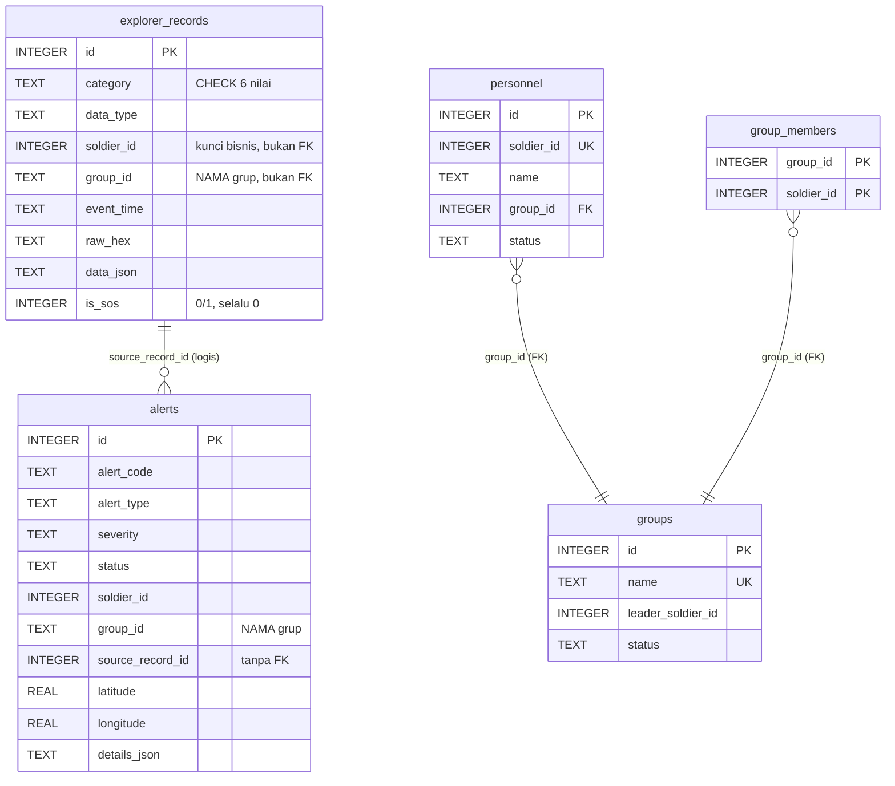
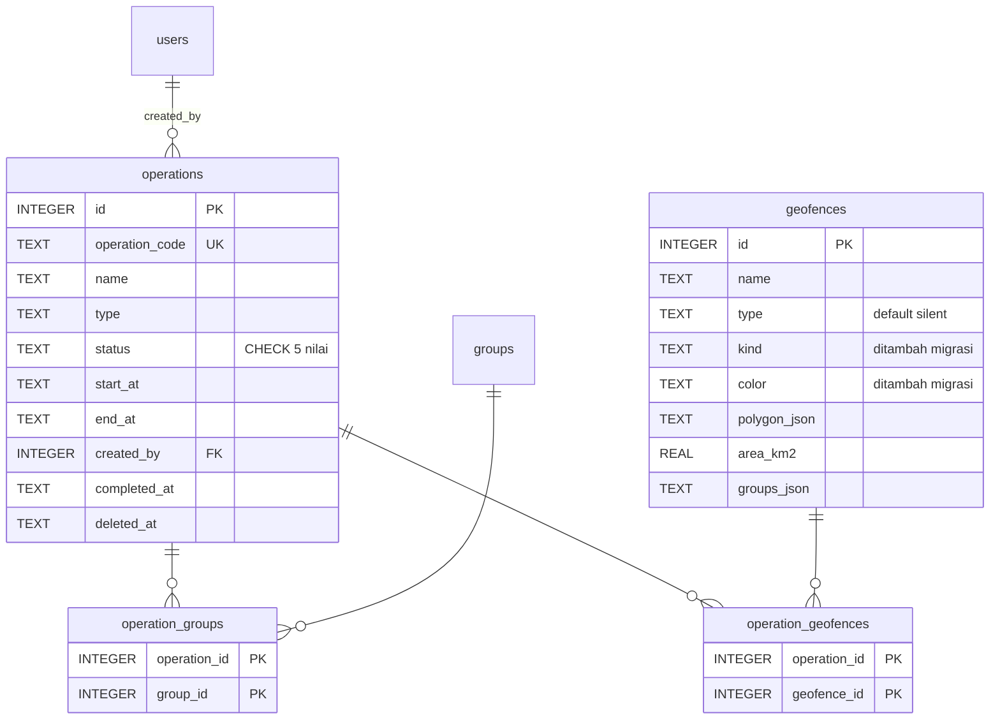

# 05 ? ERD & Database Specification

> SYNAPSE-T · Versi 1.0 · 8 Oktober 2026
> Prasyarat: [03 ? TSD](./03-tsd.md)

Spesifikasi lengkap basis data: 21 tabel, kolom, batasan, relasi, index, migrasi
startup, seed, dan retensi.

---

## 1. Informasi Umum

| Atribut | Nilai |
|---|---|
| Mesin | SQLite 3 melalui `better-sqlite3` 12.11.1 |
| Mode akses | Sinkron, satu proses, `timeout: 5000` ms |
| Pragma | `foreign_keys = ON` |
| Jumlah tabel | **21** (20 dari `initDb()` + `app_meta` dari `retention.ts`) |
| Jumlah index eksplisit | 10 |
| Sumber kebenaran skema | `src/database/database.service.ts` ? `initDb()` |
| Tipe waktu | `TEXT` berisi `YYYY-MM-DDTHH:MM:SSZ` (UTC) |
| Tipe boolean | `INTEGER` 0/1 |
| Tipe JSON | `TEXT` berisi JSON terserialisasi (`*_json`) |

### 1.1 Resolusi Lokasi Berkas

| Prioritas | Sumber | Contoh |
|---|---|---|
| 1 | `process.env.TRACKFORGE_DB` | `data/seed-validate.db` (test) |
| 2 | `$RAILWAY_VOLUME_MOUNT_PATH/trackforge.db` | `/data/trackforge.db` (produksi) |
| 3 | `<cwd>/data/trackforge.db` | pengembangan lokal |

Direktori induk dibuat dengan `mkdirSync({ recursive: true })` karena SQLite tidak
dapat membuat folder yang belum ada.

### 1.2 TypeORM

Berkas di `src/database/entities/` adalah **stub**. `synchronize` bernilai `false`
dan tidak ada migrasi TypeORM. Mengubah entity **tidak** mengubah skema. Seluruh
DDL ditulis sebagai SQL mentah di `initDb()`.

---

## 2. Entity Relationship Diagram

### 2.1 Domain Telemetri



### 2.2 Domain Operasi



### 2.3 Domain Tiket

```mermaid
erDiagram
    alerts ||--o| tickets : "source_alert_id UNIQUE"
    tickets ||--o{ ticket_collaborators : ""
    tickets ||--o{ ticket_tasks : ""
    tickets ||--o{ ticket_updates : ""
    users ||--o{ tickets : "created_by / assignee_id"
    users ||--o{ ticket_collaborators : ""
    users ||--o{ ticket_tasks : "assignee_id"
    users ||--o{ ticket_updates : "author_id"

    tickets {
        INTEGER id PK
        TEXT ticket_code UK
        INTEGER source_alert_id FK_UK
        TEXT status "CHECK 5 nilai"
        TEXT priority "CHECK 4 nilai"
        INTEGER created_by FK
        INTEGER assignee_id FK
        TEXT response_plan
    }
    ticket_collaborators {
        INTEGER ticket_id PK
        INTEGER user_id PK
        INTEGER added_by FK
    }
    ticket_tasks {
        INTEGER id PK
        INTEGER ticket_id FK
        TEXT title
        TEXT priority "CHECK 4 nilai"
        TEXT status "TODO IN_PROGRESS DONE"
    }
    ticket_updates {
        INTEGER id PK
        INTEGER ticket_id FK
        INTEGER author_id FK
        TEXT message
    }
```

### 2.4 Domain Akses & Audit

```mermaid
erDiagram
    users ||--o| user_role_bindings : "UNIQUE(user_id)"
    roles ||--o{ user_role_bindings : ""
    roles ||--o{ role_permissions : ""
    permissions ||--o{ role_permissions : ""
    users ||--o{ user_sessions : ""
    users ||--o{ audit_logs : "actor_id (tanpa FK)"

    users {
        INTEGER id PK
        TEXT identity_type "HUMAN SERVICE"
        TEXT name
        TEXT username UK
        TEXT email UK
        TEXT password_hash
        TEXT verification "PENDING VERIFIED"
        TEXT status "4 nilai"
        BLOB profile_image
        TEXT deleted_at
    }
    roles {
        INTEGER id PK
        TEXT name UK
        TEXT duty_category
        INTEGER is_system
        INTEGER is_protected
    }
    permissions {
        INTEGER id PK
        TEXT code UK
        TEXT domain
        TEXT action_type "READ ALL_ACTIONS"
    }
    role_permissions {
        INTEGER role_id PK
        INTEGER permission_id PK
    }
    user_role_bindings {
        INTEGER id PK
        INTEGER user_id FK_UK
        INTEGER role_id FK
        TEXT status "ACTIVE SUSPENDED REVOKED"
        TEXT valid_from
        TEXT valid_until
    }
    user_sessions {
        TEXT id PK "token"
        INTEGER user_id FK
        TEXT created_at
        TEXT expires_at
    }
    audit_logs {
        INTEGER id PK
        TEXT event_id UK
        TEXT timestamp
        INTEGER actor_id
        TEXT category
        TEXT action
        TEXT outcome
        TEXT session_id "PLAINTEXT - temuan S-9"
        TEXT metadata_json
    }
```

---

## 3. Spesifikasi Tabel

### 3.1 `explorer_records` ? Rekaman Telemetri Mentah

Tabel paling padat. Satu baris = satu paket (atau satu burst transport).

| Kolom | Tipe | Null | Default | Keterangan |
|---|---|---|---|---|
| `id` | INTEGER | ? | AUTOINCREMENT | PK |
| `category` | TEXT | Tidak | ? | CHECK: `TELEMETRY`, `MESH`, `UPLINK`, `BEACON`, `SPECIAL`, `SYSTEM` |
| `data_type` | TEXT | Tidak | ? | `SOLDIER_TELEMETRY`, `SATELLITE_BURST` |
| `entity_type` | TEXT | Ya | ? | `SOLDIER`, `GATEWAY` |
| `entity_id` | TEXT | Ya | ? | Nilai string dari `soldier_id` atau `gateway_id` |
| `soldier_id` | INTEGER | Ya | ? | **Kunci bisnis**, bukan FK ke `personnel` |
| `group_id` | TEXT | Ya | ? | **Nama** grup, bukan FK; `null` bila master belum ada |
| `gateway_id` | TEXT | Ya | ? | |
| `beacon_id` | TEXT | Ya | ? | Tidak pernah ditulis |
| `event_time` | TEXT | Tidak | ? | Waktu kejadian di perangkat (UTC) |
| `received_at` | TEXT | Tidak | ? | Waktu diterima server (UTC) |
| `position_source` | TEXT | Ya | ? | `GNSS`, `DEAD_RECKONING`, `TRILATERATION`, `STALE` |
| `transport` | TEXT | Ya | ? | `SATELLITE` |
| `freshness` | TEXT | Ya | ? | `FRESH`, `AGING`, `STALE` |
| `severity` | TEXT | Ya | ? | Selalu `null` pada jalur ingest |
| `record_origin` | TEXT | Ya | ? | `INGEST`, `SIMULATED` |
| `raw_format` | TEXT | Ya | ? | `PAYLOAD_21`, `SATELLITE_BURST` |
| `raw_hex` | TEXT | Ya | ? | Byte asli ? bukti forensik |
| `raw_bytes_length` | INTEGER | Ya | ? | 21 untuk payload, 6+N×21 untuk burst |
| `data_json` | TEXT | Tidak | ? | Payload terdekode, termasuk objek `flags` |
| `is_sos` | INTEGER | Tidak | `0` | CHECK (0,1) ? **tidak pernah di-set ke 1** |
| `created_at` | TEXT | Tidak | ? | |

**Index**

| Nama | Kolom |
|---|---|
| `idx_explorer_list` | `(is_sos, event_time, id)` |
| `idx_explorer_category` | `(is_sos, category, data_type)` |

**Isi `data_json` untuk `SOLDIER_TELEMETRY`**

```json
{
  "soldier_id": 107, "seq": 42, "timestamp": 1791519300,
  "lat": -6.2011234, "lon": 106.8121567,
  "hr": 88, "hrv": 46, "spo2": 97, "temp": 37, "batt": 72,
  "flags": {
    "raw": 32, "sos": false, "casualty": false, "arrhythmia": false,
    "position_source": "GNSS", "strap_connected": true,
    "low_battery": false, "heat_stress": false
  },
  "burst_id": "burst-010203040506-9f3c21aa",
  "burst_record_id": 51233,
  "burst_index": 0,
  "vital": "TANPA VITAL"
}
```

Kunci `vital` hanya ada ketika `flags.strap_connected === false`.

### 3.2 `alerts` ? Insiden

| Kolom | Tipe | Null | Keterangan |
|---|---|---|---|
| `id` | INTEGER | ? | PK AUTOINCREMENT |
| `alert_code` | TEXT | Tidak | `<TYPE>-<soldier_id>-<event_time tanpa pemisah>`; **tidak unik** |
| `alert_type` | TEXT | Tidak | 7 nilai (§4.2) ? tanpa CHECK |
| `severity` | TEXT | Tidak | `CRITICAL`, `WARNING`, `INFO` ? tanpa CHECK |
| `status` | TEXT | Tidak | `ACTIVE`, `ACKNOWLEDGED`, `RESOLVED`, `CLEARED` ? tanpa CHECK |
| `entity_type` | TEXT | Tidak | Selalu `SOLDIER` |
| `entity_id` | TEXT | Tidak | `soldier_id` sebagai string |
| `soldier_id` | INTEGER | Ya | |
| `group_id` | TEXT | Ya | Nama grup |
| `gateway_id` | TEXT | Ya | |
| `source_record_id` | INTEGER | Ya | Menunjuk `explorer_records.id` ? **tanpa FK** |
| `event_time` | TEXT | Tidak | Untuk `NO_CONTACT` = waktu terdeteksi, bukan waktu sekarang |
| `first_seen_at` | TEXT | Tidak | Tidak berubah |
| `last_seen_at` | TEXT | Tidak | Diperbarui setiap kondisi masih aktif |
| `position_source` | TEXT | Ya | |
| `latitude` | REAL | Ya | |
| `longitude` | REAL | Ya | |
| `message` | TEXT | Tidak | Teks tetap per jenis alert |
| `acknowledged_at` / `acknowledged_by` | TEXT | Ya | Aktor dari sesi |
| `resolved_at` / `resolved_by` | TEXT | Ya | Aktor dari sesi |
| `derived_from` | TEXT | Tidak | `FLAGS`, `CHEST_STRAP`, `NO_TELEMETRY` |
| `record_origin` | TEXT | Ya | |
| `created_at` / `updated_at` | TEXT | Tidak | |
| `details_json` | TEXT | Tidak | Snapshot vitals, atau `{last_telemetry_at, gap_seconds}` untuk `NO_CONTACT` |

**Index**

| Nama | Kolom | Peran |
|---|---|---|
| `idx_alerts_open` | `(soldier_id, alert_type, status)` | Lookup dedupe `openAlert()` |
| `idx_alerts_list` | `(event_time, id)` | Daftar terurut waktu |

Index lama `idx_alerts_dedupe` di-`DROP` setiap `initDb()` ? dedupe kini
diurus logika aplikasi, bukan batasan unik. Konsekuensinya: **tidak ada**
jaminan tingkat basis data terhadap dua alert terbuka untuk kombinasi yang sama;
hanya `applyCondition()` yang menjaganya.

### 3.3 `geofences` ? Zona

| Kolom | Tipe | Null | Default | Keterangan |
|---|---|---|---|---|
| `id` | INTEGER | ? | AUTOINCREMENT | PK |
| `name` | TEXT | Tidak | ? | Tidak unik |
| `description` | TEXT | Tidak | `''` | |
| `type` | TEXT | Tidak | `'silent'` | Field lama, tidak dipakai UI |
| `status` | TEXT | Tidak | `'active'` | Huruf kecil (berbeda dari tabel lain) |
| `groups_json` | TEXT | Tidak | `'[]'` | Field lama |
| `polygon_json` | TEXT | Tidak | ? | Array `[lng, lat]` terserialisasi |
| `area_km2` | REAL | Tidak | `0` | Dihitung dari poligon bila tidak dikirim |
| `created_at` | TEXT | Tidak | ? | |
| `kind` | TEXT | Ya | ? | **Ditambah migrasi**: `restricted`, `safe`, `recon` |
| `color` | TEXT | Ya | ? | **Ditambah migrasi**: hex warna |

Pasangan `type`/`status` (huruf kecil, nilai lama) hidup berdampingan dengan
`kind`/`color` (yang dipakai UI). `type` dan `groups_json` adalah peninggalan
jalur `/api/geofences` yang tidak dipakai frontend.

### 3.4 `groups` ? Satuan

| Kolom | Tipe | Null | Default | Keterangan |
|---|---|---|---|---|
| `id` | INTEGER | ? | AUTOINCREMENT | PK |
| `name` | TEXT | Tidak | ? | **UNIQUE** ? menjadi penghubung ke telemetri |
| `description` | TEXT | Ya | ? | Ditambah migrasi |
| `leader_soldier_id` | INTEGER | Ya | ? | DANRU; ditambah migrasi |
| `status` | TEXT | Tidak | `'ACTIVE'` | `ACTIVE` \| `INACTIVE` ? tanpa CHECK |
| `created_at` | TEXT | Ya | ? | Nullable karena hasil `ALTER TABLE` |
| `updated_at` | TEXT | Ya | ? | idem |

Tabel ini **tidak di-seed** ? kosong sampai operasi atau admin membuat grup.

### 3.5 `personnel` ? Master Prajurit

| Kolom | Tipe | Null | Default | Keterangan |
|---|---|---|---|---|
| `id` | INTEGER | ? | AUTOINCREMENT | PK ? **berbeda dari `soldier_id`** |
| `soldier_id` | INTEGER | Tidak | ? | **UNIQUE** ? kunci bisnis dari paket |
| `name` | TEXT | Tidak | ? | |
| `group_id` | INTEGER | Ya | ? | FK ? `groups(id)` |
| `status` | TEXT | Tidak | `'ACTIVE'` | CHECK: `ACTIVE`, `INACTIVE` |
| `created_at` / `updated_at` | TEXT | Tidak | ? | |

**Index** `idx_personnel_group` pada `(group_id, soldier_id)`.

Di-seed oleh `seedPersonnelMaster()` saat startup.

### 3.6 `group_members` ? Keanggotaan

| Kolom | Tipe | Keterangan |
|---|---|---|
| `group_id` | INTEGER | PK bagian 1, FK ? `groups(id)` |
| `soldier_id` | INTEGER | PK bagian 2 ? **tanpa FK** ke `personnel` |
| `created_at` | TEXT | |

**Index** `idx_group_members_soldier` pada `(soldier_id)`.

Catatan: keanggotaan grup tersimpan di **dua** tempat ? `personnel.group_id`
dan `group_members`. Keduanya harus dijaga konsisten oleh kode aplikasi;
tidak ada batasan yang memaksanya.

### 3.7 `operations` ? Operasi Taktis

| Kolom | Tipe | Null | Keterangan |
|---|---|---|---|
| `id` | INTEGER | ? | PK AUTOINCREMENT |
| `operation_code` | TEXT | Tidak | **UNIQUE**, pola `OP-<tahun>-<NNN>` |
| `name` | TEXT | Tidak | Maks 160 (ditegakkan aplikasi) |
| `description` | TEXT | Ya | Maks 2.000 (ditegakkan aplikasi) |
| `type` | TEXT | Ya | Ditambah migrasi |
| `status` | TEXT | Tidak | CHECK: `PLANNING`, `ACTIVE`, `ON_HOLD`, `COMPLETED`, `CANCELLED` |
| `start_at` | TEXT | Tidak | |
| `end_at` | TEXT | Tidak | Harus > `start_at` (ditegakkan aplikasi) |
| `created_by` | INTEGER | Tidak | FK ? `users(id)` |
| `created_at` / `updated_at` | TEXT | Tidak | |
| `completed_at` | TEXT | Ya | |
| `deleted_at` | TEXT | Ya | Kolom soft-delete; `DELETE /:id` melakukan hard delete |

### 3.8 `operation_groups` dan `operation_geofences`

| Tabel | PK | FK |
|---|---|---|
| `operation_groups` | `(operation_id, group_id)` | ? `operations(id)`, `groups(id)` |
| `operation_geofences` | `(operation_id, geofence_id)` | ? `operations(id)`, `geofences(id)` |

Keduanya tabel penghubung murni, tanpa kolom tambahan. Tidak ada
`ON DELETE CASCADE` ? penghapusan operasi harus membersihkan tautannya sendiri.

### 3.9 `users` ? Identitas

| Kolom | Tipe | Null | Default | Keterangan |
|---|---|---|---|---|
| `id` | INTEGER | ? | AUTOINCREMENT | PK |
| `identity_type` | TEXT | Tidak | ? | CHECK: `HUMAN`, `SERVICE` |
| `name` | TEXT | Tidak | ? | |
| `username` | TEXT | Ya | ? | **UNIQUE** |
| `email` | TEXT | Ya | ? | **UNIQUE**, dinormalkan huruf kecil |
| `password_hash` | TEXT | Ya | ? | `pbkdf2_sha256$120000$<salt>$<digest>` |
| `department`, `title`, `sponsor` | TEXT | Ya | ? | Metadata |
| `verification` | TEXT | Tidak | `'VERIFIED'` | CHECK: `PENDING`, `VERIFIED` |
| `status` | TEXT | Tidak | `'INACTIVE'` | CHECK: `INACTIVE`, `ACTIVE`, `SUSPENDED`, `DISABLED` |
| `deleted_at` | TEXT | Ya | ? | Soft delete |
| `created_at` / `updated_at` | TEXT | Tidak | ? | |
| `profile_image` | BLOB | Ya | ? | **Ditambah migrasi** |
| `profile_image_mime` | TEXT | Ya | ? | **Ditambah migrasi** |

Foto profil disimpan sebagai BLOB di dalam basis data, bukan sebagai berkas atau
object storage. Pada volume kecil ini wajar, tetapi membuat ukuran basis data
tumbuh dan setiap backup membawa seluruh gambar.

### 3.10 `roles`, `permissions`, `role_permissions`

**`roles`**

| Kolom | Tipe | Null | Keterangan |
|---|---|---|---|
| `id` | INTEGER | ? | PK |
| `name` | TEXT | Tidak | **UNIQUE** |
| `duty_category` | TEXT | Tidak | `Platform Administration`, `Command Operations`, `Operations Control`, `Field Operations`, `Fleet & Communications`, `Observation` |
| `description` | TEXT | Tidak | |
| `privilege_narrative` | TEXT | Ya | Penjelasan naratif |
| `least_privilege_baseline` | TEXT | Ya | Catatan baseline |
| `is_system` | INTEGER | Tidak | Default 0; `1` untuk 6 peran seeded |
| `is_protected` | INTEGER | Tidak | Default 0; `1` ? `PUT`/`DELETE` ditolak `403` |
| `deleted_at` | TEXT | Ya | |
| `created_at` / `updated_at` | TEXT | Tidak | |

**`permissions`**

| Kolom | Tipe | Keterangan |
|---|---|---|
| `id` | INTEGER | PK |
| `code` | TEXT | **UNIQUE**. Pola: `<domain>` = semua aksi, `<domain>.read` = baca saja |
| `name` | TEXT | Label tampilan |
| `domain` | TEXT | Salah satu dari 16 domain (§4.4) |
| `action_type` | TEXT | CHECK: `READ`, `ALL_ACTIONS` |
| `description` | TEXT | |
| `created_at` | TEXT | |

**`role_permissions`** ? PK gabungan `(role_id, permission_id)`, FK ke keduanya.

### 3.11 `user_role_bindings`

| Kolom | Tipe | Null | Keterangan |
|---|---|---|---|
| `id` | INTEGER | ? | PK |
| `user_id` | INTEGER | Tidak | FK ? `users(id)`, **UNIQUE** |
| `role_id` | INTEGER | Tidak | FK ? `roles(id)` |
| `status` | TEXT | Tidak | CHECK: `ACTIVE`, `SUSPENDED`, `REVOKED`; default `ACTIVE` |
| `valid_from` | TEXT | Ya | Bila di-set, binding belum aktif sebelum waktu ini |
| `valid_until` | TEXT | Ya | Bila di-set, binding kedaluwarsa setelah waktu ini |
| `description` | TEXT | Ya | |
| `created_at` / `updated_at` | TEXT | Tidak | |

`UNIQUE(user_id)` adalah penegak aturan **satu pengguna = satu peran** (BR-06).
**Index** `idx_bindings_role` pada `(role_id, status)`.

### 3.12 `user_sessions`

| Kolom | Tipe | Null | Keterangan |
|---|---|---|---|
| `id` | TEXT | ? | **PK = token sesi itu sendiri** (base64url 256-bit) |
| `user_id` | INTEGER | Tidak | FK ? `users(id)` |
| `created_at` | TEXT | Tidak | |
| `expires_at` | TEXT | Tidak | `created_at + 7 hari` (absolut, tidak diperpanjang) |

Token disimpan **plaintext** sebagai primary key. Dampak: pembacaan tabel ini
(atau kolom `audit_logs.session_id`) setara dengan pencurian sesi. Perbaikan
yang disarankan: simpan hash token dan cari berdasarkan hash (temuan S-9).

Tidak ada kolom `revoked_at`; logout menghapus atau menandai baris melalui
`src/common/session.ts`. Tidak ada job pembersih sesi kedaluwarsa ? baris
menumpuk sampai dihapus manual.

### 3.13 `audit_logs`

| Kolom | Tipe | Null | Keterangan |
|---|---|---|---|
| `id` | INTEGER | ? | PK |
| `event_id` | TEXT | Tidak | **UNIQUE** ? ID publik yang dipakai API |
| `timestamp` | TEXT | Tidak | |
| `actor_id` | INTEGER | Ya | **Tanpa FK** ? jejak tetap ada bila pengguna dihapus |
| `actor_name` | TEXT | Ya | Disalin saat kejadian (denormalisasi sengaja) |
| `actor_role` | TEXT | Ya | idem |
| `actor_type` | TEXT | Tidak | Default `USER`; juga `SYSTEM` |
| `category` | TEXT | Tidak | 13 kategori (?4.5) |
| `action` | TEXT | Tidak | Kosakata `ACTIONS` |
| `event_type` | TEXT | Tidak | |
| `target_id` / `target_name` / `target_type` | TEXT | Ya | Objek yang dikenai aksi |
| `outcome` | TEXT | Tidak | `SUCCESS`, `FAILED`, `DENIED` |
| `description` | TEXT | Ya | |
| `ip_address` | TEXT | Ya | Dari `req.ip` atau `socket.remoteAddress` |
| `user_agent` | TEXT | Ya | |
| `session_id` | TEXT | Ya | ?? **Token sesi plaintext** ? temuan S-9 |
| `metadata_json` | TEXT | Ya | Konteks tambahan |
| `created_at` | TEXT | Tidak | |

**Index**: `idx_audit_list` pada `(timestamp, id)`, `idx_audit_actor` pada
`(actor_id, timestamp)`.

Nama aktor dan peran disalin ke baris audit agar jejak tetap terbaca meski
pengguna atau peran berubah/dihapus di kemudian hari ? ini desain yang benar
untuk audit trail.

### 3.14 Tabel Tiket

**`tickets`**

| Kolom | Tipe | Null | Keterangan |
|---|---|---|---|
| `id` | INTEGER | ? | PK |
| `ticket_code` | TEXT | Tidak | **UNIQUE** |
| `source_alert_id` | INTEGER | Tidak | FK ? `alerts(id)`, **UNIQUE** ? 1 alert : 0..1 tiket |
| `status` | TEXT | Tidak | CHECK: `OPEN`, `IN_PROGRESS`, `WAITING`, `RESOLVED`, `CLOSED` |
| `priority` | TEXT | Tidak | CHECK: `CRITICAL`, `HIGH`, `MEDIUM`, `LOW` |
| `created_by` | INTEGER | Tidak | FK ? `users(id)` |
| `assignee_id` | INTEGER | Ya | FK ? `users(id)` |
| `response_plan` | TEXT | Ya | |
| `created_at` / `updated_at` | TEXT | Tidak | |
| `started_at` / `resolved_at` / `closed_at` | TEXT | Ya | Jejak transisi status |

**Index** `idx_tickets_list` pada `(created_at, id)`.

**`ticket_collaborators`** ? PK `(ticket_id, user_id)`; kolom `added_by`
(FK `users`) dan `added_at`.

**`ticket_tasks`**

| Kolom | Keterangan |
|---|---|
| `id` | PK |
| `ticket_id` | FK ? `tickets(id)` |
| `title` | Wajib |
| `description` | Opsional |
| `assignee_id` | FK ? `users(id)`, opsional |
| `priority` | CHECK 4 nilai |
| `status` | CHECK: `TODO`, `IN_PROGRESS`, `DONE`; default `TODO` |
| `created_by` | FK ? `users(id)` |
| `created_at`, `updated_at`, `completed_at` | |

**`ticket_updates`** ? `id`, `ticket_id` (FK), `author_id` (FK `users`),
`message`, `created_at`. Hanya bisa ditambah, tidak bisa diubah.

### 3.15 `app_meta`

Dibuat oleh `retention.ts`, bukan `initDb()`.

| Kolom | Tipe | Keterangan |
|---|---|---|
| `key` | TEXT | PK |
| `value` | TEXT | |

Satu-satunya kunci yang dipakai: `retention_last_run_at`.

---

## 4. Daftar Nilai Terkontrol

### 4.1 Kategori Rekaman (`CATEGORIES`)

| Nilai | Ditulis oleh sistem? |
|---|---|
| `TELEMETRY` | ? Setiap payload prajurit |
| `UPLINK` | ? Setiap burst satelit |
| `MESH` | ? Tidak pernah |
| `BEACON` | ? Tidak pernah |
| `SPECIAL` | ? Tidak pernah |
| `SYSTEM` | ? Tidak pernah |

Empat kategori terakhir ada di CHECK tetapi tidak pernah terisi (TD-5).

### 4.2 Jenis dan Severity Alert

| `alert_type` | `severity` | `derived_from` |
|---|---|---|
| `SOS` | `CRITICAL` | `FLAGS` |
| `CASUALTY` | `CRITICAL` | `FLAGS` |
| `ARRHYTHMIA` | `CRITICAL` | `FLAGS` |
| `LOW_BATTERY` | `WARNING` | `FLAGS` |
| `HEAT_STRESS` | `WARNING` | `FLAGS` |
| `STRAP_DISCONNECTED` | `INFO` | `CHEST_STRAP` |
| `NO_CONTACT` | `INFO` | `NO_TELEMETRY` |

### 4.3 Status

| Entitas | Nilai | Ditegakkan CHECK? |
|---|---|---|
| Alert | `ACTIVE`, `ACKNOWLEDGED`, `RESOLVED`, `CLEARED` | ? Tidak |
| Operasi | `PLANNING`, `ACTIVE`, `ON_HOLD`, `COMPLETED`, `CANCELLED` | ? Ya |
| Tiket | `OPEN`, `IN_PROGRESS`, `WAITING`, `RESOLVED`, `CLOSED` | ? Ya |
| Task tiket | `TODO`, `IN_PROGRESS`, `DONE` | ? Ya |
| Pengguna | `INACTIVE`, `ACTIVE`, `SUSPENDED`, `DISABLED` | ? Ya |
| Verifikasi pengguna | `PENDING`, `VERIFIED` | ? Ya |
| Binding peran | `ACTIVE`, `SUSPENDED`, `REVOKED` | ? Ya |
| Grup | `ACTIVE`, `INACTIVE` | ? Tidak |
| Personel | `ACTIVE`, `INACTIVE` | ? Ya |
| Geofence | `active` (huruf kecil) | ? Tidak |

### 4.4 Domain Izin

`DOMAINS` berisi **16 domain**, masing-masing menghasilkan dua kode izin
(`<domain>` = semua aksi, `<domain>.read` = baca saja) ? **32 permission**:

| Kelompok | Domain |
|---|---|
| Operasional (`OPERATIONAL_DOMAINS`, 11) | `overview`, `groups`, `personal`, `weapons`, `operations`, `geofences`, `explorer`, `alerts`, `tickets`, `history`, `reports` |
| Infrastruktur | `lora_mesh`, `gateways` |
| Administrasi | `user_access`, `activity_log`, `settings` |

Perhatikan: `profile` **bukan** domain izin ? akses profil hanya memerlukan sesi
yang valid, karena setiap pengguna hanya dapat membaca dan mengubah dirinya sendiri.

Rincian pemetaan peran ? izin ada di
[07 ? Security Specification](./07-security-specification.md) §3.

### 4.5 Kosakata Audit

Nilai pada `audit_logs` dibatasi oleh daftar di `src/common/audit.ts`
(ditegakkan aplikasi, bukan CHECK):

| Kolom | Jumlah | Nilai |
|---|---|---|
| `category` | 13 | `AUTHENTICATION`, `PERSONNEL`, `GROUPS`, `WEAPONS`, `OPERATIONS`, `ALERTS`, `TICKETS`, `HISTORY`, `COMMUNICATION`, `USER_ACCESS`, `SETTINGS`, `REPORTS`, `SYSTEM` |
| `action` | 12 | `VIEW`, `CREATE`, `UPDATE`, `DELETE`, `ASSIGN`, `REVOKE`, `ACKNOWLEDGE`, `RESOLVE`, `EXPORT`, `LOGIN`, `LOGOUT`, `ACCESS` |
| `outcome` | 3 | `SUCCESS`, `FAILED`, `DENIED` |

Daftar `category` audit **tidak sama** dengan 16 domain izin ? keduanya kosakata
terpisah yang kebetulan sebagian tumpang-tindih.

`event_id` dibentuk sebagai `EVT-<YYYYMMDD>-<urutan 6 digit>`, dengan sampai
5 kali percobaan penambahan urutan bila terjadi benturan.

---

## 5. Pola Relasi yang Tidak Biasa

Tiga keputusan yang menyimpang dari normalisasi klasik dan perlu dipahami
sebelum menulis kueri:

### 5.1 Grup Direferensikan Berdasarkan Nama

`explorer_records.group_id` dan `alerts.group_id` bertipe **TEXT** dan berisi
**nama** grup, bukan `groups.id`.

| Alasan | Konsekuensi |
|---|---|
| Telemetri boleh masuk sebelum master personel ada | Rename grup tidak mengubah rekaman historis |
| Tidak ada FK yang gagal saat prajurit tak terdaftar | Join harus `ON er.group_id = g.name` |
| `null` berarti "belum diketahui", bukan "tidak ada grup" | `purgeOrphanGroupLabels()` membersihkan label menggantung |

### 5.2 `soldier_id` Bukan Foreign Key

`soldier_id` adalah kunci bisnis dari paket radio. `personnel.id` adalah kunci
teknis. Keduanya sengaja dipisah agar telemetri dapat diterima dari prajurit yang
belum terdaftar di master.

### 5.3 `alerts.source_record_id` Tanpa Foreign Key

Dibiarkan tanpa FK supaya retensi dapat menghapus `explorer_records` tanpa
dihalangi batasan referensi. Akibatnya, setelah retensi berjalan,
`source_record_id` bisa menunjuk baris yang sudah tidak ada.

---

## 6. Migrasi Startup

`initDb()` dijalankan setiap boot. Mekanismenya bukan sistem migrasi bernomor,
melainkan pemeriksaan kolom ad-hoc.

### 6.1 Pola Aman ? `ALTER TABLE ADD COLUMN`

| Tabel | Kolom yang ditambahkan |
|---|---|
| `users` | `profile_image` (BLOB), `profile_image_mime` (TEXT) |
| `groups` | `description`, `leader_soldier_id`, `created_at`, `updated_at` |
| `operations` | `type` |
| `geofences` | `kind`, `color` |

Konsekuensi: kolom-kolom ini **nullable** meski secara logis wajib, karena
`ALTER TABLE` SQLite tidak dapat menambahkan `NOT NULL` tanpa default.

### 6.2 Pola Berbahaya ? `DROP TABLE`

```
Jika tabel explorer_records ada
   dan (tidak punya kolom 'entity_type' ATAU tidak punya 'record_origin')
      ? DROP TABLE explorer_records          ? SELURUH TELEMETRI HILANG

Jika tabel alerts ada
   dan (tidak punya kolom 'alert_code' ATAU tidak punya 'first_seen_at')
      ? DROP TABLE alerts                    ? SELURUH ALERT HILANG
```

Ini adalah risiko **R-6** di dokumen 01. Pada basis data yang sudah mutakhir,
cabang ini tidak pernah tereksekusi. Tetapi melakukan rollback ke versi kode lama
lalu maju lagi dapat memicunya dan menghapus data produksi tanpa peringatan.

Rekomendasi: ganti dengan migrasi bertahap (rename + copy + drop) atau pakai
pustaka migrasi bernomor.

### 6.3 Urutan Eksekusi `initDb()`

```
1. Pemeriksaan DROP explorer_records
2. CREATE TABLE explorer_records + 2 index
3. Pemeriksaan DROP alerts
4. DROP INDEX idx_alerts_dedupe
5. CREATE TABLE alerts + 2 index
6. CREATE TABLE geofences, users
7. ALTER users (profile_image, profile_image_mime)
8. CREATE TABLE roles, permissions, role_permissions,
   user_role_bindings, user_sessions, audit_logs,
   tickets, ticket_collaborators, ticket_tasks, ticket_updates,
   groups, personnel, group_members,
   operations, operation_groups, operation_geofences
9. ALTER groups, operations, geofences
10. seedPersonnelMaster(conn)
11. Jika COUNT(explorer_records) = 0 dan TRACKFORGE_SEED != '0' ? seedExplorer()
12. seedAccess(conn)
13. purgeOrphanGroupLabels(conn)
14. runRetentionIfDue(conn)
```

Langkah 12 (`seedAccess`) berjalan **setiap boot**. Katalog permission dan peran
bersifat idempoten, tetapi `ensureSuperadminAccount()` di dalamnya menulis ulang
hash password `superadmin` setiap kali ? ini temuan keamanan S-3 (§8.3).

---

## 7. Catatan Kinerja

### 7.1 Kolom Pemimpin Index yang Tidak Selektif

Kedua index `explorer_records` dipimpin oleh `is_sos`:

```sql
CREATE INDEX idx_explorer_list     ON explorer_records (is_sos, event_time, id);
CREATE INDEX idx_explorer_category ON explorer_records (is_sos, category, data_type);
```

`is_sos` **selalu bernilai 0** ? tidak ada kode yang menyetelnya ke 1 (SOS
direpresentasikan di dalam `data_json.flags.sos`). Akibatnya kolom pemimpin punya
kardinalitas 1 dan tidak memberi selektivitas apa pun. Index tetap berguna karena
kolom kedua (`event_time` / `category`) masih dapat dipakai setelah SQLite
mencocokkan `is_sos = 0`, **tetapi hanya bila kueri menyertakan predikat
`is_sos`**. Kueri Explorer tidak menyertakannya, sehingga kedua index ini
sebagian besar tidak terpakai.

Perbaikan yang disarankan: buat ulang sebagai
`(event_time DESC, id)` dan `(category, data_type, event_time)`, lalu hapus
kolom `is_sos` beserta CHECK-nya.

### 7.2 Volume Data

Dengan konfigurasi default:

| Metrik | Nilai |
|---|---|
| Rekaman TELEMETRY per menit | 30 (15 prajurit × 2) |
| Per hari | ~43.200 |
| Per 30 hari (batas retensi) | ~1.296.000 |
| Perkiraan ukuran per baris | ~400?600 byte (termasuk `data_json` dan `raw_hex`) |
| Perkiraan ukuran tabel pada kondisi mantap | ~600?800 MB |

Ini mendekati batas praktis SQLite berkas tunggal pada volume Railway, dan
memperkuat rekomendasi migrasi ke PostgreSQL (risiko R-1).

### 7.3 Kueri `syncNoContact()`

`syncNoContact()` menjalankan satu agregasi `GROUP BY soldier_id` atas seluruh
`explorer_records` kategori TELEMETRY, lalu satu kueri per prajurit. Karena itu
seed dan live tick memanggilnya **sekali per tick**, bukan sekali per rekaman
(`syncNoContactScan: false`). Jalur ingest HTTP memanggilnya satu kali per burst.

---

## 8. Seed Data

### 8.1 `seedPersonnelMaster()` ? Setiap Boot

Menanam master `personnel` untuk prajurit simulasi. Tabel `groups` **tidak**
di-seed (diverifikasi test `does_not_seed_groups`), sehingga `personnel.group_id`
awalnya `null` dan telemetri tidak mendapat nama grup sampai ada yang membuat grup.

### 8.2 `seedExplorer()` ? Hanya Bila `explorer_records` Kosong

| Parameter | Nilai default | Override env |
|---|---|---|
| Jumlah prajurit | 15 (`soldier_id` 101?115) | ? |
| Durasi | 24 jam | `TRACKFORGE_SEED_HOURS` |
| Interval | 30 detik | ? |
| Jumlah tick | 2.880 | ? |
| Rekaman TELEMETRY | ~43.200 (dikurangi gap) | ? |
| Basis waktu | Berakhir pada wall-clock sekarang | `TRACKFORGE_SEED_BASE` |
| Nonaktif | ? | `TRACKFORGE_SEED=0` |

Seluruh nilai bersifat **deterministik** (fungsi dari `tick` dan `soldier_id`),
bukan acak ? sehingga test dapat memeriksa jumlah baris yang pasti.

Prajurit `115` sengaja diberi jeda telemetri > 30 menit agar menghasilkan satu
alert `NO_CONTACT` yang dapat diuji.

### 8.3 `seedAccess()` ? Setiap Boot

| Langkah | Kapan berjalan | Yang ditanam |
|---|---|---|
| `ensurePermissionCatalog()` | Setiap boot (idempoten) | 32 permission ? 16 domain × (`<domain>`, `<domain>.read`) |
| `seedRoles()` | **Hanya bila `COUNT(roles) = 0`** | 6 peran sistem (`is_system = 1`, `is_protected = 1`) beserta grant-nya |
| `ensureSuperadminAccount()` | **Setiap boot** | Akun `superadmin` + binding ke peran `superadmin` |

?? `ensureSuperadminAccount()` menjalankan
`UPDATE users SET password_hash = hashPassword(SUPERADMIN_PASSWORD)` **setiap
boot**. Mengubah password akun ini lewat API akan dikembalikan ke nilai default
pada restart berikutnya. Query yang sama juga memaksa
`verification = 'VERIFIED'` dan mengangkat status `SUSPENDED`/`DISABLED`
kembali menjadi `INACTIVE` ? artinya akun ini **tidak dapat dinonaktifkan secara
permanen**. Ini temuan S-3, prioritas P0.

---

## 9. Retensi

| Atribut | Nilai |
|---|---|
| Masa simpan | 30 hari (`RETENTION_DAYS`) |
| Frekuensi | Maks 1× per 24 jam; dicatat di `app_meta.retention_last_run_at` |
| Pemicu | Setiap tick simulator + `setInterval` 1 jam + saat `initDb()` |
| Mode paksa | `runRetentionIfDue(db, true)` (dipakai test) |

**Yang dihapus**

```sql
DELETE FROM explorer_records WHERE category = 'TELEMETRY'  AND event_time < :cutoff;
DELETE FROM explorer_records WHERE category = 'UPLINK'
                               AND data_type = 'SATELLITE_BURST'
                               AND event_time < :cutoff;
DELETE FROM alerts           WHERE event_time < :cutoff;
```

**Yang tidak tersentuh**: `users`, `roles`, `permissions`, `role_permissions`,
`user_role_bindings`, `user_sessions`, `personnel`, `groups`, `group_members`,
`operations`, `operation_groups`, `operation_geofences`, `geofences`, `tickets`
beserta tabel anaknya, `audit_logs`, `app_meta`.

Diverifikasi test `retention_deletes_old_telemetry_not_masters`.

**Konsekuensi yang perlu diketahui:**

| Efek | Keterangan |
|---|---|
| `alerts` dihapus bersama telemetri | Alert > 30 hari hilang **meski masih `ACTIVE`** |
| `tickets.source_alert_id` menggantung | FK tidak di-cascade; tiket dapat menunjuk alert yang sudah terhapus |
| `alerts.source_record_id` menggantung | Menunjuk rekaman yang sudah terhapus |
| Tidak ada `VACUUM` | Berkas basis data tidak menyusut setelah penghapusan |

---

## 10. Kueri Referensi

Posisi terakhir setiap prajurit (dipakai peta dashboard dan operasi):

```sql
SELECT er.*
FROM explorer_records er
JOIN (
  SELECT soldier_id, MAX(event_time) AS t
  FROM explorer_records
  WHERE category = 'TELEMETRY' AND soldier_id IS NOT NULL
  GROUP BY soldier_id
) last ON last.soldier_id = er.soldier_id AND last.t = er.event_time
WHERE er.category = 'TELEMETRY'
ORDER BY er.soldier_id;
```

Alert yang masih terbuka:

```sql
SELECT * FROM alerts
WHERE status IN ('ACTIVE', 'ACKNOWLEDGED')
ORDER BY
  CASE severity WHEN 'CRITICAL' THEN 0 WHEN 'WARNING' THEN 1 ELSE 2 END,
  event_time DESC;
```

Izin efektif satu pengguna:

```sql
SELECT p.code
FROM user_role_bindings b
JOIN roles r            ON r.id = b.role_id
JOIN role_permissions rp ON rp.role_id = r.id
JOIN permissions p      ON p.id = rp.permission_id
WHERE b.user_id = :userId
  AND b.status = 'ACTIVE'
  AND (b.valid_from  IS NULL OR b.valid_from  <= :now)
  AND (b.valid_until IS NULL OR b.valid_until >= :now);
```

Menggabungkan telemetri dengan master personel (perhatikan join berbasis nama):

```sql
SELECT er.soldier_id, er.event_time, pe.name AS soldier_name, g.name AS group_name
FROM explorer_records er
LEFT JOIN personnel pe ON pe.soldier_id = er.soldier_id
LEFT JOIN groups    g  ON g.name        = er.group_id   -- join by NAME
WHERE er.category = 'TELEMETRY';
```

---

## 11. Ringkasan Temuan Basis Data

| ID | Temuan | Tingkat |
|---|---|---|
| DB-1 | `initDb()` dapat `DROP TABLE` telemetri dan alert | **Tinggi** |
| DB-2 | Token sesi disimpan plaintext sebagai PK dan di `audit_logs.session_id` | **Kritis** |
| DB-3 | `seedAccess()` menulis ulang password `superadmin` setiap boot | **Kritis** |
| DB-4 | Kolom pemimpin index `is_sos` tidak selektif | Sedang |
| DB-5 | `alerts.status`, `alert_type`, `severity` tanpa CHECK | Sedang |
| DB-6 | Keanggotaan grup terduplikasi di `personnel.group_id` dan `group_members` | Sedang |
| DB-7 | Tidak ada `ON DELETE CASCADE` di mana pun | Sedang |
| DB-8 | Tidak ada pembersih `user_sessions` kedaluwarsa | Rendah |
| DB-9 | Retensi dapat menghapus alert yang masih `ACTIVE` | Sedang |
| DB-10 | `geofences` punya dua set field status (`type`/`status` dan `kind`/`color`) | Rendah |
| DB-11 | Tidak ada `VACUUM` setelah retensi | Rendah |
| DB-12 | Entity TypeORM menyesatkan ? bukan skema aktif | Sedang |
