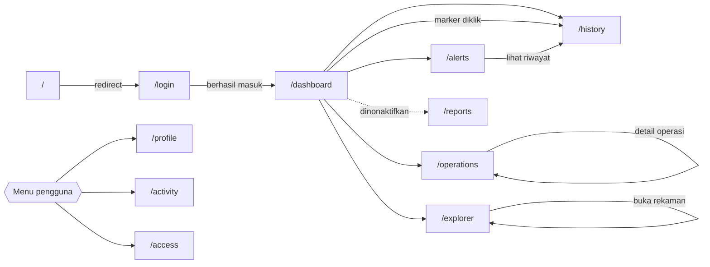
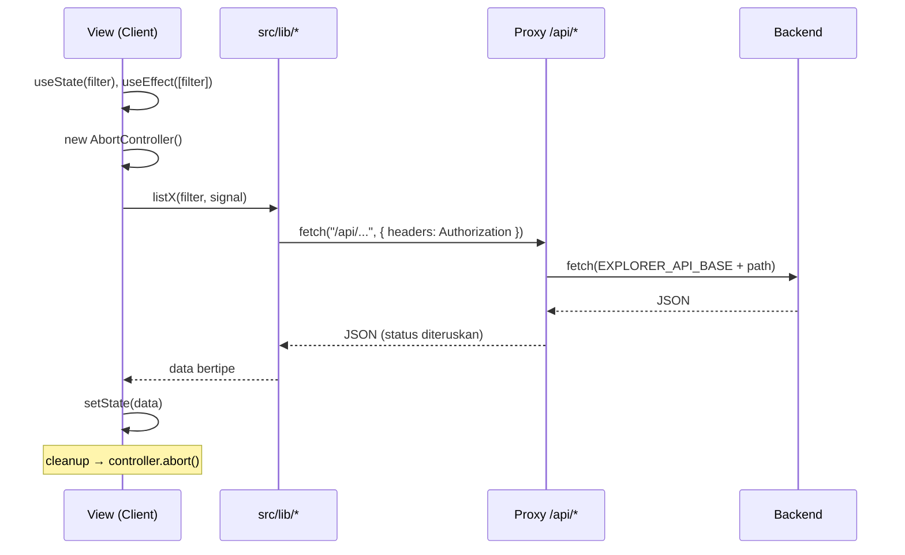

# 06 — UI/UX Specification

> SYNAPSE-T · Versi 1.0 · 8 Oktober 2026
> Prasyarat: [03 — TSD](./03-tsd.md) §7, [04 — API Contract](./04-api-contract.md)

Spesifikasi antarmuka: prinsip desain, token, navigasi, tiap layar beserta sumber
datanya, konvensi peta, pola interaksi, dan perilaku responsif.

---

## 1. Prinsip Desain

| Prinsip | Penerapan nyata |
|---|---|
| **Peta adalah antarmuka utama** | 5 dari 10 layar memuat peta Leaflet; Dashboard bahkan memakai mode peta penuh (`.cmd.is-map`) |
| **Satu layar, tanpa scroll global** | `.cmd { height: 100vh; overflow: hidden }` — scrolling hanya terjadi di dalam panel |
| **Gelap permanen** | Satu palet gelap tanpa toggle tema; tile OSM pun digelapkan dengan filter SVG |
| **Warna hanya untuk status** | Merah/kuning/hijau membawa makna; tidak dipakai sebagai dekorasi |
| **Kerapatan tinggi** | Tipografi kecil dan padding ketat agar banyak informasi tertampung |
| **State ada di satu tempat** | Setiap layar punya satu Client Component pemegang seluruh state |

---

## 2. Design Token

Seluruh token didefinisikan pada selector `.cmd` di
`src/app/(platform)/dashboard/dashboard.css` dan diwarisi oleh semua layar.

### 2.1 Warna

| Token | Nilai | Pemakaian |
|---|---|---|
| `--bg` | `#07101c` | Latar aplikasi |
| `--panel` | `#0d1726` | Permukaan kartu dan panel |
| `--panel-2` | `#101b2d` | Permukaan bertingkat (panel di dalam panel) |
| `--line` | `rgba(148, 176, 214, 0.16)` | Semua border dan pemisah |
| `--text` | `#e8f0fb` | Teks utama |
| `--muted` | `#8ea3bf` | Teks sekunder, label |
| `--faint` | `#647892` | Teks tersier, placeholder |
| `--cyan` | `#22d3ee` | Aksen utama, status normal, elemen aktif |
| `--blue` | `#3b82f6` | Aksen sekunder, tautan |
| `--green` | `#22c55e` | Sehat / terselesaikan |
| `--red` | `#ef4444` | Kritis / SOS / terputus |
| `--amber` | `#f59e0b` | Peringatan / baterai lemah / heat stress |

Latar header memakai `#08111e` (sedikit lebih gelap dari `--bg`) agar bilah
navigasi terbaca sebagai kromium, bukan konten.

### 2.2 Semantik Warna Status

| Tone | Token | Dipakai untuk |
|---|---|---|
| `critical` / `bad` | `--red` | SOS, casualty, aritmia, hilang kontak, operasi `CANCELLED` |
| `warn` | `--amber` | Baterai lemah, heat stress, strap terlepas, data `AGING`, operasi `ON_HOLD` |
| `ok` | `--green` / `--cyan` | Normal, data `FRESH`, operasi `ACTIVE` |
| `info` | `--blue` | Pemeliharaan, catatan |
| `idle` | `--faint` | Belum ditugaskan, data `STALE` |

### 2.3 Tipografi

| Atribut | Nilai |
|---|---|
| Font sans | **Geist Sans** via `next/font` → `var(--font-sans)` |
| Font mono | **Geist Mono** → `var(--font-mono)`; dipakai untuk hex, ID, koordinat |
| Fallback | `ui-sans-serif, system-ui, sans-serif` |

Dimuat di `src/app/layout.tsx` sehingga tersedia global tanpa flash font.

### 2.4 Layout Dasar

```css
.cmd {
  height: 100vh;
  display: grid;
  grid-template-rows: 48px minmax(0, 1fr);  /* header, konten */
  overflow: hidden;
}

.cmd.is-map {                               /* Dashboard: peta penuh */
  position: relative;
  grid-template-rows: minmax(0, 1fr);       /* header mengapung di atas peta */
}

.cmd-header {
  display: grid;
  grid-template-columns: minmax(0, 1fr) auto minmax(0, 1fr);  /* brand | nav | akun */
  height: 48px;
  border-bottom: 1px solid var(--line);
  background: #08111e;
}
```

Pola `minmax(0, 1fr)` dipakai konsisten agar grid child dapat menyusut di bawah
ukuran kontennya — tanpa ini, panel dengan tabel panjang akan mendorong layout
melebihi viewport.

### 2.5 Prefix Kelas CSS

Tidak ada CSS Modules maupun styled-components. Isolasi dicapai lewat prefix
manual per fitur:

| Prefix | Layar | Berkas | Baris |
|---|---|---|---|
| `cmd-` | Kromium bersama + Dashboard | `dashboard.css` | 2.897 |
| `op-` | Operations | `operations.css` | 2.332 |
| `rp-` | Reports | `reports.css` | 936 |
| `al-` | Alerts | `alerts.css` | 907 |
| `ex-` | Explorer | `explorer.css` | 810 |
| `hs-` | History | `history.css` | 766 |
| `pf-` | Profile | `profile.css` | 691 |
| `auth-` | Login | `login.css` | 655 |
| `act-` | Activity Log | `activity.css` | 579 |
| `ua-` | User Access | `access.css` | 530 |
| — | Reset global + variabel font | `globals.css` | 57 |

Total ≈ 11.160 baris CSS kustom. Tailwind v4 terpasang lewat
`@tailwindcss/postcss` tetapi praktis hanya menyediakan reset — utilitas Tailwind
tidak dipakai di markup.

---

## 3. Navigasi

### 3.1 Navigasi Utama (`TopHeader`)

| Urutan | Label | Rute | Status |
|---|---|---|---|
| 1 | Dashboard | `/dashboard` | Aktif |
| 2 | Operations | `/operations` | Aktif |
| 3 | Alerts | `/alerts` | Aktif |
| 4 | Explorer | `/explorer` | Aktif |
| 5 | History | `/history` | Aktif |
| 6 | Reports | `/reports` | **Dinonaktifkan** — dirender sebagai `<span aria-disabled="true" title="Coming soon">` |

Penanda aktif: `pathname === item.href || pathname.startsWith(item.href + "/")`
→ kelas `is-active` dan `aria-current="page"`.

Brand di kiri (`/images/synapse-t-mark.png` + wordmark) selalu menautkan ke
`/dashboard`.

### 3.2 Menu Pengguna

Tombol di kanan menampilkan avatar (atau inisial), nama, dan jabatan. Saat belum
masuk: **"Guest" / "Signed out"**.

| Item menu | Aksi |
|---|---|
| My Profile | `router.push("/profile")` |
| Activity Log | `router.push("/activity")` |
| User Access | `router.push("/access")` |
| Settings | **Hanya menutup dropdown** — tidak ada halaman tujuan |
| Logout | Membuka dialog konfirmasi |

Tiga halaman (`/profile`, `/activity`, `/access`) hanya dapat dijangkau dari menu
ini — tidak ada di navigasi utama.

### 3.3 Mode Header Mengapung

`<TopHeader floating />` menyembunyikan navigasi dan hanya menampilkan kartu akun
(`.cmd-account-card`). Dipakai Dashboard agar peta mengisi seluruh viewport tanpa
bilah navigasi yang memotongnya.

### 3.4 Dialog Logout

Dirender lewat `createPortal(..., document.body)` agar tidak terjebak oleh
`overflow: hidden` atau konteks stacking peta.

Aksesibilitas: `role="dialog"`, `aria-modal="true"`,
`aria-labelledby="cmd-logout-title"`, klik latar menutup, klik kartu
`stopPropagation`.

Teks: judul "Log out?", isi "Are you sure you want to log out of SYNAPSE-T?",
aksi "Cancel" dan "Log out".

### 3.5 Peta Rute



### 3.6 Deep Link

Dibaca di Server Component sebagai `searchParams` lalu diturunkan sebagai prop
awal ke view. **Tidak** memakai `useSearchParams`.

| Rute | Parameter | Efek |
|---|---|---|
| `/explorer` | `?record=<id>` | Membuka panel detail rekaman |
| `/alerts` | `?alert=<id>` | Memilih alert dan memusatkan peta |
| `/history` | `?soldier=<id>`, `?scope=` | Memuat track prajurit tersebut |
| `/operations` | `?op=<id>` | Membuka panel detail operasi |

URL hasilnya dapat disalin dan dibagikan antar operator — satu operator bisa
mengirim tautan alert spesifik ke rekannya.

---

## 4. Spesifikasi Layar

### 4.1 `/login` — Masuk

| Atribut | Nilai |
|---|---|
| Berkas | `src/app/login/page.tsx` → `components/login-view.tsx` |
| Letak | **Di luar** grup `(platform)` → tanpa `TopHeader` |
| Prefix CSS | `auth-` (655 baris) |
| API | `POST /api/users/login` |

Alur: masukkan username + password → simpan `session_id` ke `localStorage` →
`router.push("/dashboard")`.

| Kondisi | Tampilan |
|---|---|
| Kredensial salah (`401`) | Pesan galat inline |
| Akun tidak aktif (`403`) | Pesan galat inline |
| Sedang mengirim | Tombol dinonaktifkan, indikator muat |

### 4.2 `/dashboard` — Peta Komando

Layar paling kompleks (`dashboard-view.tsx`, `dashboard.css` 2.897 baris).

| Atribut | Nilai |
|---|---|
| Layout | `.cmd.is-map` — peta satu lapis penuh, header mengapung |
| Komponen peta | `ops-map.tsx` (utama), `history-mini-map.tsx` (pratinjau track) |
| Interval polling | `MAP_POLL_MS = 5000` (5 detik) |

**Sumber data**

| Region | Panggilan |
|---|---|
| Marker prajurit | `listExplorer({ category: "TELEMETRY" })` → `latestPinsFromExplorer()` |
| Panel alert | `listAlerts(...)` |
| Pratinjau track | `listHistoryTrack(...)` + `downsampleTrackPoints()` |
| Geofence | `listOperations()` → `operationMap(id)` → `mapPayloadToFences()` |

**Region UI**

| Region | Isi |
|---|---|
| Peta | Marker prajurit, poligon geofence operasi, marker senjata (statis) |
| Kartu akun mengapung | Avatar, nama, jabatan, menu |
| Dossier prajurit | Panel samping saat marker diklik: unit, status, GNSS, terakhir terlihat, `overview`, `vitals`, `gear`, `events` |
| Panel alert | Daftar alert terbuka, diurutkan severity lalu waktu |
| Pratinjau track | Peta mini berisi jalur terakhir prajurit terpilih |

**Jenis marker** — tipe `Marker` mendukung `kind: "person" | "vehicle" | "ship" | "weapon"`
dan `role?: "danru"` (komandan regu ditandai khusus).

> **Keterbatasan yang diketahui.** Dua belas marker senjata (`weaponMarkers`)
> adalah array **hardcoded** di dalam `dashboard-view.tsx` dengan koordinat dan
> status tetap. Tidak ada API senjata; marker ini tidak pernah berubah. Menu
> "Weapons" dinonaktifkan dengan tooltip "Coming soon".

**Dossier prajurit** memakai tipe `Reading { label, value, note, tone }` di tiga
kelompok (`overview`, `vitals`, `gear`) sehingga tiap baris dapat membawa warna
status sendiri. `events` adalah daftar kronologis `{ color, time, text }`.

### 4.3 `/operations` — Operasi Taktis

| Atribut | Nilai |
|---|---|
| Prefix CSS | `op-` (2.332 baris) |
| Komponen | `operations-view.tsx`, `operations-map.tsx`, `operation-detail.tsx`, `create-operation-modal.tsx` (852 baris) |
| Deep link | `?op=<id>` |

**Region**

| Region | Isi |
|---|---|
| Daftar operasi | Kartu per operasi: kode, nama, status, jumlah grup/personel/zona |
| Filter | Pencarian, status, grup, rentang mulai |
| Panel detail | Tab: Overview, Personnel, Groups, Geofences, Map, Alerts, Tickets |
| Aksi siklus hidup | Tombol Activate / Hold / Resume / Complete / Cancel / Delete sesuai status |
| Modal pembuatan | Wizard 4 langkah |

**Lencana status**

| Status | Warna |
|---|---|
| `PLANNING` | `--faint` |
| `ACTIVE` | `--green` |
| `ON_HOLD` | `--amber` |
| `COMPLETED` | `--cyan` |
| `CANCELLED` | `--red` |

**Tab Geofences** memiliki penanganan khusus: bila payload `/map` tidak memuat
poligon, tab jatuh ke `detail.geofences`, menandai zona bermasalah dengan
`· polygon missing`, dan menampilkan catatan:

> "Zones are linked but polygon points didn't load — check Map tab after refresh,
> or recreate the zone."

### 4.4 Wizard Create Operation

Empat langkah dengan tombol Back / Next / Create. Tombol Next dinonaktifkan sampai
`canNext()` terpenuhi.

| Langkah | Judul | Isi | Syarat lanjut |
|---|---|---|---|
| 1 | Details | Nama, deskripsi, tipe, `start_at`, `end_at` | Nama tidak kosong |
| 2 | Assign | Pilih personel, bentuk grup, tunjuk DANRU | ≥1 orang ditugaskan |
| 3 | Zones | Gambar geofence di peta | — (opsional) |
| 4 | Review | Ringkasan + tombol Create | — |

**Tata letak langkah 2** — hasil beberapa iterasi atas umpan balik pengguna:

```
.op-assign.is-groups-first
  grid-template-rows: minmax(160px, 0.9fr) minmax(220px, 1.1fr)

┌─────────────────────────────┬─────────────────────────────┐  baris 1
│ Create group from selection │ Groups created              │  (dua kolom
│                             │                             │   bersebelahan)
├─────────────────────────────┴─────────────────────────────┤  baris 2
│ Peta (ringkas)              │ Select members              │
└─────────────────────────────┴─────────────────────────────┘
```

Keputusan tata letak dan alasannya:

| Keputusan | Alasan |
|---|---|
| Dua kartu aksi di **baris atas** | Permintaan pengguna: kartu grup harus di atas, bukan di bawah peta |
| Keduanya **bersebelahan** dalam grid 2 kolom | Permintaan pengguna; perlu selector gabungan `.op-assign-actions.op-assign-top-actions` dengan `flex-direction: unset` karena `.op-assign-actions` sebelumnya memaksa `flex-direction: column` |
| Peta **dibatasi** `min-height: 160px; max-height: 240px` | Permintaan pengguna: peta tidak boleh memakan setengah lebar/tinggi |
| `.op-built-groups` dan `.op-built-members` jadi **1 kolom** | Grid 2 kolom di dalam panel sempit membuat teks saling tumpang-tindih |
| Baris anggota `grid-template-columns: minmax(0, 1fr) auto` | Memisahkan identitas (bisa menyusut + ellipsis) dari tombol aksi (`white-space: nowrap`) |

**Mode gambar geofence (langkah 3)**

| Mode | Interaksi | Hasil |
|---|---|---|
| Polygon | Klik tiap titik sudut | Poligon ≥3 titik |
| Circle | Klik pusat | `circleToPolygon(center, 400)` — poligon radius 400 m |

Zona yang digambar tetapi belum ditekan "Save" ikut tersimpan saat pengguna
menekan Next atau Create, melalui `withFlushedDraft()`.

**Fitur yang dihapus.** Kartu "Link existing group" pernah ada di langkah 2
(awalnya dropdown, lalu diubah menjadi input dengan `datalist`), kemudian dihapus
seluruhnya atas permintaan pengguna. Endpoint backend
`GET /api/operations/groups/options` dan rute penautan grup masih berfungsi —
hanya UI-nya yang tidak ada.

### 4.5 `/alerts` — Triase Alert

| Atribut | Nilai |
|---|---|
| Prefix CSS | `al-` (907 baris) |
| Deep link | `?alert=<id>` |
| API | `listAlerts`, detail, acknowledge, resolve, ekspor CSV |

| Region | Isi |
|---|---|
| Kartu ringkasan | Jumlah per severity dan status |
| Filter | Jenis, severity, status, prajurit, grup, waktu, pencarian |
| Daftar alert | Baris: lencana severity, jenis, prajurit, grup, waktu, status |
| Panel detail | Pesan, posisi, `details_json`, jejak acknowledge/resolve |
| Peta | Lokasi alert terpilih |
| Aksi | Acknowledge, Resolve (dengan catatan), Ticket |

Urutan prioritas tampilan: `CRITICAL` → `WARNING` → `INFO`, lalu `event_time`
menurun.

> Tombol **Ticket** adalah satu-satunya titik masuk fitur tiket di UI. Seluruh
> 17 endpoint tiket (task, kolaborator, update, siklus hidup) belum punya
> antarmuka.

### 4.6 `/explorer` — Penelusuran Rekaman

| Atribut | Nilai |
|---|---|
| Prefix CSS | `ex-` (810 baris) |
| Komponen peta | `explorer-mini-map.tsx` |
| Deep link | `?record=<id>` |

| Region | Isi |
|---|---|
| Panel filter | Kategori, tipe data, entitas, prajurit, grup, gateway, asal posisi, transport, freshness, asal rekaman, format mentah, waktu, pencarian |
| Timeline | Grafik recharts berisi distribusi rekaman per waktu |
| Tabel hasil | Baris terpaginasi, offset-based |
| Panel detail | Seluruh field terdekode + **hex mentah** + peta mini posisi |
| Ekspor | Unduh CSV sesuai filter aktif |

Panel detail menampilkan `raw_hex` dengan font monospace — ini antarmuka
verifikasi: operator dapat membandingkan byte mentah dengan nilai terdekode.

### 4.7 `/history` — Analisis Historis

| Atribut | Nilai |
|---|---|
| Prefix CSS | `hs-` (766 baris) |
| Komponen peta | `history-track-map.tsx` |
| Deep link | `?soldier=<id>`, `?scope=` |

| Region | Isi |
|---|---|
| Pemilih lingkup | `SOLDIER` atau `GROUP` |
| Filter | Prajurit/grup, jenis data, asal posisi, rentang waktu |
| Peta track | Polyline berurutan waktu + marker posisi playback |
| Kontrol playback | Play / Pause, kecepatan 1× – 8×, penggeser posisi |
| Kartu statistik | Jarak total, durasi, kecepatan rata-rata, rata-rata HR |
| Grafik vitals | Recharts: HR, SpO₂, suhu sepanjang waktu |
| Daftar event | Rekaman terpaginasi |

Titik track dijarangkan dengan `downsampleTrackPoints()` sebelum dirender —
track 24 jam berisi 2.880 titik per prajurit, terlalu banyak untuk polyline
Leaflet yang responsif.

Kartu jarak selalu menyertakan penanda bahwa nilainya **diturunkan** dari
koordinat (`distance_is_derived: true`), bukan dibaca dari perangkat.

### 4.8 `/access` — User Access

| Atribut | Nilai |
|---|---|
| Prefix CSS | `ua-` (530 baris) |
| API | `/api/users`, `/api/roles`, `/api/user-roles` |

| Region | Isi |
|---|---|
| Kartu ringkasan | Jumlah identitas per tipe dan status |
| Tab Identities | Daftar pengguna + filter tipe/status/verifikasi/binding |
| Tab Roles | Katalog peran + `duty_category` + daftar izin |
| Tab Bindings | Pemetaan pengguna → peran, dengan status |
| Aksi | Buat identitas manusia, ikat peran, ubah status binding |

Peran dengan `is_protected = 1` ditampilkan tanpa tombol ubah/hapus.

> Tidak ada UI untuk **menetapkan izin** sebuah peran. Peran kustom yang dibuat
> dari layar ini lahir tanpa izin apa pun (TD-7).

### 4.9 `/activity` — Activity Log

| Atribut | Nilai |
|---|---|
| Prefix CSS | `act-` (579 baris) |
| API | `/api/audit-logs`, `/summary`, `/categories`, `/export` |

| Region | Isi |
|---|---|
| Kartu ringkasan | Total aktivitas, aksi pengguna, aksi sistem, aksi gagal |
| Chip kategori | 13 kategori beserta jumlahnya, berfungsi sebagai filter |
| Filter | Rentang waktu (`24h`/`7d`/`30d`/`90d`), aksi, kategori, hasil, aktor, resource, IP, pencarian |
| Tabel event | Waktu, aktor, peran, kategori, aksi, target, hasil |
| Panel detail | Deskripsi, IP, user agent, metadata |
| Ekspor | Unduh CSV |

Perhatikan: preset rentang waktu di layar ini **berbeda** dari layar telemetri
(yang hanya mengenal `all` dan `30d`) karena backend `audit-logs` memakai tabel
preset sendiri.

### 4.10 `/profile` — Profil Pengguna

| Atribut | Nilai |
|---|---|
| Prefix CSS | `pf-` (691 baris) |
| API | `/api/auth/me`, `PATCH /api/auth/users/me`, gambar profil, `/audit-logs/me` |

| Region | Isi |
|---|---|
| Kartu identitas | Avatar, nama, username, email, peran, status |
| Formulir edit | Nama, email, unggah/hapus foto |
| Aktivitas saya | Daftar audit milik pengguna sendiri |

Perubahan profil memancarkan event `PROFILE_UPDATED` yang didengar `TopHeader`,
sehingga avatar di header ikut berubah tanpa reload.

Manajemen URL objek gambar ditangani eksplisit: setiap `URL.createObjectURL`
dipasangkan dengan `URL.revokeObjectURL` di setiap jalur keluar (ganti gambar,
keluar dari sesi, unmount) untuk mencegah kebocoran memori.

### 4.11 `/reports` — Laporan

| Atribut | Nilai |
|---|---|
| Prefix CSS | `rp-` (936 baris) |
| API | **Tidak ada** |
| Status | Mock statis; menu dinonaktifkan |

Layar ini berisi 936 baris CSS dan markup lengkap, tetapi seluruh angkanya
hardcoded dan tidak ada satu pun panggilan API. Rute tetap dapat diakses langsung
lewat URL meski item navigasinya dinonaktifkan.

---

## 5. Konvensi Peta

### 5.1 Komponen

| Berkas | Dipakai di | Fungsi |
|---|---|---|
| `dashboard/components/ops-map.tsx` | `/dashboard` | Peta komando utama |
| `dashboard/components/history-mini-map.tsx` | `/dashboard` | Pratinjau track di dossier |
| `explorer/components/explorer-mini-map.tsx` | `/explorer` | Posisi satu rekaman |
| `history/components/history-track-map.tsx` | `/history` | Track + playback |
| `operations/components/operations-map.tsx` | `/operations` | Peta operasi + zona + mode gambar |

Semuanya diimpor dengan `dynamic(() => import(...), { ssr: false })` karena
Leaflet mengakses `window` saat modul dievaluasi.

### 5.2 Proxy Tile

`src/app/tiles/[z]/[x]/[y]/route.ts`:

| Aspek | Perilaku |
|---|---|
| Hulu | `https://tile.openstreetmap.org/{z}/{x}/{y}.png` |
| Validasi | `z` 1–2 digit, `x` ≤6 digit, `y` ≤7 digit; gagal → `400` |
| Sufiks `.png` | Dibuang dari `y` sebelum diteruskan |
| `User-Agent` | `TrackforgeDashboard/1.0` (syarat kebijakan OSM) |
| Cache | `Cache-Control: public, max-age=86400` (24 jam) |
| Galat hulu | Status hulu diteruskan apa adanya |

Alasan proxy: menetapkan `User-Agent` yang sesuai kebijakan OSM, menyeragamkan
caching, dan menghindari permintaan lintas-origin langsung dari browser.

### 5.3 Tema Peta Gelap

Tile OSM berwarna terang. Agar serasi dengan palet gelap, layer tile diberi
**filter SVG "night"** (inversi + penyesuaian hue/saturasi) di sisi klien.
Pendekatan filter dipilih karena tile style gelap pihak ketiga memerlukan kunci
API berbayar.

### 5.4 Koordinat

| Konteks | Urutan |
|---|---|
| Leaflet (`LatLngExpression`) | `[lat, lng]` |
| Backend `polygon_json` | `[lng, lat]` (urutan GeoJSON) |
| Pusat default | `MAP_CENTER = [-6.175421, 106.827312]` (Jakarta) |

Konversi dilakukan terpusat di `src/lib/operations.ts`
(`bePolygonToLatLng`, `normalizeBePolygon`). Jangan menukar koordinat secara
ad-hoc di komponen.

### 5.5 Warna Geofence

| `kind` | Warna default | Makna |
|---|---|---|
| `restricted` | `--red` (`#ef4444`) | Zona larangan |
| `safe` | `--green` (`#22c55e`) | Zona aman |
| `recon` | `--cyan` (`#22d3ee`) | Zona pengintaian |

Warna dapat ditimpa per zona melalui kolom `geofences.color`.

---

## 6. Pola Interaksi

### 6.1 Siklus Pemuatan Data



Setiap fungsi `lib` menerima `AbortSignal` opsional. View membatalkan request
lama saat filter berubah cepat atau komponen unmount, sehingga respons yang
terlambat tidak menimpa state yang lebih baru.

### 6.2 Status Muat, Kosong, dan Galat

| Status | Perlakuan |
|---|---|
| Muat | Indikator pada panel yang bersangkutan, bukan overlay layar penuh |
| Kosong | Teks jelas yang menyebutkan sebabnya (mis. "No geofences on map") |
| Galat | Pesan inline dari `detail` backend, tanpa `alert()` |
| Galat sebagian | Panggilan paralel memakai `.catch(() => [])` agar satu kegagalan tidak mengosongkan seluruh layar |

Pola `Promise.all([...].map(p => p.catch(() => [])))` dipakai di wizard operasi
agar daftar personel tetap muncul meski salah satu sumber gagal.

### 6.3 Pola Modal

| Modal | Cara render |
|---|---|
| Dialog logout | `createPortal` ke `document.body` |
| Wizard create operation | Overlay di dalam layar Operations |
| Panel detail | Panel samping inline, bukan modal |

Portal dipakai ketika modal harus keluar dari konteks stacking peta
(Leaflet menetapkan `z-index` tinggi pada pane-nya).

### 6.4 Persistensi Sesi di Klien

| Aspek | Perilaku |
|---|---|
| Penyimpanan | `localStorage.session_id` |
| Pengiriman | Header `Authorization: Bearer <token>` dari `src/lib/session.ts` |
| Tanpa sesi | `TopHeader` menampilkan "Guest / Signed out"; panggilan terproteksi mengembalikan `401` |
| Logout | `logoutAccount()` lalu `router.push("/login")` |

> Keterbatasan: beberapa panggilan (explorer, akses, daftar audit, ekspor)
> dikirim **tanpa header autentikasi** karena endpoint backend-nya anonim.
> Ini bukan bug frontend, melainkan cermin dari celah di backend (dok 07 §6).
> `localStorage` juga membuat token terekspos pada XSS — lihat temuan S-11.

---

## 7. Perilaku Responsif

Target utama adalah layar desktop ruang kendali. Dua breakpoint menjaga agar
layout tidak pecah di laptop:

| Breakpoint | Perubahan |
|---|---|
| ≤ 1100 px | Panel menyempit; `.op-assign-top-actions` **tetap** 2 kolom |
| ≤ 860 px | `.op-assign-top-actions` turun menjadi `1fr` (menumpuk); grid lain ikut menumpuk |

Tidak ada tata letak khusus ponsel. `height: 100vh` dengan `overflow: hidden`
berarti di viewport pendek konten dipangkas, bukan di-scroll — konsekuensi sadar
dari desain "satu layar".

Pola pencegah luapan yang dipakai konsisten:

```css
min-width: 0;                              /* izinkan grid child menyusut */
grid-template-columns: minmax(0, 1fr) auto;/* konten lentur + aksi tetap */
overflow: hidden;
text-overflow: ellipsis;
white-space: nowrap;                        /* pada tombol aksi */
```

---

## 8. Aksesibilitas

### 8.1 Yang Sudah Ada

| Praktik | Lokasi |
|---|---|
| `aria-label="Main"` pada navigasi | `TopHeader` |
| `aria-current="page"` pada tautan aktif | `TopHeader` |
| `aria-disabled` + `title` pada Reports | `TopHeader` |
| `aria-haspopup="menu"` + `aria-expanded` | Tombol menu pengguna |
| `role="menu"` / `role="menuitem"` | Dropdown pengguna |
| `role="dialog"` + `aria-modal` + `aria-labelledby` | Dialog logout |
| `aria-hidden="true"` pada ikon SVG dekoratif | Seluruh ikon |
| `alt=""` pada gambar dekoratif, `alt="SYNAPSE-T"` pada wordmark | `TopHeader` |

### 8.2 Celah yang Diketahui

| Celah | Dampak |
|---|---|
| Tidak ada focus trap di modal | Tab dapat keluar dari dialog |
| Tidak ada penanganan tombol `Escape` | Modal hanya tertutup lewat klik |
| Peta tidak dapat dioperasikan via keyboard | Marker tidak bisa dijangkau tanpa tetikus |
| Status hanya dibedakan warna | Pengguna buta warna sulit membedakan tone |
| Kontras `--faint` (`#647892`) pada `--bg` ≈ 3.1:1 | Di bawah ambang WCAG AA (4.5:1) untuk teks kecil |
| Pembaruan data tidak diumumkan | Tidak ada `aria-live` untuk alert baru |

---

## 9. Pedoman untuk Pengembangan Lanjutan

Saat menambah layar baru, ikuti pola yang sudah ada:

1. Buat folder di `src/app/(platform)/<fitur>/`.
2. `page.tsx` sebagai Server Component: `export const metadata`, baca
   `searchParams`, render view.
3. `components/<fitur>-view.tsx` sebagai Client Component pemegang seluruh state.
4. `<fitur>.css` dengan **prefix kelas baru** (hindari benturan dengan 10 prefix
   yang sudah dipakai).
5. Impor token dengan membungkus akar layar dalam `className="cmd ..."`.
6. Tambah fungsi klien di `src/lib/<domain>.ts` yang menerima `AbortSignal`.
7. Bila butuh endpoint backend baru, pastikan ada route proxy di
   `src/app/api/` — jangan pernah memanggil backend langsung dari komponen.
8. Komponen peta harus `dynamic(..., { ssr: false })` dan mengambil tile dari
   `/tiles/{z}/{x}/{y}`.

Hal yang **tidak** boleh dilakukan:

| Jangan | Alasan |
|---|---|
| `useSearchParams` | Memaksa Suspense dan membuat halaman dinamis; pakai `searchParams` server |
| `fetch` langsung ke `EXPLORER_API_BASE` dari komponen | Membocorkan alamat backend ke klien |
| Menukar `[lat, lng]`/`[lng, lat]` secara ad-hoc | Pakai helper di `lib/operations.ts` |
| Menambah utilitas Tailwind di markup | Tidak konsisten dengan 11.000 baris CSS kustom yang ada |
| Menambah `overflow: visible` pada panel grid | Merusak kontrak "satu layar tanpa scroll global" |
