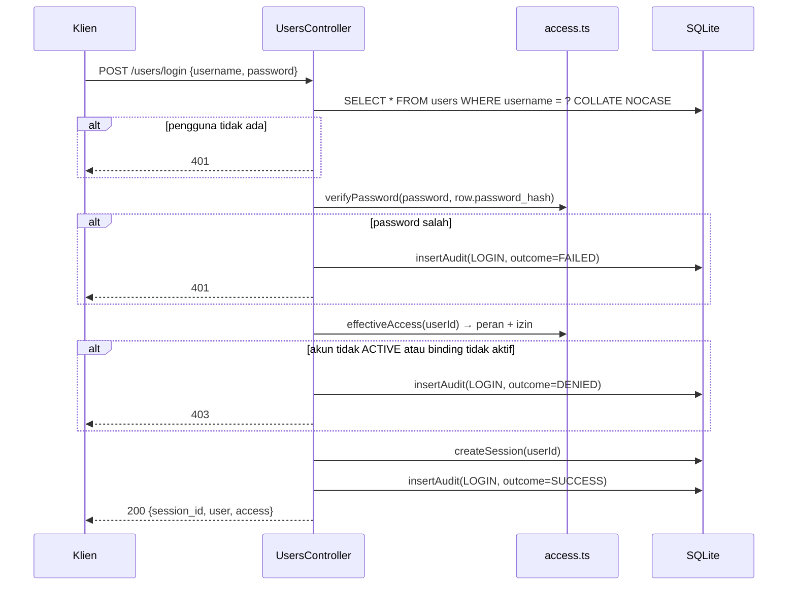
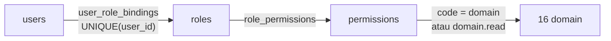

# 07 — Security Specification

> SYNAPSE-T · Versi 1.0 · 8 Oktober 2026
> Prasyarat: [04 — API Contract](./04-api-contract.md), [05 — ERD & Database](./05-erd-database-specification.md)

Dokumen ini menjelaskan mekanisme keamanan yang **ada** di kode, lalu mencatat
secara jujur celah yang **belum** ditangani beserta langkah perbaikannya.

> **Ringkasan untuk pengambil keputusan.** Primitif kriptografi sistem ini kuat
> (PBKDF2 120.000 iterasi, token acak 256-bit, perbandingan timing-safe, audit
> trail yang tidak dapat diubah). Masalahnya bukan kriptografi, melainkan
> **penegakan**: 31 dari 104 endpoint — termasuk seluruh pengelolaan identitas
> dan peran — dapat diakses tanpa autentikasi. Dalam kondisi sekarang sistem
> **belum layak dipakai operasional** tanpa menutup temuan P0 di §7.

---

## 1. Autentikasi

### 1.1 Penyimpanan Password

Implementasi: `src/database/access.ts`.

| Atribut | Nilai |
|---|---|
| Algoritma | PBKDF2-HMAC-SHA256 |
| Iterasi | **120.000** |
| Salt | 16 byte acak kriptografis (`crypto.randomBytes(16)`), unik per pengguna |
| Panjang kunci | 32 byte |
| Format tersimpan | `pbkdf2_sha256$120000$<salt hex>$<digest hex>` |

```ts
export function hashPassword(password: string): string {
  const salt = crypto.randomBytes(16).toString('hex');
  const digest = crypto
    .pbkdf2Sync(password, salt, 120_000, 32, 'sha256')
    .toString('hex');
  return `pbkdf2_sha256$120000$${salt}$${digest}`;
}
```

Verifikasi (`verifyPassword`) melakukan hal yang benar:

1. Menolak password atau hash yang kosong.
2. Memeriksa format berisi tepat 4 bagian.
3. Memeriksa nama algoritma dan bahwa jumlah iterasi berupa angka.
4. Membaca iterasi **dari hash tersimpan**, sehingga menaikkan biaya kerja di
   masa depan tidak mematahkan password lama.
5. Membandingkan dengan **`crypto.timingSafeEqual`**, didahului pemeriksaan
   panjang — mencegah kebocoran lewat waktu eksekusi.

Penilaian: **kuat**. 120.000 iterasi PBKDF2-SHA256 melampaui rekomendasi minimum
OWASP (600.000 untuk PBKDF2-SHA256 pada 2023 — perlu dinaikkan, tetapi jauh di
atas praktik yang tidak aman). Argon2id akan lebih baik, namun pilihan saat ini
tidak lemah.

### 1.2 Manajemen Sesi

Implementasi: `src/common/audit.ts` (`createSession`, `actorFromSession`).

| Atribut | Nilai |
|---|---|
| Jenis token | Opaque, bukan JWT |
| Entropi | 32 byte (**256 bit**) dari `crypto.randomBytes` |
| Encoding | base64url (43 karakter) |
| Penyimpanan | `user_sessions.id` — **token itu sendiri sebagai primary key** |
| TTL | 7 hari, **absolut** (tidak diperpanjang aktivitas) |
| Transport | `Authorization: Bearer <token>` atau `X-Session-Id` |
| Penyimpanan klien | `localStorage.session_id` |

**Resolusi sesi**

```sql
SELECT u.id, u.name
FROM user_sessions s
JOIN users u ON u.id = s.user_id
WHERE s.id = ? AND s.expires_at > ? AND u.deleted_at IS NULL
```

Tiga pemeriksaan sekaligus: token ada, belum kedaluwarsa, dan pengguna belum
dihapus. Pengguna yang di-soft-delete langsung kehilangan akses tanpa perlu
mencabut sesinya satu per satu.

**Logout** (`POST /users/logout`) melakukan
`DELETE FROM user_sessions WHERE id = ?` — pencabutan nyata, bukan penanda.
Inilah keunggulan token opaque dibanding JWT: pencabutan berlaku seketika.

**Kelemahan**

| Isu | Dampak |
|---|---|
| Token disimpan plaintext sebagai PK | Pembacaan tabel = pencurian seluruh sesi aktif |
| Token juga tersimpan di `audit_logs.session_id` | Lihat temuan **S-9** — endpoint audit anonim membocorkannya |
| Tidak ada pembersih sesi kedaluwarsa | Baris menumpuk tanpa batas |
| Tidak ada rotasi token setelah login | Session fixation bukan vektor di sini (token dibuat server), tetapi rotasi tetap praktik baik |
| TTL absolut 7 hari tanpa idle timeout | Sesi yang tidak dipakai 6 hari tetap valid |

### 1.3 Alur Login



Upaya login yang gagal maupun yang ditolak keduanya tercatat di audit dengan
`outcome` yang berbeda (`FAILED` vs `DENIED`), sehingga pola serangan dapat
dibedakan dari masalah hak akses.

### 1.4 Kriteria Kelayakan Akun

Untuk operasi **tulis** pada `operations` dan `tickets`, lulus izin saja tidak
cukup. Empat pemeriksaan tambahan:

| Pemeriksaan | Gagal → |
|---|---|
| `identity_type === 'HUMAN'` | `403 account is not human` |
| `verification === 'VERIFIED'` | `403 account is not verified` |
| `status === 'ACTIVE'` | `403 account is not active` |
| `isActiveBinding(binding, now)` | `403` |

`isActiveBinding()` memeriksa `status === 'ACTIVE'` **dan** jendela waktu
`valid_from` / `valid_until`. Akun service karena itu tidak dapat melakukan
perubahan operasional — hanya pembacaan.

---

## 2. Autorisasi (RBAC)

### 2.1 Model



Satu pengguna → tepat satu peran (ditegakkan `UNIQUE(user_id)`) → banyak
permission → 16 domain fungsional.

### 2.2 Semantik Kode Izin

| Pola kode | Arti | `action_type` |
|---|---|---|
| `<domain>` | Semua aksi pada domain (baca + tulis) | `ALL_ACTIONS` |
| `<domain>.read` | Baca saja | `READ` |

```ts
export function hasPermission(granted: Set<string>, domain: string, action: string) {
  if (granted.has(domain)) return true;              // izin penuh mencakup baca
  if (action === 'read') return granted.has(`${domain}.read`);
  return false;                                       // .read TIDAK mencakup tulis
}
```

Desain ini benar: izin penuh secara implisit mencakup baca, tetapi `.read`
tidak pernah membuka jalur tulis. Fungsi pembantu `expandReadCodes()` juga
menambahkan `<domain>.read` secara otomatis saat `<domain>` diberikan, sehingga
set izin efektif konsisten.

### 2.3 Perhitungan Izin Efektif

`effectiveAccess(db, userId)`:

```sql
SELECT p.code
FROM user_role_bindings b
JOIN roles r             ON r.id = b.role_id
JOIN role_permissions rp ON rp.role_id = r.id
JOIN permissions p       ON p.id = rp.permission_id
WHERE b.user_id = :userId
  AND b.status = 'ACTIVE'
  AND (b.valid_from  IS NULL OR b.valid_from  <= :now)
  AND (b.valid_until IS NULL OR b.valid_until >= :now)
```

Dihitung **setiap request** — tidak ada cache. Pencabutan peran langsung
berlaku, dengan biaya satu kueri join per permintaan. Pada beban saat ini
(SQLite lokal, 15 prajurit) ini pilihan yang tepat.

---

## 3. Matriks Peran dan Izin

Enam peran di-seed oleh `seedRoles()` **hanya bila tabel `roles` kosong**.
Semuanya `is_system = 1` dan `is_protected = 1`.

### 3.1 Grant per Peran

| Peran | `duty_category` | Grant |
|---|---|---|
| `superadmin` | Platform Administration | Seluruh **16 domain** (akses penuh) |
| `operations commander` | Command Operations | 11 domain operasional penuh + `lora_mesh.read`, `gateways.read`, `activity_log.read` |
| `operations officer` | Operations Control | Penuh: `overview`, `groups`, `personal`, `operations`, `geofences`, `explorer`, `alerts`, `tickets`, `history`. Baca: `weapons.read`, `reports.read` |
| `field operator` | Field Operations | Baca saja: `overview.read`, `groups.read`, `personal.read`, `operations.read`, `alerts.read`, `history.read` |
| `device & fleet admin` | Fleet & Communications | Penuh: `lora_mesh`, `gateways`. Baca: `overview.read` |
| `viewer` | Observation | `.read` untuk 11 domain operasional |

`OPERATIONAL_DOMAINS` (11) = `overview`, `groups`, `personal`, `weapons`,
`operations`, `geofences`, `explorer`, `alerts`, `tickets`, `history`, `reports`.

### 3.2 Matriks Lengkap

Legenda: **F** = penuh (baca+tulis) · **R** = baca saja · — = tanpa akses

| Domain | superadmin | ops commander | ops officer | field operator | device admin | viewer |
|---|---|---|---|---|---|---|
| `overview` | F | F | F | R | R | R |
| `groups` | F | F | F | R | — | R |
| `personal` | F | F | F | R | — | R |
| `weapons` | F | F | R | — | — | R |
| `operations` | F | F | F | R | — | R |
| `geofences` | F | F | F | — | — | R |
| `explorer` | F | F | F | — | — | R |
| `alerts` | F | F | F | R | — | R |
| `tickets` | F | F | F | — | — | R |
| `history` | F | F | F | R | — | R |
| `reports` | F | F | R | — | — | R |
| `lora_mesh` | F | R | — | — | F | — |
| `gateways` | F | R | — | — | F | — |
| `user_access` | F | — | — | — | — | — |
| `activity_log` | F | R | — | — | — | — |
| `settings` | F | — | — | — | — | — |

Prinsip least-privilege diterapkan dengan rapi: hanya `superadmin` yang dapat
menyentuh `user_access` dan `settings`; `device & fleet admin` tidak memiliki
akses operasional sama sekali.

### 3.3 Proteksi Peran Sistem

| Operasi | Pada peran `is_protected = 1` |
|---|---|
| `PUT /roles/:roleId` | `403` |
| `DELETE /roles/:roleId` | `403` |

> **Keterbatasan penting.** Tidak ada endpoint untuk **menetapkan izin** sebuah
> peran. Fungsi `replaceRolePermissions()` ada di `src/database/access.ts`
> tetapi tidak dipanggil controller mana pun. Akibatnya peran kustom yang dibuat
> lewat `POST /roles` lahir **tanpa izin apa pun** dan tidak berguna. RBAC
> praktis terbatas pada enam peran seeded.

---

## 4. Validasi Input

### 4.1 Pipe Global

```ts
app.useGlobalPipes(new ValidationPipe({
  transform: true,
  whitelist: true,
  forbidNonWhitelisted: false,
}));
```

| Opsi | Nilai | Efek |
|---|---|---|
| `transform` | `true` | Payload diubah menjadi instance kelas DTO |
| `whitelist` | `true` | Properti tanpa dekorator dibuang **secara diam-diam** |
| `forbidNonWhitelisted` | `false` | Properti tak dikenal **tidak** memicu error |

**Masalahnya:** `ValidationPipe` hanya bekerja bila handler mendeklarasikan tipe
DTO berdekorator. Controller `operations` dan `tickets` — domain terbesar dengan
40 endpoint — memakai `@Body() body: any`. Kelas DTO ada di
`src/operations/dto/` lengkap dengan dekorator `class-validator`, tetapi tidak
pernah dipasang. Untuk domain itu pipe tidak melakukan apa pun.

Gabungan `whitelist: true` + `forbidNonWhitelisted: false` juga berarti field
yang salah tulis akan hilang tanpa pemberitahuan — klien menyangka datanya
tersimpan padahal tidak.

### 4.2 Validasi Manual yang Ada

Di mana DTO tidak dipakai, service melakukan pemeriksaannya sendiri. Ini
dikerjakan dengan cukup teliti:

| Domain | Pemeriksaan |
|---|---|
| Operations | Daftar putih field (`unexpected fields: ...` → `422`), `name` ≤160, `description` ≤2000, `end_at > start_at`, `normalizeSoldierId()`, `cleanPolygon()` ≥3 titik |
| Ingest | `parseHex()` (panjang genap, karakter hex), panjang burst `6 + N×21`, `1 ≤ N ≤ 15`, timestamp terbaca |
| Explorer / Alerts / History | `timeRangeStart()` menolak preset tak dikenal, `canonicalTime()` menolak waktu tak terbaca |
| Users | Daftar putih `identity_type`, `status`, `verification`, `access_binding`; `name`/`username` wajib |
| Audit | `normalizeAuditCode()` memeriksa `action`/`category`/`outcome` terhadap kosakata |
| Tickets | Daftar putih status dan prioritas |

### 4.3 Pencegahan SQL Injection

Seluruh kueri memakai **prepared statement** `better-sqlite3` dengan placeholder
`?`. Helper `bind()` menormalkan nilai sebelum dikirim.

Interpolasi string ke SQL hanya terjadi pada:

- Nama kolom dari array konstanta (`COLUMNS`, `PUBLIC_FIELDS`, `CSV_COLUMNS`)
- Daftar CHECK yang dibangun dari konstanta `CATEGORIES`

Tidak ada input pengguna yang pernah masuk ke string SQL. Nilai filter list
dibangun sebagai `?,?,?` sesuai jumlah elemen, lalu di-bind. **Penilaian: aman.**

### 4.4 Pembersihan Metadata Audit

```ts
const SECRET_PARTS = ['password', 'token', 'secret', 'jwt', 'api_key', 'authorization'];
```

`cleanMetadata()` membuang setiap kunci metadata yang **mengandung** salah satu
substring di atas sebelum disimpan ke `audit_logs.metadata_json`. Ini praktik
yang baik — sayangnya dibatalkan oleh kolom `session_id` yang justru menyimpan
token sesi secara sengaja (temuan S-9).

---

## 5. Audit Trail

### 5.1 Properti

| Properti | Status |
|---|---|
| Tidak dapat diubah | ✅ Tidak ada endpoint update |
| Tidak dapat dihapus | ✅ `DELETE /audit-logs/:eventId` selalu `405` |
| Aktor tidak dapat dipalsukan | ✅ Selalu diambil dari sesi, bukan body (diuji) |
| Denormalisasi nama aktor | ✅ `actor_name`, `actor_role` disalin saat kejadian |
| Mencatat kegagalan | ✅ `outcome` = `FAILED` / `DENIED` |
| Mencatat konteks jaringan | ✅ `ip_address`, `user_agent` |
| Secret dibersihkan dari metadata | ✅ `cleanMetadata()` |
| Token sesi tidak tersimpan | ❌ **Tersimpan** di `session_id` |

### 5.2 Kosakata

| Kolom | Jumlah | Nilai |
|---|---|---|
| `category` | 13 | `AUTHENTICATION`, `PERSONNEL`, `GROUPS`, `WEAPONS`, `OPERATIONS`, `ALERTS`, `TICKETS`, `HISTORY`, `COMMUNICATION`, `USER_ACCESS`, `SETTINGS`, `REPORTS`, `SYSTEM` |
| `action` | 12 | `VIEW`, `CREATE`, `UPDATE`, `DELETE`, `ASSIGN`, `REVOKE`, `ACKNOWLEDGE`, `RESOLVE`, `EXPORT`, `LOGIN`, `LOGOUT`, `ACCESS` |
| `outcome` | 3 | `SUCCESS`, `FAILED`, `DENIED` |

`event_id` berpola `EVT-<YYYYMMDD>-<urutan 6 digit>`.

### 5.3 Kejadian yang Tercatat

| Kategori | Contoh kejadian |
|---|---|
| `AUTHENTICATION` | `USER_LOGIN` (SUCCESS/FAILED/DENIED), `USER_LOGOUT` |
| `OPERATIONS` | `OPERATION_CREATED`, `OPERATION_GROUP_ADDED`, `OPERATION_GROUP_REMOVED`, `OPERATION_GEOFENCE_REMOVED`, transisi siklus hidup |
| `ALERTS` | Acknowledge, resolve |
| `TICKETS` | Pembuatan, penugasan, transisi status |
| `USER_ACCESS` | Pembuatan identitas, pengikatan peran, perubahan status |
| `GROUPS` / `PERSONNEL` | Pembuatan dan perubahan master |

Setiap entri audit menyertakan `target { id, name, type }` sehingga objek yang
dikenai aksi dapat dilacak. Untuk operasi, `target.name` memakai
`operation_code` — lebih stabil daripada nama yang bisa diubah.

---

## 6. Temuan Keamanan

Setiap temuan diberi ID, tingkat keparahan, bukti dari kode, dampak, dan
perbaikan yang disarankan.

### S-1 · Endpoint Pengelolaan Identitas Tanpa Autentikasi — **KRITIS**

**Bukti.** `UsersController`, `RolesController`, dan `BindingsController` tidak
memiliki satu pun pemeriksaan sesi atau izin. Tidak ada guard, tidak ada
`effectiveAccess()` di jalur masuk.

**Dampak.** Siapa pun yang dapat menjangkau backend bisa melakukan rantai ini
tanpa kredensial apa pun:

```
POST /users/human        → buat akun baru
GET  /roles              → temukan role_id "superadmin"
POST /user-roles         → ikat akun baru ke peran superadmin
POST /users/login        → masuk dengan akun tersebut
```

Hasilnya: kendali penuh atas platform. Ini **eskalasi hak istimewa lengkap dari
posisi tanpa autentikasi**.

**Perbaikan.** Daftarkan `SessionGuard` sebagai `APP_GUARD` global dan beri
`@RequirePermission('user_access', 'write')` pada seluruh handler ketiga
controller. Endpoint yang memang harus publik (`/health`, `/openapi.json`,
`POST /users/login`) ditandai dengan dekorator `@Public()`.

**Prioritas: P0 — blocker produksi.**

---

### S-2 · Guard Tidak Pernah Didaftarkan — **TINGGI**

**Bukti.** `src/common/session.guard.ts` berisi `SessionGuard` yang lengkap dan
`src/common/auth.decorators.ts` berisi `RequirePermission`. Keduanya tidak
pernah muncul di `providers` modul mana pun maupun sebagai `APP_GUARD`.

**Dampak.** Autorisasi dikerjakan manual per controller
(`requireRead`, `requireWrite`, `requireDomain`, `reader`, `writer`, `operator`).
Pola tersebar berarti setiap endpoint baru harus mengingat untuk memanggilnya —
dan kenyataannya tujuh controller lupa (temuan S-1, S-4, S-5, S-6).

**Catatan tambahan.** `SessionGuard` yang ada pun memakai header
`X-User-Id` — bukan token sesi. Bila didaftarkan apa adanya, siapa pun bisa
menyamar sebagai pengguna mana pun dengan mengirim `X-User-Id: 1`. Guard harus
diubah dulu agar memakai `sessionToken()` + `actorFromSession()`.

**Perbaikan.** Perbaiki guard agar berbasis token sesi, lalu daftarkan global
dengan model deny-by-default.

**Prioritas: P0.**

---

### S-3 · Kredensial Default Ditulis Ulang Setiap Boot — **KRITIS**

**Bukti.** `ensureSuperadminAccount()` di `src/database/access.ts` dijalankan
oleh `seedAccess()` pada **setiap** `initDb()`:

```sql
UPDATE users
SET password_hash = ?,                      -- hashPassword(SUPERADMIN_PASSWORD)
    email = ?,
    verification = 'VERIFIED',
    status = CASE WHEN status IN ('SUSPENDED','DISABLED') THEN 'INACTIVE' ELSE status END,
    updated_at = ?
WHERE id = ?
```

**Dampak.** Tiga hal sekaligus:

1. Password `superadmin` kembali ke nilai default setiap restart — mengubahnya
   lewat API sia-sia.
2. `verification` dipaksa `VERIFIED` meski admin menurunkannya.
3. Akun `SUSPENDED` atau `DISABLED` diangkat kembali ke `INACTIVE` — akun ini
   **tidak dapat dinonaktifkan secara permanen**.

Pada Railway, setiap deploy dan setiap restart container memicu ini.

**Perbaikan.** Jalankan seeding akun **hanya** bila belum ada
(`INSERT ... WHERE NOT EXISTS`). Jangan pernah `UPDATE password_hash`.
Ambil kredensial awal dari variabel environment dan paksa penggantian password
pada login pertama.

**Prioritas: P0.**

---

### S-4 · Ingest Telemetri Tanpa Autentikasi — **TINGGI**

**Bukti.** `POST /api/ingest` tanpa pemeriksaan apa pun.

**Dampak.** Siapa pun dapat menyuntikkan telemetri palsu: posisi prajurit yang
salah, SOS fiktif, atau flag casualty palsu. Karena setiap flag memicu alert,
ini juga jalur untuk membanjiri pusat kendali dengan alert palsu — merusak
kepercayaan pada sistem dan menyembunyikan insiden nyata.

**Perbaikan.** Autentikasi gateway dengan API key per perangkat (header
`X-Gateway-Key`) atau mTLS. Tambah rate limit per gateway. Catat setiap ingest
ke audit dengan identitas gateway.

**Prioritas: P1.**

---

### S-5 · Explorer Tanpa Autentikasi — **TINGGI**

**Bukti.** `ExplorerController` tanpa pemeriksaan sesi pada kelima endpoint,
termasuk `GET /api/explorer/export.csv`.

**Dampak.** Seluruh riwayat posisi dan tanda vital setiap prajurit dapat
diunduh sebagai CSV oleh pihak tak berwenang. Dalam konteks militer ini
kebocoran posisi satuan — konsekuensinya bisa operasional, bukan hanya privasi.

Perbedaan yang mencolok: `/api/history` — yang membaca **data yang sama** —
memeriksa izin `history` dengan benar. Hanya Explorer yang terlewat.

**Perbaikan.** Tambahkan pemeriksaan `explorer` (baca) dengan pola yang sama
seperti `HistoryController.requireHistory()`.

**Prioritas: P0** (kebocoran data operasional).

---

### S-6 · Geofence Mandiri Tanpa Autentikasi — **SEDANG**

**Bukti.** `GeofencesController` (`GET`, `POST`, `DELETE`) tanpa pemeriksaan.

**Dampak.** Zona dapat dibaca, dibuat, dan dihapus oleh siapa pun. Menghapus
geofence yang tertaut operasi akan gagal pada FK, tetapi geofence lepas dapat
dihapus bebas, dan zona palsu dapat disuntikkan.

**Perbaikan.** Tambahkan pemeriksaan izin `geofences`, atau hapus controller ini
seluruhnya karena frontend tidak memakainya (TD-8).

**Prioritas: P1.**

---

### S-7 · Tanpa Rate Limiting — **TINGGI**

**Bukti.** Tidak ada `@nestjs/throttler` maupun middleware pembatas di
`app.module.ts` atau `main.ts`.

**Dampak.** Dua vektor:

| Target | Serangan |
|---|---|
| `POST /users/login` | Brute force password tanpa batas. Lebih buruk: setiap percobaan menjalankan PBKDF2 **120.000 iterasi secara sinkron** — beberapa ratus permintaan per detik akan memblokir event loop Node dan mematikan seluruh API. Mekanisme pengamanan password justru menjadi amplifier DoS. |
| `POST /api/ingest` | Banjir burst 321 byte; setiap burst memicu dekode + 15 insert + evaluasi alert + pemindaian `syncNoContact` |

**Perbaikan.** Pasang `@nestjs/throttler`: 5 percobaan login per IP per 15 menit
dengan backoff progresif; batas terpisah per gateway untuk ingest. Pertimbangkan
memindahkan verifikasi password ke `pbkdf2` asinkron agar tidak memblokir event
loop.

**Prioritas: P1.**

---

### S-8 · Pesan Exception Internal Terbawa ke Klien — **SEDANG**

**Bukti.** `DetailExceptionFilter`:

```ts
const message = exception instanceof Error ? exception.message : 'Internal server error';
response.status(500).json({ detail: message });
```

**Dampak.** Error tak tertangani mengembalikan pesan aslinya. Error SQLite
membocorkan nama tabel, nama kolom, dan batasan yang dilanggar — memberi
penyerang peta skema basis data secara gratis.

**Perbaikan.** Untuk non-`HttpException`, kembalikan `{ detail: 'Internal server error' }`
dan catat detail aslinya ke log server beserta ID korelasi.

**Prioritas: P1.**

---

### S-9 · Token Sesi Dapat Dipanen Lewat Audit Anonim — **KRITIS**

**Bukti.** Dua fakta yang bergabung menjadi kerentanan serius:

1. `insertAudit()` menyimpan `session_id: sessionToken(request)` — **token sesi
   plaintext** — ke kolom `audit_logs.session_id`.
2. `GET /audit-logs` dan `GET /audit-logs/:eventId` tidak memeriksa autentikasi,
   dan `listItem()` mengembalikan field `sessionId` di dalam respons JSON.

**Dampak.** Satu permintaan tanpa kredensial:

```
GET /audit-logs?limit=100
```

mengembalikan daftar token sesi aktif. Penyerang dapat langsung menyamar sebagai
pengguna mana pun — termasuk `superadmin` — tanpa pernah menebak password.
Ini **melewati seluruh mekanisme autentikasi** yang dibangun dengan baik di §1.

**Perbaikan (tiga langkah, semuanya diperlukan):**

1. Jangan simpan token mentah: simpan `sha256(token)` saja, atau cukup
   `user_sessions.id` yang di-hash.
2. Hapus `sessionId` dari payload respons API.
3. Lindungi seluruh endpoint `audit-logs` dengan izin `activity_log`.

Selain itu, rotasi seluruh sesi aktif setelah perbaikan diterapkan.

**Prioritas: P0 — temuan paling serius pada sistem.**

---

### S-10 · Tanpa CORS, Security Header, dan HTTPS Enforcement — **SEDANG**

**Bukti.** `main.ts` tidak memanggil `app.enableCors()` dan tidak memakai
`helmet`. `next.config.ts` kosong — tidak ada `headers()`.

**Dampak.**

| Yang tidak ada | Risiko |
|---|---|
| Kebijakan CORS eksplisit | Default Nest menolak lintas-origin, jadi relatif aman; tetapi tidak ada kebijakan tertulis saat nanti diperlukan |
| `Content-Security-Policy` | Tidak ada mitigasi XSS berlapis |
| `Strict-Transport-Security` | Tidak ada penguncian HTTPS |
| `X-Content-Type-Options`, `X-Frame-Options` | MIME sniffing, clickjacking |

**Perbaikan.** Pasang `helmet` di backend; tambahkan blok `headers()` di
`next.config.ts` dengan CSP, HSTS, `X-Content-Type-Options: nosniff`, dan
`X-Frame-Options: DENY`.

**Prioritas: P2.**

---

### S-11 · Token Sesi di `localStorage` — **SEDANG**

**Bukti.** `src/lib/session.ts` membaca dan menulis `localStorage.session_id`.

**Dampak.** Token dapat diakses JavaScript apa pun di origin tersebut; satu
kerentanan XSS berarti pencurian sesi. Cookie `HttpOnly` + `Secure` +
`SameSite=Strict` tidak dapat dibaca skrip.

**Mitigasi yang meringankan:** aplikasi tidak pernah merender HTML dari input
pengguna (React melakukan escaping otomatis) dan tidak ada `dangerouslySetInnerHTML`.
Permukaan XSS karena itu kecil — tetapi tidak nol.

**Perbaikan.** Pindahkan sesi ke cookie `HttpOnly`, di-set oleh route handler
Next.js saat login. Proxy sisi server kemudian meneruskannya sebagai header
`Authorization` ke backend — token tidak pernah menyentuh JavaScript klien.

**Prioritas: P2.**

---

### S-12 · `DROP TABLE` pada Jalur Migrasi — **TINGGI** (integritas)

**Bukti.** `initDb()` menjalankan `DROP TABLE explorer_records` dan
`DROP TABLE alerts` bila kolom yang diharapkan tidak ditemukan.

**Dampak.** Rollback kode diikuti deploy maju dapat menghapus seluruh telemetri
dan alert tanpa peringatan. Ini kehilangan ketersediaan dan hilangnya bukti —
relevan untuk keamanan, bukan hanya keandalan.

**Perbaikan.** Ganti dengan migrasi aditif bertahap. Jika restrukturisasi tabel
tidak terhindarkan, lakukan rename + copy + verify + drop, bukan drop langsung.

**Prioritas: P1.**

---

### S-13 · Data Simulasi Tidak Dibedakan di UI — **RENDAH**

**Bukti.** Rekaman seed dan live tick ditandai `record_origin = 'SIMULATED'`,
tetapi UI tidak menampilkan penanda tersebut secara menonjol.

**Dampak.** Operator dapat salah menganggap data demo sebagai posisi nyata.
Dalam konteks komando, keputusan atas data palsu berbahaya.

**Perbaikan.** Tampilkan banner "SIMULATION MODE" saat mayoritas rekaman terbaru
ber-`record_origin = 'SIMULATED'`, dan beri penanda pada tiap marker.

**Prioritas: P2.**

---

### S-14 · Foto Profil Tanpa Validasi Ketat — **RENDAH**

**Bukti.** `profile.controller.ts` menerima `multipart/form-data` maupun data URL
base64 dan menyimpan BLOB beserta `profile_image_mime` yang dilaporkan klien.

**Dampak.** Tidak terlihat adanya pembatasan ukuran atau verifikasi magic bytes.
MIME yang dipercaya dari klien dapat menyebabkan berkas disajikan dengan tipe
konten yang salah.

**Perbaikan.** Batasi ukuran (mis. 2 MB), verifikasi magic bytes untuk
PNG/JPEG/WebP, tetapkan `Content-Type` dari hasil deteksi server, dan sajikan
dengan `Content-Disposition: inline` + `X-Content-Type-Options: nosniff`.

**Prioritas: P3.**

---

## 7. Ringkasan dan Prioritas

### 7.1 Tabel Temuan

| ID | Temuan | Tingkat | Prioritas |
|---|---|---|---|
| S-9 | Token sesi dapat dipanen lewat audit anonim | Kritis | **P0** |
| S-1 | Pengelolaan identitas dan peran tanpa autentikasi | Kritis | **P0** |
| S-3 | Kredensial default ditulis ulang setiap boot | Kritis | **P0** |
| S-5 | Explorer (seluruh telemetri + ekspor CSV) tanpa autentikasi | Tinggi | **P0** |
| S-2 | Guard tidak terdaftar; guard yang ada memakai `X-User-Id` | Tinggi | **P0** |
| S-7 | Tanpa rate limiting (brute force + DoS PBKDF2) | Tinggi | P1 |
| S-4 | Ingest telemetri tanpa autentikasi | Tinggi | P1 |
| S-12 | `DROP TABLE` pada jalur migrasi | Tinggi | P1 |
| S-8 | Pesan exception internal terbawa ke klien | Sedang | P1 |
| S-6 | Geofence mandiri tanpa autentikasi | Sedang | P1 |
| S-10 | Tanpa CORS/helmet/HSTS/CSP | Sedang | P2 |
| S-11 | Token sesi di `localStorage` | Sedang | P2 |
| S-13 | Data simulasi tidak dibedakan di UI | Rendah | P2 |
| S-14 | Foto profil tanpa validasi ketat | Rendah | P3 |

### 7.2 Urutan Perbaikan yang Disarankan

**Tahap 1 — menutup jalur pengambilalihan (P0)**

1. Hapus `sessionId` dari respons audit; simpan hash token (S-9).
2. Lindungi seluruh `audit-logs` dengan izin `activity_log` (S-9).
3. Perbaiki `SessionGuard` agar memakai token sesi, bukan `X-User-Id` (S-2).
4. Daftarkan guard global deny-by-default; tandai endpoint publik dengan
   `@Public()` (S-2).
5. Beri `@RequirePermission` pada `users`, `roles`, `user-roles` (S-1).
6. Beri pemeriksaan izin `explorer` pada `ExplorerController` (S-5).
7. Ubah seeding `superadmin` menjadi insert-sekali + kredensial dari env (S-3).
8. Rotasi seluruh sesi aktif dan ganti kredensial default.

**Tahap 2 — pengerasan (P1)**

9. Pasang `@nestjs/throttler` untuk login dan ingest (S-7).
10. Autentikasi gateway untuk `POST /api/ingest` (S-4).
11. Sanitasi respons `500` (S-8).
12. Lindungi atau hapus `/api/geofences` (S-6).
13. Ganti `DROP TABLE` dengan migrasi aditif (S-12).
14. Pasang DTO `class-validator` pada controller `operations` dan `tickets`;
    aktifkan `forbidNonWhitelisted: true`.

**Tahap 3 — defense in depth (P2–P3)**

15. `helmet` + header keamanan di `next.config.ts` (S-10).
16. Pindahkan sesi ke cookie `HttpOnly` (S-11).
17. Penanda mode simulasi di UI (S-13).
18. Validasi unggahan gambar (S-14).
19. Job pembersih `user_sessions` kedaluwarsa.
20. Naikkan iterasi PBKDF2 atau migrasi ke Argon2id.

### 7.3 Yang Sudah Benar

Agar penilaian ini berimbang — hal-hal berikut dikerjakan dengan baik dan
sebaiknya tidak diubah saat melakukan perbaikan di atas:

| Praktik | Keterangan |
|---|---|
| PBKDF2-SHA256 120.000 iterasi + salt unik | Melampaui praktik minimum |
| `crypto.timingSafeEqual` untuk verifikasi | Mencegah serangan timing |
| Iterasi dibaca dari hash tersimpan | Memungkinkan upgrade biaya kerja tanpa reset password |
| Token opaque 256-bit, bukan JWT | Pencabutan seketika |
| Logout benar-benar menghapus baris sesi | Bukan penanda semu |
| Resolusi sesi memeriksa `deleted_at` pengguna | Soft-delete langsung mencabut akses |
| Prepared statement di seluruh kueri | Tidak ada permukaan SQL injection |
| Izin dihitung ulang setiap request | Pencabutan peran langsung berlaku |
| `.read` tidak pernah mengizinkan tulis | Semantik izin yang benar |
| Audit tidak dapat diubah/dihapus | `DELETE` → `405` |
| Aktor audit selalu dari sesi | Tidak dapat dipalsukan lewat body (diuji) |
| `cleanMetadata()` membuang kunci rahasia | Mencegah kebocoran insidental |
| Profil tidak dapat mengubah peran/status | Mencegah eskalasi lewat self-service (diuji) |
| Operasi tulis memeriksa kelayakan akun | HUMAN + VERIFIED + ACTIVE + binding aktif |
| `EXPLORER_API_BASE` server-only | Alamat backend tidak bocor ke browser |
| Login gagal dan ditolak dibedakan di audit | Deteksi pola serangan |

---

## 8. Catatan Kepatuhan

Sistem ini memproses data posisi dan biometrik personel militer. Beberapa hal
yang perlu diputuskan di tingkat organisasi, di luar lingkup kode:

| Aspek | Status saat ini | Perlu diputuskan |
|---|---|---|
| Klasifikasi data | Tidak ditetapkan | Tingkat klasifikasi posisi dan vitals satuan |
| Retensi | 30 hari (teknis) | Apakah sesuai kebijakan arsip organisasi |
| Enkripsi saat diam | Tidak ada (SQLite plaintext di volume) | Perlukah SQLCipher atau enkripsi volume |
| Enkripsi saat transit | HTTPS via Railway/Vercel | Perlukah mTLS untuk jalur gateway |
| Kedaulatan data | Railway + Vercel (host luar negeri) | Apakah dibolehkan untuk data satuan |
| Pemisahan tugas | Satu peran per pengguna | Apakah perlu persetujuan dua pihak untuk aksi kritis |
| Retensi audit | Tidak terbatas (tidak kena retensi) | Masa simpan jejak audit |
