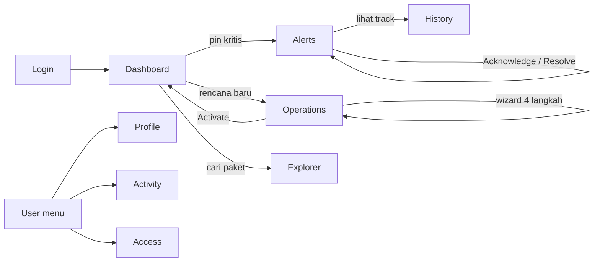

# 02 — Fungsi Menu Frontend SYNAPSE-T

> Prasyarat: [01 — Ikhtisar Frontend](./01-frontend-overview.md)  
> Dokumen ini adalah **katalog fungsi** setiap menu di UI — tombol, filter, tab, aksi.

---

## Daftar Isi

1. [Navigasi & Menu Pengguna](#1-navigasi--menu-pengguna)
2. [Login](#2-login--login)
3. [Dashboard](#3-dashboard--dashboard)
4. [Operations](#4-operations--operations)
5. [Alerts](#5-alerts--alerts)
6. [Explorer](#6-explorer--explorer)
7. [History](#7-history--history)
8. [Reports](#8-reports--reports)
9. [My Profile](#9-my-profile--profile)
10. [Activity Log](#10-activity-log--activity)
11. [User Access](#11-user-access--access)
12. [Ringkasan Matriks Fungsi](#12-ringkasan-matriks-fungsi)

---

## 1. Navigasi & Menu Pengguna

**Berkas:** `src/components/TopHeader.tsx`

### 1.1 Navigasi utama

| Menu | Rute | Fungsi |
|---|---|---|
| Brand SYNAPSE-T | `/dashboard` | Kembali ke peta komando |
| Dashboard | `/dashboard` | Buka peta komando |
| Operations | `/operations` | Buka daftar operasi |
| Alerts | `/alerts` | Buka triase alert |
| Explorer | `/explorer` | Buka pencarian telemetri |
| History | `/history` | Buka riwayat track |
| Reports | `/reports` | **Dinonaktifkan** — tooltip "Coming soon" |

Item aktif mendapat kelas `is-active` + `aria-current="page"`.

### 1.2 Menu pengguna (klik avatar)

| Item | Fungsi | Status |
|---|---|---|
| **My Profile** | Buka halaman profil sendiri | Aktif |
| **Activity Log** | Buka log audit sistem | Aktif |
| **User Access** | Buka kelola identitas / peran / binding | Aktif |
| **Settings** | Menutup dropdown saja | Belum ada halaman |
| **Logout** | Buka dialog konfirmasi | Aktif |

### 1.3 Dialog Logout

| Kontrol | Fungsi |
|---|---|
| **Cancel** | Tutup dialog, tetap masuk |
| **Log out** | Panggil `logoutAccount()` → hapus sesi → `/login` |

Teks dialog: *"Are you sure you want to log out of SYNAPSE-T?"*

---

## 2. Login · `/login`

**Berkas:** `src/app/login/components/login-view.tsx`  
**Tanpa TopHeader.**

### Layout

| Region | Isi |
|---|---|
| Kiri | Panel brand / marketing (hanya tampilan) |
| Kanan | Kartu form masuk |

### Fungsi kontrol

| Kontrol | Label UI | Fungsi |
|---|---|---|
| Input akun | Email or username | Isi username atau email |
| Input sandi | Password | Isi password (tanpa toggle tampilkan) |
| Tombol submit | **Sign in** | `loginAccount()` → simpan `session_id` → `/dashboard` |

### Validasi sisi klien

| Kondisi | Pesan |
|---|---|
| Akun / password kosong | Peringatan inline |
| Ada `@` tapi format email salah | Invalid email |
| Username < 2 karakter | Invalid email (pesan generik) |
| Server `401` / `403` | Pesan dari backend |

### Batasan

- Tidak ada "Forgot password", SSO, atau "Remember me"
- Tidak redirect otomatis jika sudah login
- Selalu ke `/dashboard` setelah sukses (tanpa return URL)

---

## 3. Dashboard · `/dashboard`

**Berkas:** `dashboard-view.tsx`, `ops-map.tsx`, `history-mini-map.tsx`  
**Judul:** Command Dashboard — SYNAPSE-T  
**Polling:** 5 detik (`MAP_POLL_MS`)

### Layout

```
┌──────────────────────────────────────────────────────────┐
│ TopHeader (floating di atas peta)                        │
├──────────────┬───────────────────────────┬───────────────┤
│ Recent       │                           │ Soldier       │
│ Matches      │     PETA PENUH            │ Dossier       │
│ (kiri)       │     (ops-map)             │ (kanan)       │
└──────────────┴───────────────────────────┴───────────────┘
```

### 3.1 Kontrol peta

| Kontrol | Fungsi |
|---|---|
| **+** / **−** | Zoom in / out (batas 3–19) |
| Ikon Layers | Buka dialog **Show** |

**Dialog Layers**

| Layer | Fungsi | Status |
|---|---|---|
| **Personal** | Tampilkan pin personel + garis grup | Default aktif |
| **Weapons** | Layer senjata | **Coming soon** (disabled) |

### 3.2 Panel Recent Matches (kiri)

| Kontrol | Fungsi |
|---|---|
| Judul **Recent Matches** | Buka kembali panel jika tertutup |
| **×** | Tutup panel + hentikan polling panel |
| Tab **Explorer** | Feed rekaman TELEMETRY terbaru |
| Tab **Alerts** | Feed alert terbuka |
| Klik baris Explorer | → `/explorer?id=<recordId>` |
| Klik baris Alerts | → `/alerts?id=<alertId>` |

### 3.3 Soldier Dossier (kanan, saat pin diklik)

| Kontrol / Area | Fungsi |
|---|---|
| **×** | Sembunyikan kartu (seleksi pin tetap) |
| Kartu Overview | Link ke Explorer (`?id=` atau `?q=`) |
| **Open History** | → `/history?soldier=<id>` |
| Play / Pause | Putar ulang track mini |
| Scrubber | Geser posisi playback |
| Kecepatan **0.5x – 4x** | Ubah kecepatan playback |
| **View Detail** (movement) | → `/history?soldier=&id=` |
| Baris Events | → `/explorer?id=` |
| Baris Alerts | → `/alerts?id=` |

**Data yang ditampilkan di dossier**

| Kelompok | Contoh field |
|---|---|
| Status | SOS / Casualty / Warning / Active |
| Overview | Heart Rate, HRV, Battery (+ sparkline) |
| Identitas | Unit, GNSS, terakhir terlihat |

### 3.4 Sumber data

| Region | Fungsi lib |
|---|---|
| Pin personel | `listExplorer` → `latestPinsFromExplorer` |
| Alert feed | `listAlerts` |
| Track mini | `listHistoryTrack` + `downsampleTrackPoints` |
| Geofence | `listOperations` → `operationMap` → `mapPayloadToFences` |

### 3.5 Batasan Dashboard

| Item | Keterangan |
|---|---|
| Weapons | 12 pin hardcoded di kode; layer UI dinonaktifkan |
| Geofence draw tools | Ada di kode tapi **tidak dirender** |
| Deep link inbound | Dashboard **mengabaikan** `?soldier=` |
| DANRU badge | Tidak muncul untuk pin live (field `role` tidak di-set) |

---

## 4. Operations · `/operations`

**Berkas:** `operations-view.tsx`, `operation-detail.tsx`, `create-operation-modal.tsx`, `operations-map.tsx`  
**Judul:** Operations — SYNAPSE-T  
**Catatan:** Detail & wizard adalah **state klien** — tidak ada rute `/operations/[id]`. Refresh kembali ke daftar.

### 4.1 Mode daftar

```
┌────────────────────┬─────────────────────────────┐
│ Create Operation   │                             │
│ Ringkasan          │     Peta operasi terpilih   │
│ Filter + Search    │                             │
│ Kartu operasi...   │                             │
└────────────────────┴─────────────────────────────┘
```

| Kontrol | Fungsi |
|---|---|
| **Create Operation** | Buka wizard 4 langkah |
| Filter **Status** | All / PLANNING / ACTIVE / ON_HOLD / COMPLETED / CANCELLED |
| Filter **Group** | All + nama grup dari API |
| Search | Pencarian nama/kode (debounce 300 ms) |
| Klik kartu | Highlight di peta |
| Double-click / **Open detail** | Buka mode detail |
| **Delete** | Konfirmasi → `deleteOperation` (hanya status yang boleh dihapus) |

Ringkasan menampilkan jumlah operasi per status (`operationsSummary`).

### 4.2 Mode detail — header

| Tombol | Muncul saat status | Fungsi |
|---|---|---|
| **Operations** (back) | Selalu | Kembali ke daftar + reload |
| **Activate** | PLANNING | → ACTIVE |
| **Hold** | ACTIVE | → ON_HOLD |
| **Resume** | ON_HOLD | → ACTIVE |
| **Complete** | ACTIVE / ON_HOLD | → COMPLETED |
| **Cancel** | PLANNING / ACTIVE / ON_HOLD | → CANCELLED |

COMPLETED / CANCELLED: tidak ada tombol siklus hidup. **Tidak ada dialog konfirmasi** pada aksi ini.

### 4.3 Mode detail — tab

| Tab | Fungsi / isi |
|---|---|
| **Overview** | Statistik personel/alert/zona, info operasi, grup, geofence ringkas |
| **Map** | Peta marker + poligon (tanpa mode gambar) |
| **Groups & Personnel** | Daftar anggota; pill **Leader** untuk DANRU |
| **Alerts** | Alert terkait; **View Detail** → `/alerts?id=` |
| **Geofences** | Zona + luas + jenis; bila poligon hilang → `· polygon missing` |

### 4.4 Wizard Create Operation (4 langkah)

#### Langkah 1 — Basic Information

| Field | Wajib | Fungsi |
|---|---|---|
| Name | Ya | Nama operasi |
| Description | Tidak | Deskripsi |
| Start / End | Ya | Jadwal (`DateTimePicker`) |
| Type | Tidak | Reconnaissance / Patrol / Security / Support |

**Next** aktif bila nama terisi.

#### Langkah 2 — Create Groups

Layout (atas ke bawah):

```
┌──────────────────────────┬──────────────────────────┐
│ Create group from        │ Groups created           │
│ selection                │                          │
├──────────────────────────┴──────────────────────────┤
│ Peta (ringkas)           │ Select members           │
└──────────────────────────┴──────────────────────────┘
```

| Kontrol | Fungsi |
|---|---|
| Klik pin di peta | Pilih / lepas personel |
| Search anggota | Filter daftar Select members |
| **Create group** | Buat grup dari seleksi (butuh ≥1 orang) |
| **Make leader** | Tandai DANRU grup |
| **Remove** | Hapus anggota dari grup |
| **Clear** | Kosongkan seleksi |

**Sumber personel:** digabung dari Settings personnel + pin Explorer TELEMETRY (sama dengan Dashboard).

**Next** aktif bila ≥1 orang sudah ditugaskan ke grup.

> Kartu "Link existing group" **sudah dihapus** dari UI. Endpoint backend masih ada.

#### Langkah 3 — Geofences

| Kontrol | Fungsi |
|---|---|
| Zone name | Nama zona |
| Kind | Recon / Restricted / Safe (warna beda) |
| Mode **Polygon** | Klik titik sudut di peta (≥3) |
| Mode **Circle** | Klik pusat → poligon radius **400 m** tetap |
| **Save zone** | Simpan zona ke draft |
| **Remove** | Hapus zona dari draft |
| **Next** / **Create** | Otomatis flush gambar yang belum di-Save (`withFlushedDraft`) |

#### Langkah 4 — Review & Create

| Kontrol | Fungsi |
|---|---|
| Ringkasan read-only | Nama, jadwal, grup, zona |
| **Create Operation** | `createOperation(draftToCreateBody)` → status awal PLANNING |
| **Creating...** | Tombol disabled saat submit |

Footer semua langkah: **Cancel** · **Back** (2–4) · **Next** (1–3) / **Create** (4).

### 4.5 Batasan Operations

| Item | Keterangan |
|---|---|
| Tidak ada URL detail | Refresh hilangkan detail |
| Limit daftar | `page=1`, `limit=50` — tanpa pager |
| Tidak edit grup/zona setelah create | Hanya lewat API |
| Tickets di operasi | Fungsi lib ada (`operationTickets`) tapi **tidak dipakai UI** |
| Lifecycle tanpa konfirmasi | Klik langsung mengubah status |

---

## 5. Alerts · `/alerts`

**Berkas:** `alerts-view.tsx`, `alerts-chart.tsx`  
**Judul:** Alerts — SYNAPSE-T  
**Polling:** 5 detik (dijeda saat mode fokus `?id=`)

### Layout

```
Header (stats + Back to Map + Export)
SOS strip (opsional)
Chart harian
┌──────────┬──────────────────┬─────────────────┐
│ Filters  │ Tabel hasil      │ Detail drawer   │
│          │ + pager          │                 │
└──────────┴──────────────────┴─────────────────┘
```

### 5.1 Kontrol header

| Kontrol | Fungsi |
|---|---|
| **Back to Map** | → `/dashboard` |
| Kartu severity | Ringkasan CRITICAL / WARNING / INFO |
| **Refresh** | Reset filter (keluar dari fokus `?id=`) |
| **Export** | Unduh `alerts.csv` |

### 5.2 Filter (draft → Apply)

| Filter | Opsi / fungsi |
|---|---|
| Search | Teks bebas → `q` |
| Status | All, ACTIVE, ACKNOWLEDGED, RESOLVED, CLEARED |
| Time Range | All time (`all`), 30 days (`30d`) |
| Severity | CRITICAL, WARNING, INFO (checkbox) |
| Alert Type | SOS, CASUALTY, ARRHYTHMIA, LOW_BATTERY, HEAT_STRESS, STRAP_DISCONNECTED, NO_CONTACT |
| Group | Nilai dari API |
| **Apply** | Terapkan filter, kembali ke halaman 1 |

### 5.3 Tabel & pager

| Kontrol | Fungsi |
|---|---|
| Klik baris | Buka detail drawer |
| SOS chips | Pilih alert SOS terbuka |
| `‹` / `›` | Halaman sebelumnya / berikutnya |
| Rows per page | **8 / 20 / 50 / 100** |

### 5.4 Detail drawer

| Kontrol | Fungsi |
|---|---|
| **×** | Tutup drawer |
| Tab **Details** | Pesan, posisi, vitals, jejak acknowledge/resolve |
| Tab **Related** | Hingga 5 alert prajurit yang sama |
| **Acknowledge** | `acknowledgeAlert` — hanya status ACTIVE |
| **Resolve** | `resolveAlert` — nonaktif jika sudah closed |
| **Ticket** | `createAlertTicket` — **tidak membuka UI tiket** |
| **Open on main map** | → `/dashboard?soldier=` (Dashboard saat ini mengabaikan param) |

### 5.5 Deep link

| Param | Efek |
|---|---|
| `?id=` | Mode fokus: satu alert + drawer terbuka |
| `?soldier=` | Filter `soldier_id` (angka) |
| `?type=` | Pre-select jenis alert |

### 5.6 Batasan Alerts

| Item | Keterangan |
|---|---|
| Ticket | API saja; tidak ada halaman tiket |
| Export | Tidak mengirim header auth |
| Rentang kustom | Tidak ada date picker `from`/`to` |

---

## 6. Explorer · `/explorer`

**Berkas:** `explorer-view.tsx`, `explorer-chart.tsx`, `explorer-mini-map.tsx`  
**Judul:** Search / Explorer — SYNAPSE-T  
**Kategori terkunci:** TELEMETRY saja

### Layout

```
Header + Export
Chart "Telemetry Records Over Time"
┌──────────┬──────────────────┬─────────────────┐
│ Filters  │ Tabel hasil      │ Record drawer   │
└──────────┴──────────────────┴─────────────────┘
```

### 6.1 Kontrol

| Kontrol | Fungsi |
|---|---|
| **Export** | Unduh `explorer.csv` sesuai filter |
| Interval chart | **1 hour** / **6 hour** / **1 day** (rebucket klien) |
| Time | **Last 30 Days** / **All time** (langsung apply) |
| Soldier ID | `S-104` atau `104` → filter soldier; teks lain → `q` |
| Group | Opsi dari API + All |
| Record / origin dll. | Opsi dari API |
| **Reset** | Kembali ke default 30 hari |
| Klik baris | Buka drawer detail |
| Pager + **10/25/50/100** | Navigasi halaman |

### 6.2 Drawer detail rekaman

| Tab / area | Fungsi |
|---|---|
| **Decoded Data** | Field terdekode (HR, SpO₂, flags, dll.) |
| **Raw Data** | Hex mentah (`raw_hex`) — font mono |
| **Packet Info** | Metadata paket + ukuran |
| Mini-map | Posisi rekaman (non-interaktif) |

### 6.3 Deep link

| Param | Efek |
|---|---|
| `?id=` | Fokus satu rekaman |
| `?q=` | Isi awal kotak Soldier ID / search |

### 6.4 Batasan Explorer

| Item | Keterangan |
|---|---|
| Kategori lain | MESH/UPLINK/dll. tidak diekspos di UI |
| Auth header | Fetch Explorer **tanpa** Bearer (endpoint BE anonim) |
| Sort kolom waktu | Tidak bisa di-sort dari UI |

---

## 7. History · `/history`

**Berkas:** `history-view.tsx`, `history-track-map.tsx`  
**Judul:** History — SYNAPSE-T  
**Butuh sesi** (izin `history.read`)

### Layout

```
┌──────────┬────────────────────────────────────────┐
│ Filters  │ Stats + Track map + Playback           │
│          │ Detail drawer (opsional)               │
└──────────┴────────────────────────────────────────┘
```

### 7.1 Filter

| Kontrol | Fungsi |
|---|---|
| **Back to Map** | → `/dashboard` |
| **Export** | Unduh CSV (butuh Apply dulu) |
| View By | **Soldier** / **Group** |
| Soldier ID | Lingkup prajurit |
| Group | Lingkup nama grup |
| Time Range | All time / 30 days (+ nilai API) |
| Data Type | TELEMETRY (checkbox read-only) |
| Position Source | GNSS, DEAD_RECKONING, TRILATERATION, STALE |
| **Reset** | Kosongkan filter |
| **Apply** | Muat track + statistik |

### 7.2 Peta & playback

| Kontrol | Fungsi |
|---|---|
| **+** / **−** | Zoom peta |
| Play / Pause | Putar track |
| Scrubber | Geser posisi waktu |
| Kecepatan **0.5x – 4x** | Ubah kecepatan |
| Detail **×** | Tutup drawer titik |

### 7.3 Kartu statistik

| Kartu | Isi |
|---|---|
| Total Distance | km (diturunkan dari koordinat) |
| Heart Rate (avg) | bpm |
| Battery (avg) | % |
| TELEMETRY records | Jumlah titik |

### 7.4 Deep link

| Param | Efek |
|---|---|
| `?soldier=` | Auto-apply bila valid |
| `?id=` | Loncat scrubber ke titik tersebut |

### 7.5 Batasan History

| Item | Keterangan |
|---|---|
| Data awal | Kosong sampai Apply (kecuali `?soldier=` valid) |
| Cap peta | Maks ~400 titik (downsample) |
| Marker klik | Tidak membuka detail dari klik marker |
| `historyStatistics` / `historyCharts` | Ada di lib, **belum dipakai UI** |

---

## 8. Reports · `/reports`

**Berkas:** `reports-view.tsx`  
**Judul:** Reports — SYNAPSE-T  
**Status:** Mock lokal — **tidak ada panggilan API**  
**Nav:** Dinonaktifkan ("Coming soon"); rute masih bisa dibuka langsung.

### Tab

| Tab | Isi |
|---|---|
| **Generate Report** | Form konfigurasi + preview kertas |
| **Report History** | Tabel riwayat palsu |
| **Scheduled Reports** | Jadwal palsu |

### Kontrol Generate (semua lokal / banyak inert)

| Kontrol | Fungsi nyata |
|---|---|
| Tipe laporan | Personnel / Operation / Incident / Custom — hanya UI state |
| Target | Single / Multiple / Group — hanya Single yang mengubah UI |
| Range | Last 6h / 24h / 7d / 30d / Custom (tanggal hardcoded) |
| Include sections | Checkbox Overview, Vitals, History, Alerts, Events, Equipment |
| Format | PDF / CSV / JSON — disimpan di state, tidak diterapkan |
| Detail level | Summary / Standard / Full — idem |
| **Generate Report** | **Tidak ada onClick** |
| **Preview Full Report** | **Tidak ada onClick** |
| **Download** | **Tidak ada onClick** |
| **New Schedule** / **See Details** | **Tidak ada onClick** |

Soldiers mock: S-108, S-104, S-107, S-101.

---

## 9. My Profile · `/profile`

**Berkas:** `profile-view.tsx`  
**Akses:** Menu pengguna → My Profile

### Tab

| Tab | Fungsi |
|---|---|
| **Profile** | Identitas + edit |
| **Activity** | Audit milik saya sendiri |

### 9.1 Tab Profile

| Kontrol | Fungsi |
|---|---|
| **Edit** | Buka mode edit nama + email |
| **Save** | `updateProfile` → nama / email |
| Drop zone / **Change Photo** | Unggah foto → `updateProfile({ profile_image })` |
| **Remove Photo** | `deleteProfileImage` |
| **Sign in** | → `/login` bila belum masuk |

Field read-only: username, department, role, status.

Perubahan foto/nama memicu event `PROFILE_UPDATED` agar avatar di header ikut berubah.

### 9.2 Tab Activity

| Kontrol | Fungsi |
|---|---|
| Tabel When / Event / Outcome | `listMyAuditLogs` |
| Previous / Next | Pager (10 per halaman) |

### Batasan Profile

- Tidak bisa ubah password / role / status dari sini
- Tidak ada tombol Cancel saat edit
- Drop zone = file input (bukan drag-drop penuh)

---

## 10. Activity Log · `/activity`

**Berkas:** `activity-view.tsx`  
**Akses:** Menu pengguna → Activity Log  
**Scope:** Seluruh audit sistem (bukan hanya milik saya)

### Layout

```
Time range + Export
Stat cards
Filters
Tabel event → klik baris → Detail drawer
```

### 10.1 Kontrol

| Kontrol | Fungsi |
|---|---|
| Time range | All time / 24h / 7d / 30d / 90d |
| **Export** | Unduh `activity-log.csv` |
| **Reset** | Hapus semua filter |
| Search actor | Filter nama aktor (debounce 300 ms) |
| Search action/target | Teks bebas |
| ACTION | All + VIEW, CREATE, UPDATE, DELETE, ASSIGN, REVOKE, ACKNOWLEDGE, RESOLVE, EXPORT, LOGIN, LOGOUT, ACCESS |
| OUTCOME | All, SUCCESS, FAILED, DENIED |
| Category chips | All + kategori dari API (single-select) |
| Sort Most Recent / Oldest | Urut ulang **halaman saat ini saja** |
| Klik baris | `readAuditLog` → drawer |
| Checkbox baris | Toggle saja — **tidak ada aksi massal** |
| Pager + **8/20/50/100** | Navigasi |

### 10.2 Kartu ringkasan

| Kartu | Isi |
|---|---|
| Total activities | Semua event |
| User actions | Aktor tipe USER |
| System actions | Aktor tipe SYSTEM |
| Failed actions | Outcome FAILED + DENIED |

### Batasan Activity

| Item | Keterangan |
|---|---|
| Checkbox | Belum ada bulk delete/export terpilih |
| Date picker kustom | Tidak ada `from`/`to` di UI |
| List fetch | Tidak selalu mengirim Bearer (endpoint BE sebagian anonim) |

---

## 11. User Access · `/access`

**Berkas:** `access-view.tsx`  
**Akses:** Menu pengguna → User Access

### Tab

| Tab | Fungsi |
|---|---|
| **Identity Registry** | Kelola pengguna (manusia) |
| **Role Model** | Katalog peran |
| **Access Binding** | Ikat pengguna ↔ peran |

### 11.1 Identity Registry

| Kontrol | Fungsi |
|---|---|
| Search | Cari nama / username / email |
| Type | Human / Service |
| Status | INACTIVE / ACTIVE / SUSPENDED / DISABLED |
| Verification | PENDING / VERIFIED |
| Access Binding | BOUND / NO_BINDING |
| **Refresh** | Muat ulang daftar |
| **+ Add Identity** | Buat identitas manusia (`createHuman`) |
| Klik baris / **Edit** | Drawer → `updateHuman` |
| Pager | 20 per halaman |

### 11.2 Role Model

| Kontrol | Fungsi |
|---|---|
| Search + Duty Category | Filter klien |
| **+ Add Role** | `createRole` |
| **Edit** | `updateRole` |
| **Delete** | `deleteRole` — **disembunyikan** bila `is_protected` |

Peran sistem (`superadmin`, dll.) tidak bisa diubah/dihapus dari UI.

### 11.3 Access Binding

| Kontrol | Fungsi |
|---|---|
| Search + Status | Filter klien (Active / Suspended / Revoked) |
| **+ Add Binding** | `assignRole` (user + role) |
| **Suspend** | Status → SUSPENDED |
| **Activate** | Status → ACTIVE |
| **Revoke** | Status → REVOKED |

### Batasan User Access

| Item | Keterangan |
|---|---|
| Add Identity | Hanya Human — tidak ada create Service |
| Hapus user / ganti password | Tidak ada di UI |
| Binding directory | Dibatasi ~100 user pertama |
| Editor permission peran | Tidak ada — peran kustom lahir tanpa izin |
| valid_from / valid_until | Tidak ada di form assign |

---

## 12. Ringkasan Matriks Fungsi

### 12.1 Apa yang bisa dilakukan operator

| Kebutuhan | Menu | Aksi utama |
|---|---|---|
| Lihat posisi satuan sekarang | Dashboard | Klik pin → dossier |
| Cari paket mentah / hex | Explorer | Filter + Export CSV |
| Tangani SOS / alert | Alerts | Acknowledge → Resolve → Ticket |
| Lihat jalur pergerakan | History | Apply → Play track |
| Susun operasi + zona | Operations | Create Operation (wizard) |
| Aktifkan / tahan operasi | Operations → Detail | Activate / Hold / Resume / … |
| Lihat jejak aktivitas | Activity Log | Filter + Export |
| Kelola akun & peran | User Access | Identity / Role / Binding |
| Ubah foto / nama sendiri | My Profile | Edit + Change Photo |

### 12.2 Fitur yang belum tersedia di FE

| Fitur | Di mana seharusnya | Status |
|---|---|---|
| Laporan periodik | Reports | Mock / Coming soon |
| Layer senjata | Dashboard Layers | Coming soon |
| Settings aplikasi | Menu user | No-op |
| UI tiket penuh | Dari Alerts → Ticket | Tombol saja |
| Link grup Settings ke operasi | Wizard langkah 2 | Dihapus dari UI |
| Edit operasi setelah create | Operations detail | Belum ada |
| Forgot password | Login | Belum ada |

### 12.3 Alur kerja tipikal



---

## Lampiran A — Mapping Menu → Berkas Kode

| Menu | `page.tsx` | View utama | CSS |
|---|---|---|---|
| Login | `app/login/page.tsx` | `login-view.tsx` | `login.css` |
| Dashboard | `(platform)/dashboard/page.tsx` | `dashboard-view.tsx` | `dashboard.css` |
| Operations | `(platform)/operations/page.tsx` | `operations-view.tsx` | `operations.css` |
| Alerts | `(platform)/alerts/page.tsx` | `alerts-view.tsx` | `alerts.css` |
| Explorer | `(platform)/explorer/page.tsx` | `explorer-view.tsx` | `explorer.css` |
| History | `(platform)/history/page.tsx` | `history-view.tsx` | `history.css` |
| Reports | `(platform)/reports/page.tsx` | `reports-view.tsx` | `reports.css` |
| Profile | `(platform)/profile/page.tsx` | `profile-view.tsx` | `profile.css` |
| Activity | `(platform)/activity/page.tsx` | `activity-view.tsx` | `activity.css` |
| Access | `(platform)/access/page.tsx` | `access-view.tsx` | `access.css` |
| Header | — | `components/TopHeader.tsx` | `dashboard.css` |

## Lampiran B — Mapping Menu → Modul Lib

| Menu | Modul utama `src/lib` |
|---|---|
| Login / Profile / Logout | `profile.ts`, `session.ts` |
| Dashboard | `explorer.ts`, `alerts.ts`, `history.ts`, `operations.ts` |
| Operations | `operations.ts` (+ `explorer.ts` di wizard) |
| Alerts | `alerts.ts` |
| Explorer | `explorer.ts` |
| History | `history.ts`, `session.ts` |
| Activity | `audit-logs.ts` |
| Access | `access.ts` |
| Reports | — (tidak ada) |
